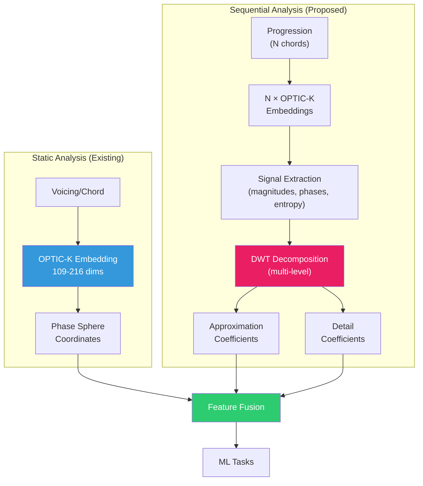

# OPTIC-K + DWT: Multi-Resolution Harmonic Analysis

## Executive Summary

This document proposes extending OPTIC-K with **Discrete Wavelet Transforms (DWT)** to capture temporal and hierarchical musical structure that the current DFT-based Phase Sphere cannot express.

| Transform | Role | Domain |
|-----------|------|--------|
| **DFT** (existing) | Global spectral structure | Static pitch-class geometry |
| **DWT** (proposed) | Localized multi-scale structure | Temporal/hierarchical dynamics |

**Key insight**: DFT sees chords as *objects*; DWT sees progressions as *signals*.

---

## 1. Motivation

### What DFT Already Does Well

OPTIC-K's Phase Sphere uses DFT to extract:
- Interval cycle affinities (k=1 through k=6)
- Transposition-invariant magnitudes
- Key-encoding phases
- Z-relation detection via spectral antipodes

This is **global** analysis—perfect for single harmonic objects.

### What DFT Cannot Do

| Phenomenon | Why DFT Fails |
|------------|---------------|
| Progression dynamics | No temporal dimension |
| Phrase boundaries | No locality awareness |
| Hierarchical tension | Single-scale analysis |
| Rhythmic harmonic changes | Static snapshot only |

### The DWT Opportunity

Wavelets decompose signals into:
- **Frequency bands** (like DFT)
- **Localized time windows** (unlike DFT)

This enables:
```
coarse features → slow, large-scale harmonic movement
fine features   → quick, small-scale voice-leading events
```

---

## 2. Architecture

### 2.1 Conceptual Model



### 2.2 Signal Extraction from OPTIC-K

Transform these scalar/vector time series with DWT:

| Signal | Source | Captures |
|--------|--------|----------|
| `Mag_k5[t]` | Fourier magnitude k=5 | Diatonicity over time |
| `Phase_k5[t]` | Fourier phase k=5 | Key drift trajectory |
| `Entropy[t]` | Spectral entropy | Tension/release curve |
| `Barycenter[t]` | Spectral center | Harmonic gravity flow |
| `Distance[t]` | θ(chord[t], chord[t+1]) | Voice-leading cost |

### 2.3 Wavelet Decomposition

For a progression of N chords:

```
Signal: [x₀, x₁, x₂, ..., xₙ₋₁]
         ↓
  ┌──────┴──────┐
  ↓             ↓
 cA₁          cD₁    (Level 1: half resolution)
  ↓
┌─┴─┐
↓   ↓
cA₂ cD₂              (Level 2: quarter resolution)
 ↓
...
```

**Output**: Approximation coefficients (cAₖ) + Detail coefficients (cDₖ) at each level.

---

## 3. Implementation Plan

### Phase 1: Core DWT Infrastructure

#### 3.1 Wavelet Service

```csharp
// Proposed: GA.Business.ML/Wavelets/WaveletTransformService.cs

public class WaveletTransformService
{
    /// <summary>
    /// Supported wavelet families for musical analysis.
    /// Default: Daubechies4 ("good generalist" for musical signals)
    /// </summary>
    public enum WaveletFamily
    {
        Haar,           // Ultra-fast, step-like changes (segmentation)
        Daubechies4,    // DEFAULT - good for musical structure
        Daubechies8,    // Smoother, longer phrases, more compute
        Symlet4         // Symmetric variant of db4
    }

    /// <summary>
    /// Computes adaptive decomposition levels based on signal length.
    /// Formula: L = min(3, floor(log2(T)) - 2)
    /// </summary>
    public static int ComputeAdaptiveLevels(int signalLength)
    {
        if (signalLength < 4) return 1;
        int maxLevel = (int)Math.Floor(Math.Log2(signalLength)) - 2;
        return Math.Clamp(maxLevel, 1, 3);
    }

    /// <summary>
    /// Performs multi-level DWT decomposition on a signal.
    /// </summary>
    /// <param name="signal">Input scalar time series (entropy, velocity, etc.)</param>
    /// <param name="wavelet">Wavelet family (default: db4)</param>
    /// <param name="levels">Decomposition levels (null = adaptive)</param>
    public WaveletDecomposition Decompose(
        double[] signal, 
        WaveletFamily wavelet = WaveletFamily.Daubechies4,
        int? levels = null)
    {
        int L = levels ?? ComputeAdaptiveLevels(signal.Length);
        // ... implementation
    }

    /// <summary>
    /// Extracts feature vector from decomposition.
    /// </summary>
    public double[] ExtractFeatures(WaveletDecomposition decomposition);
}

public record WaveletDecomposition(
    double[] ApproximationCoefficients,  // Slow trend (phrase-level)
    double[][] DetailCoefficients,       // [L1=medium, L2=faster, L3=very fast]
    int Levels,
    WaveletFamily Wavelet
);
```

#### 3.2 Progression Embedding Service

```csharp
// Proposed: GA.Business.ML/Wavelets/ProgressionEmbeddingService.cs

public class ProgressionEmbeddingService
{
    private readonly MusicalEmbeddingGenerator _embeddingGenerator;
    private readonly WaveletTransformService _waveletService;

    /// <summary>
    /// Generates a multi-resolution embedding for a chord progression.
    /// </summary>
    public async Task<ProgressionEmbedding> GenerateAsync(
        IReadOnlyList<VoicingDocument> progression)
    {
        // 1. Generate OPTIC-K embeddings for each chord
        var embeddings = await GenerateChordEmbeddingsAsync(progression);
        
        // 2. Extract signal time series
        var signals = ExtractSignals(embeddings);
        
        // 3. Apply DWT to each signal
        var waveletFeatures = ApplyDWT(signals);
        
        // 4. Combine into unified feature vector
        return new ProgressionEmbedding(
            ChordEmbeddings: embeddings,
            WaveletFeatures: waveletFeatures,
            GlobalFeatures: ComputeGlobalFeatures(embeddings)
        );
    }

    private Dictionary<string, double[]> ExtractSignals(double[][] embeddings)
    {
        return new Dictionary<string, double[]>
        {
            ["Mag_k5"] = embeddings.Select(e => e[EmbeddingSchema.FourierMagK5]).ToArray(),
            ["Phase_k5"] = embeddings.Select(e => e[EmbeddingSchema.FourierPhaseK5]).ToArray(),
            ["Entropy"] = embeddings.Select(e => e[EmbeddingSchema.SpectralEntropy]).ToArray(),
            // ... other signals
        };
    }
}
```

### Phase 2: Feature Schema Extension

#### 3.3 Extended Embedding Schema

```csharp
// Addition to EmbeddingSchema.cs

#region Wavelet Features (Proposed: indices 216-255)

/// <summary>Starting index of WAVELET partition.</summary>
public const int WaveletOffset = 216;

/// <summary>Number of dimensions in WAVELET partition.</summary>
public const int WaveletDim = 40;

// Level 1 Approximation (indices 216-219)
public const int WaveletApproxL1Mean = 216;
public const int WaveletApproxL1Std = 217;
public const int WaveletApproxL1Energy = 218;
public const int WaveletApproxL1Entropy = 219;

// Level 1 Detail (indices 220-223)
public const int WaveletDetailL1Mean = 220;
public const int WaveletDetailL1Std = 221;
public const int WaveletDetailL1Energy = 222;
public const int WaveletDetailL1Entropy = 223;

// ... Levels 2, 3 follow same pattern

// Cross-scale features (indices 240-255)
public const int WaveletScaleRatio12 = 240;  // Energy ratio L1/L2
public const int WaveletScaleRatio23 = 241;  // Energy ratio L2/L3
public const int WaveletDominantScale = 242; // Which level dominates
// ...

#endregion
```

### Phase 3: ML Applications

#### 3.4 Progression Classifier

```csharp
// Proposed: GA.Business.ML/Classification/ProgressionClassifier.cs

public class ProgressionClassifier
{
    /// <summary>
    /// Classifies a progression by style/genre using wavelet-augmented features.
    /// </summary>
    public ClassificationResult Classify(ProgressionEmbedding embedding)
    {
        // Feature vector = OPTIC-K aggregates + Wavelet features
        var features = CombineFeatures(
            embedding.GlobalFeatures,
            embedding.WaveletFeatures
        );
        
        // Apply trained model (SVM, Random Forest, or Neural Net)
        return _model.Predict(features);
    }
}

public record ClassificationResult(
    string PredictedStyle,      // "jazz", "classical", "rock", etc.
    double Confidence,
    Dictionary<string, double> StyleProbabilities
);
```

#### 3.5 Phrase Boundary Detector

```csharp
// Proposed: GA.Business.ML/Segmentation/PhraseBoundaryDetector.cs

public class PhraseBoundaryDetector
{
    /// <summary>
    /// Detects phrase boundaries using wavelet detail coefficient spikes.
    /// </summary>
    public IReadOnlyList<int> DetectBoundaries(ProgressionEmbedding embedding)
    {
        // High detail coefficients indicate rapid harmonic changes
        var detailEnergy = ComputeDetailEnergy(embedding.WaveletFeatures);
        
        // Find peaks above threshold
        return FindPeaks(detailEnergy, threshold: 0.7);
    }
}
```

---

## 4. Use Cases

### 4.1 Progression Classification

**Task**: Classify harmonic progressions by style (jazz, classical, rock, atonal).

**Why wavelets help**: Different styles have different *transition patterns*:
- Jazz: frequent, smooth modulations (high fine-scale detail)
- Classical: phrase-based structure (periodic coarse features)
- Rock: repetitive, stable patterns (low detail energy)

**Feature set**:
```
[OPTIC-K mean/std over progression] + [Wavelet coefficients]
```

### 4.2 Tension Curve Modeling

**Task**: Generate a tension curve for a progression.

**Why wavelets help**: Tension involves both:
- Global harmonic distance from tonic (DFT → Phase Sphere)
- Local rate of change (DWT → detail coefficients)

**Formula**:
```
Tension[t] = α × Entropy[t] + β × DetailEnergy[t] + γ × KeyDistance[t]
```

### 4.3 Harmonic Similarity with Context

**Task**: Find similar progressions, not just similar chords.

**Why wavelets help**: Two progressions might use similar chords but have different dynamics.

**Similarity metric**:
```
Sim(P, Q) = w₁ × CosineSim(OPTIC-K_mean(P), OPTIC-K_mean(Q))
          + w₂ × CosineSim(Wavelet(P), Wavelet(Q))
```

### 4.4 Predictive Generation

**Task**: Predict the next chord given a progression.

**Why wavelets help**: Multi-scale context improves prediction:
- Approximation: "where is the progression heading?"
- Detail: "what small-scale pattern is active?"

**Model input**:
```
[Last N chord embeddings] + [Wavelet features of sequence]
```

---

## 5. Library Selection

### 5.1 .NET Options

| Library | Pros | Cons |
|---------|------|------|
| **Accord.NET** | Mature, well-documented | Large dependency |
| **Math.NET Numerics** | Clean API, active | Limited wavelet support |
| **Custom Implementation** | No dependencies | More code to maintain |

**Recommendation**: Start with **custom Haar/Daubechies-4** implementation for prototyping, then evaluate Accord.NET for production.

### 5.2 Python Interop (Alternative)

If heavy ML is needed:
```python
import pywt  # PyWavelets

coeffs = pywt.wavedec(signal, 'db4', level=3)
cA3, cD3, cD2, cD1 = coeffs
```

Expose via Python.NET or gRPC service.

---

## 6. Verification Plan

### 6.1 Unit Tests

- [ ] DWT of sine wave produces expected frequency peak
- [ ] DWT of step function produces expected detail spike
- [ ] Decomposition → Reconstruction is lossless
- [ ] Feature extraction is deterministic

### 6.2 Integration Tests

- [ ] Progression embedding generates correct dimensions
- [ ] Wavelet features differ for contrasting progressions
- [ ] Classifier accuracy > 70% on style detection

### 6.3 Musical Validation

- [ ] Tension curves match expert annotations
- [ ] Phrase boundaries align with score structure
- [ ] Similar progressions are grouped correctly

---

## 7. Design Decisions (Finalized)

> [!IMPORTANT]
> These decisions were finalized based on domain expertise. They prioritize "ship it" pragmatism.

### 7.1 Wavelet Family Selection

**Decision**: Ship db4, allow override.

| Wavelet | Use Case | Notes |
|---------|----------|-------|
| **db4** (default) | General musical structure | "Good generalist" for OPTIC-K signals |
| Haar | Segmentation / boundary detection | Ultra-fast, step-like changes |
| db8 / sym8 | Longer phrases, expressive curves | Smoother, slightly more compute |

> Wavelets are like guitar picks: you can collect 200, but you'll play better if you always have one in your pocket.

### 7.2 Decomposition Levels

**Decision**: Adaptive, capped at 3.

**Formula**:
```
L = min(3, floor(log₂(T)) - 2)
```

**Examples**:
| T (chords) | log₂(T) | L |
|------------|---------|---|
| 16 | 4 | 2 |
| 32 | 5 | 3 |
| 64 | 6 | 3 |
| 8 | 3 | 1 |

**Why**: With short progressions, level 3 becomes "mostly boundary artifacts." Adaptive prevents this.

**Semantic mapping**:
| Level | Captures |
|-------|----------|
| Approximation | Phrase-level slow trend |
| Detail L1 | Harmonic rhythm |
| Detail L2 | Local voice-leading |
| Detail L3 | Very fast flicker |

### 7.3 Latency Modes

**Decision**: Support both, design for interactive chat first.

#### Interactive Chat Mode (Primary)

| Metric | Target |
|--------|--------|
| DWT features | < 50 ms |
| End-to-end (before LLM) | < 200-400 ms |

**Implementation**:
- Small windows (8-32 events)
- Precompute per-event signals (ring buffer)
- DWT on scalar series only

#### Live Performance Mode (Future)

| Metric | Target |
|--------|--------|
| Per-update | < 10-20 ms |
| Jitter | Stable |

**Implementation**:
- Haar or db2, L ≤ 2
- Small windows (8-16)
- Fixed tick updates (100-200 ms)
- Cache filter coefficients, reuse arrays

### 7.4 Signal Selection

> [!CAUTION]
> Use wavelets on **derived scalar signals**, NOT raw 216D embedding dimensions.

**Approved signals**:

| Signal | Source | Meaning |
|--------|--------|----------|
| `entropy(t)` | `SpectralEntropy` | Tension/organization |
| `velocity(t)` | θ(chord[t], chord[t+1]) | Voice-leading speed |
| `barycenter_drift(t)` | Spectral center delta | Harmonic gravity shift |
| `tonal_magnetism(t)` | \|F₅\|(t) | Key pull strength |

**Why**: Interpretable, cheap, avoids "216D wavelet soup" problem.

---

## 8. Summary

| Component | Status | Priority |
|-----------|--------|----------|
| `WaveletTransformService` | ✅ Done | High |
| `ProgressionEmbeddingService` | ✅ Done | High |
| Adaptive levels formula | ✅ Done | High |
| Extended `EmbeddingSchema` | ✅ Done | Medium |
| `ProgressionClassifier` | ✅ Done | Medium |
| `PhraseBoundaryDetector` | ✅ Done | Low |
| Live performance mode | Future | Low |

**Status Update (2026-01-17)**: Core implementation of Wavelet infrastructure is complete and verified by `WaveletTransformTests.cs`.
