# OPTIC-K Applications Guide

## OPTIC-K: Symbolic–Spectral Embeddings for Musical Cognition

---

## Executive Summary

**OPTIC-K is not a feature vector.**  
**It is a coordinate system for musical objects.**

Every chord, scale, voicing, or pitch-class set is embedded into a **109-dimensional hybrid manifold** that unifies:

| Layer | What it encodes |
|-------|-----------------|
| **OPTIC/K** | Set-theoretic invariants |
| **MORPHOLOGY** | Physical realization |
| **CONTEXT** | Functional & temporal meaning |
| **SYMBOLIC** | Technique & lineage |
| **SPECTRAL** | Fourier-space geometry (Phase Sphere) |

The result is a system where:

- **similarity** = geometric proximity
- **modulation** = spectral rotation
- **voice-leading** = geodesic flow
- **Z-relations** = antipodal symmetry

This makes OPTIC-K both a **music-theory engine** and a **navigation system** through harmonic space.

### Visual: The 109-Dimensional Embedding Structure


### Visual: The Phase Sphere Concept

```mermaid
graph TB
    subgraph "Phase Sphere: Harmonic Space"
        direction TB
        
        subgraph "Fifths Axis (k=5)"
            C["C Major<br/>φ₅ = 0°"]
            G["G Major<br/>φ₅ = 30°"]
            D["D Major<br/>φ₅ = 60°"]
            Fsharp["F# Major<br/>φ₅ = 180°"]
        end
        
        C -.->|"rotation"| G
        G -.->|"rotation"| D
        C <-.->|"antipodal"| Fsharp
    end
    
    style C fill:#3498db,color:#fff
    style G fill:#2ecc71,color:#fff
    style D fill:#9b59b6,color:#fff
    style Fsharp fill:#e74c3c,color:#fff
```



**Key insight**: Transposition = rotation on the sphere. Keys a tritone apart are antipodal (opposite poles).

---

## Prerequisites: Understanding the Building Blocks

OPTIC-K builds on foundational music theory concepts. If you're new to these ideas:

> 📚 **Recommended Reading**: [Interval Class Glossary](https://harmoniousapp.net/p/bd/Glossary-Interval-Class) — A clear introduction to interval classes, pitch-class sets, and the mathematical foundations OPTIC-K is built upon.

**Key concepts you'll encounter:**
- **Pitch Class**: A note regardless of octave (C in any octave = pitch class 0)
- **Interval Class**: The distance between two pitch classes (1-6, since 7+ "wraps around")
- **Interval Class Vector (ICV)**: A 6-number fingerprint counting each interval type in a chord
- **Fourier Transform**: Decomposes a pitch-class set into cyclic components (the basis of SPECTRAL)

---

## Part I — Production-grade Applications

### 1. Voicing Search as Geometric Retrieval

**Status**: ✅ Production

Current OPTIC-K similarity:

```
Similarity(A,B) =
  0.45·cos(STRUCTURE) +
  0.25·cos(MORPHOLOGY) +
  0.20·cos(CONTEXT) +
  0.10·cos(SYMBOLIC)
```


> [!NOTE]
> For a detailed explanation of why we use this partitioned approach instead of a single vector cosine, see **[Section II: Understanding the Logic](#part-ii--understanding-the-logic-why-cosine--partitions)** below.

---

## Part II — Understanding the Logic: Why Cosine & Partitions?

### 1. The Math: Partitioned Cosine Similarity

Current OPTIC-K similarity formula:
```
Similarity(A,B) =
  0.45·cos(STRUCTURE) +
  0.25·cos(MORPHOLOGY) +
  0.20·cos(CONTEXT) +
  0.10·cos(SYMBOLIC)
```

Unlike standard AI embeddings which treat the vector as a single "blob", OPTIC-K slices the vector into four distinct musical dimensions and compares them individually.

**Why?** A "C Major Open" and "C Major Shell" might look 90% different geometrically (Morphology), but musically they are identical (Structure). If we used a single global cosine, they would be considered distant. By partitioning, we can say:
- **Structure**: 1.0 (Identical notes)
- **Morphology**: 0.2 (Different shapes)
- **Weighted Score**: **0.80** (Highly similar because Structure is weighted heavily).

### 2. The Weights Explained

The weights `[0.45, 0.25, 0.20, 0.10]` represent the **Production Preset**, optimized for a general-purpose guitar assistant.

#### **0.45 · STRUCTURE (The Musical Anchor)**
*   **What**: Pitch Class Set, Intervals, Bass Note.
*   **Why**: If two chords don't share fundamental harmony, they aren't "similar" in a useful way. Structure dominates so recommendations serve the correct musical function, even if the shape changes.

#### **0.25 · MORPHOLOGY (The Guitarist's Reality)**
*   **What**: Fret range, strings used, span.
*   **Why**: Physical constraints. A voicing at fret 3 and one at fret 15 are musically identical but physically distinct. This weight ensures "alternatives" are playable in the same neck region.

#### **0.20 · CONTEXT (Harmonic Function)**
*   **What**: Tonal gravity, tension/resolution.
*   **Why**: Captures functional equivalence. It groups "Dominant" behaving chords together (e.g., tritone subs) even if their notes differ slightly.

#### **0.10 · SYMBOLIC (The "Vibe")**
*   **What**: Tags like "Jazz", "Hendrix", "Neo-Soul".
*   **Why**: A nudge factor. It floats culturally relevant voicings to the top without overriding the fundamental correctness of the notes.

### 3. Dynamic Weighting (Search Presets)

These weights are dynamic. The Chatbot can shift them based on user intent:
- **"Find a spread voicing shape"** → Weight **MORPHOLOGY** higher (0.45).
- **"Find a functional substitute"** → Weight **STRUCTURE + CONTEXT** higher (0.85).

---

### 4. Concrete Example: The OPTIC-K Hierarchy (Decomposing Cmaj7)

Consider a lush, open C Major 7 shape. OPTIC-K peels it like an onion, separating **Physicality** from **Identity** from **Structure**.

| Layer | Concept | Data Representation | Meaning |
|-------|---------|---------------------|---------|
| **0. VOICING** | Physical Instance | `x-3-2-0-0-0` (Fretboard) | "Specifically this open shape." |
| **I. IDENTITY** | Musical Object | `Cmaj7` (Root: C) | "Any Cmaj7 chord." |
| **II. CHROMA** | Pitch Class Set | `{0, 4, 7, 11}` (C, E, G, B) | "These specific notes." |
| **III. TRANSPOSED** | Prime Form | `(0158)` | "Major 7th quality (any key)." |
| **IV. INVARIANT** | Interval Vector | `<101220>` | "Deepest DNA: 1 semitone, 2 major thirds, 2 fifths." |
| **V. SPECTRAL** | Fourier Bracelet | `Mag/Phase Spectra` | "Geometric shape on the circle." |


**Why this matters for AI:**
- When a user asks "Give me a **Cmaj7**", the AI filters by **Level I (Identity)**.
- When they ask "Give me a **similar sound**", the AI searches near **Level IV/V (Structure)** to find substitutions (like Em9/C) that share the same deep interval content.
- When they ask "Give me a **similar shape**", the AI searches near **Level 0 (Morphology)**.

---


**Smaller angle = higher similarity.** The weighted cosine formula measures this across all partitions.

---

### 2. Symbolic–Spectral Tagging

**Status**: ✅ Production

**SYMBOLIC (66–77)** is not a classifier — it is a **semantic projection**.

Tags like:
- `drop-2`
- `neo-soul`
- `tristan-chord`

are not metadata — they become **dimensions in harmonic space** that participate in similarity and clustering.

This allows hybrid queries:

> *"Give me Hendrix-style quartal voicings near this shape."*

---

### 3. Texture & Register as First-class Harmonics

**Status**: ✅ Production

**EXTENSIONS (78–95)** encode what classical theory never could:

| Feature | Meaning |
|---------|---------|
| Mean Register | Brightness |
| Doubling Ratio | Thickness |
| Bass-Melody Span | Vertical width |
| Local Clustering | Density |
| Smoothness Budget | Voice-leading potential |

This makes OPTIC-K suitable not just for harmony, but for **arrangement**, **orchestration**, and **voicing design**.

---

### 4. Chord Explanation (NLG)

**Status**: ✅ Production

`VoicingExplanationService` reverse-maps embedding dimensions to natural language:

> *"This is a mid-register drop-2 voicing of Cmaj7. High smoothness budget suggests good voice-leading potential. Located on the fifths axis near the diatonic pole."*

---

## Part II — Phase Sphere: The Harmonic Manifold

> **This is where OPTIC-K becomes unique.**

Each musical object has a **Fourier-space position**:

$$S(X) = (|F_1|e^{i\phi_1}, \ldots, |F_6|e^{i\phi_6})$$

normalized to lie on the **Phase Sphere** — a high-dimensional unit sphere in spectral space.

This measures **location on the harmonic manifold**.

| Musical idea | Phase-sphere meaning |
|--------------|---------------------|
| Transposition | Rotation |
| Modulation | Continuous phase drift |
| Z-relation | Antipodal symmetry |
| Maximally-even | Spectral poles |
| Tonal gravity | Fifths-axis attraction |

---

### 5. Spectral Distance = Harmonic Color Distance

**Status**: ✅ Implemented (`PhaseSphereService`)

Instead of counting intervals, OPTIC-K measures:

> *How far apart are two sets on the harmonic sphere?*

That angle predicts:
- smoothness of transition
- perceived relatedness
- modulation effort

This measures **location on the harmonic manifold**.

---

### 6. Z-Relations as Harmonic Twins

**Status**: ✅ Implemented

Z-related sets:
- share magnitude spectra
- differ only in phase

On the phase sphere, they lie on the **same latitude but opposite longitudes** — same complexity, opposite harmonic pull.

```mermaid
graph LR
    subgraph "Z-Related Sets on Phase Sphere"
        direction LR
        
        A["Set A<br/>|F₅| = 0.8<br/>φ₅ = 45°"] 
        Center["•<br/>Center"]
        B["Set B<br/>|F₅| = 0.8<br/>φ₅ = 225°"]
        
        A <-->|"Same magnitude<br/>Opposite phase"| B
        A --> Center
        Center --> B
    end
    
    style A fill:#3498db,color:#fff
    style B fill:#e74c3c,color:#fff
    style Center fill:#333,color:#fff
```



**Musical meaning**: Z-twins sound equally complex but pull harmony in opposite directions.

This makes them ideal for:
- tension–release play
- shadow harmonies
- spectral inversion effects

---

### 7. Cycle Projections = Harmonic Axes

**Status**: ✅ Implemented

The k-cycles give real, navigable axes:

| k | Axis | Musical meaning |
|---|------|-----------------|
| 1 | Semitone | Chromatic clumping, cluster tightness |
| 2 | Whole-tone | Tritone structure, whole-tone affinity |
| 3 | Minor-third | Diminished symmetry |
| 4 | Major-third | Augmented symmetry |
| 5 | Fifths | Tonality, diatonicness |
| 6 | Tritone | Balance, dominant function |

These are not abstract — they are **directions in embedding space**.


**The fifths axis (k=5) is the most important for tonal music** — it measures "key-ness" and diatonic alignment.

This measures **location on the harmonic manifold**.

---

### 8. Spectral Entropy = Harmonic Temperature

**Status**: ✅ Production (Index 108)

Spectral entropy measures how concentrated the spectrum is.

| Entropy | Harmonic Character |
|---------|-------------------|
| High (→1.0) | Organized, pure cycles |
| Low (→0.0) | Chromatic, noisy |

This lets you:
- "find clean harmonic poles"
- "avoid noisy chromatic clouds"
- "locate stable attractors"

**No conventional chord representation can do this.**

---

## Part III — Where This Leads

### 9. Atonal Navigation Mode

**Status**: 🔄 Defined (weight preset available)

By giving SPECTRAL weight, OPTIC-K becomes a **navigation engine for post-tonal harmony**:

```
STRUCTURE: 0.35, SPECTRAL: 0.15, MORPHOLOGY: 0.20,
CONTEXT: 0.20, SYMBOLIC: 0.10
```

Not "which chord shares notes?"  
But **"which chord lies closest on the harmonic manifold?"**

This is Tymoczko-grade geometry made computational.

---

### 10. Harmonic Maps

**Status**: 🔮 Roadmap

PCA projection of the phase sphere becomes a **true musical atlas**:

- **poles** = tonal centers
- **clusters** = vocabularies
- **bridges** = modulation paths

This is not visualization — it is **harmonic cognition**.

---

### 11. Key-less Modulation

**Status**: 🔮 Roadmap

Interpolating on the phase sphere yields:
- smooth, non-tonal progressions
- spectral voice-leading
- tension-controlled transitions

You are literally **computing geodesics in harmonic space**.

```mermaid
graph LR
    subgraph "Voice-Leading as Geodesics"
        direction LR
        
        Dm7["Dm7<br/>Start"] 
        Int1["•"]
        Int2["•"]
        G7["G7<br/>Target"]
        
        Dm7 ==>|"geodesic<br/>path"| Int1
        Int1 ==>|"smooth<br/>motion"| Int2
        Int2 ==>|"arrival"| G7
    end
    
    style Dm7 fill:#3498db,color:#fff
    style G7 fill:#2ecc71,color:#fff
    style Int1 fill:#9b59b6,color:#fff
    style Int2 fill:#9b59b6,color:#fff
```



**The geodesic is the shortest path on the sphere** — musically, it's the smoothest voice-leading between two harmonies.

---

### 12. Spectral RAG: Retrieval-Augmented Generation for Harmony

**Status**: 🔮 Roadmap

The future chatbot will not retrieve chords by name — it will retrieve them by **location in harmonic geometry**.

That is how humans actually hear.

#### The Problem with Text-Only RAG

Traditional music chatbots use text embeddings:
- Query: "What chord sounds like Dm7 but jazzier?"
- Retrieval: Find documents containing "Dm7" and "jazz"
- Result: Text about jazz theory, maybe some chord names

**This fails because**:
- "Jazzier" is a spectral quality, not a keyword
- "Sounds like" requires harmonic proximity, not text similarity
- The answer should be a *voicing*, not a description

#### How Spectral RAG Works


#### Query Types Spectral RAG Enables

| Query | What it really asks | How OPTIC-K answers |
|-------|--------------------|--------------------|
| "Jazzier version of X" | Spectral neighbor with higher SYMBOLIC jazz weight | Weighted retrieval biasing jazz tags |
| "Brighter voicing" | Higher mean register, same STRUCTURE | Filter EXTENSIONS[84] > current |
| "More tense chord" | Higher spectral entropy or dominant function | Filter CONTEXT tension, SPECTRAL entropy |
| "Something darker" | Lower register, minor-third axis | Shift EXTENSIONS, increase k=3 projection |
| "Smoother voice-leading from here" | Shortest geodesic distance | Sort by `PhaseSphereService.SpectralDistance()` |

#### Example Dialogue

```
User: "I'm playing a Cmaj7 in open position. What's a more sophisticated 
       voicing that's still easy to play?"

Spectral RAG:
1. Parse: chord = Cmaj7, constraint = "easy to play"
2. Compute: OPTIC-K(Cmaj7, open position) = [109D vector]
3. Retrieve: 
   - Spectral neighbors (small Δφ₅)
   - Filter: MORPHOLOGY complexity < 0.4
   - Filter: SYMBOLIC "beginner-friendly" or "campfire-chord"
   - Sort by: STRUCTURE similarity + lower EXTENSIONS[88] (less clustering)
4. Results: Cmaj9 (x-3-0-0-0-0), Cmaj7/G (3-x-0-0-0-0)

Bot: "Try this Cmaj9 shape — same harmonic color but with an added 9th 
      that gives it more shimmer. The open D string adds brightness without 
      changing the fundamental key position on the fifths axis (φ₅ = 0.83)."
```

#### Why This Matters

Traditional chatbots answer: *"A sophisticated Cmaj7 voicing is..."* (hallucinated text)

Spectral RAG answers with:
- **Actual voicings** from the database
- **Geometric justification** (spectral proximity, axis positions)
- **Playability constraints** respected
- **No hallucination** — the voicings are real and indexed

The LLM becomes a **narrator**, not an inventor. OPTIC-K provides the **musical truth**.

#### Implementation Path

1. **Chord Parser** — Extract chord names from natural language queries
2. **OPTIC-K Lookup** — Map parsed chords to stored embeddings
3. **Spectral Retrieval** — MongoDB vector search with partition weighting
4. **Constraint Filtering** — Apply MORPHOLOGY/EXTENSIONS filters
5. **Explanation Generation** — `VoicingExplanationService` → LLM

---

## Part IV — Why OPTIC-K Beats Neural Music Embeddings

Most music-AI systems today rely on neural embeddings: large models trained on audio or symbolic data that learn to map musical objects into high-dimensional vectors where "similar things end up near each other."

This works well for:
- recommendation
- tagging
- genre clustering

**But it fails at something deeper: musical navigation.**

Neural embeddings can tell you that two chords are similar.  
They cannot tell you **why**, **how**, or **how to move between them**.

OPTIC-K was designed to solve exactly that.

---

### 1. Neural embeddings are statistical — OPTIC-K is geometric

Neural embeddings discover correlations:
> *"These two things appeared in similar contexts."*

OPTIC-K encodes musical laws:
> *"These two things occupy nearby locations on the harmonic manifold."*

In OPTIC-K:
- **distance** = spectral proximity
- **direction** = harmonic tendency
- **rotation** = transposition
- **antipodes** = Z-relations
- **poles** = maximally-even sets

This means every chord has:
- a **position**
- an **orientation**
- a set of **forces** acting on it

Neural vectors do not have any of that structure.

---

### 2. Neural embeddings are opaque — OPTIC-K is interpretable

If two chords are close in a neural embedding, you cannot explain why.

In OPTIC-K, proximity decomposes into:
- interval structure (OPTIC/K)
- physical shape (MORPHOLOGY)
- function (CONTEXT)
- technique (SYMBOLIC)
- spectral orientation (PHASE SPHERE)

You can literally say:
> *"These chords are close because they share fifth-axis phase and similar voice-leading geometry."*

**That is impossible in a black-box embedding.**

---

### 3. Neural embeddings cannot support modulation — OPTIC-K was built for it

Neural systems cannot answer:
> *"What is the smoothest harmonic path from this chord to that one?"*

OPTIC-K can.

Because chords live on the Phase Sphere, you can:
1. Compute their spectral positions
2. Find the geodesic between them
3. Walk along it, snapping to real chords

That is **key-less modulation**, driven by geometry rather than rules.

---

### 4. Z-relations, symmetry, and polarity exist in OPTIC-K — They do not exist in neural space

Z-related sets are not "similar" — they are **spectral twins pointing in opposite harmonic directions**.

Neural embeddings collapse them.  
OPTIC-K preserves their antipodal geometry.

This gives you:
- harmonic shadow chords
- tension mirrors
- spectral inversions

**None of that survives statistical embedding.**

---

### 5. OPTIC-K unifies symbolic, physical, and spectral meaning

Neural embeddings mix everything into one cloud.

OPTIC-K keeps them **separated but aligned**:
- **Theory** (what the set is)
- **Shape** (how it is played)
- **Context** (what it does)
- **Spectrum** (how it sounds)

That lets Guitar Alchemist do things no neural system can:

> *"Find me a drop-2 voicing that is spectrally near this diminished cluster but physically playable in mid-register."*

**This is not search. This is musical cognition.**

---

## Part V — OPTIC-K as a Mathematical Embedding Layer

OPTIC-K vectors are **pure mathematical embeddings** that integrate seamlessly with modern AI architectures.

### 13. Embedding Properties for Similarity & Reuse

**OPTIC-K vectors satisfy all standard embedding requirements:**

| Property | OPTIC-K |
|----------|---------|
| Fixed dimension | 109 |
| Continuous | ✅ All values in [0,1] |
| Metric | Weighted cosine / Angular distance |
| Differentiable | ✅ Suitable for gradient-based learning |
| Composable | ✅ Partitions can be weighted independently |

**Similarity computation:**
```python
# Standard cosine similarity works
similarity = cosine(vector_a, vector_b)

# Or use partition-weighted similarity
similarity = (
    0.45 * cosine(structure_a, structure_b) +
    0.25 * cosine(morphology_a, morphology_b) +
    0.20 * cosine(context_a, context_b) +
    0.10 * cosine(symbolic_a, symbolic_b)
)
```

**Embedding reuse patterns:**
- Store in vector databases (MongoDB, Pinecone, Qdrant)
- Use for clustering, classification, regression
- Input to downstream ML models
- Basis for transfer learning

---

### 14. Transformer Integration

OPTIC-K embeddings integrate with transformer architectures in multiple ways:

#### A. As Input Conditioning

Feed OPTIC-K vectors as **prefix tokens** to condition generation:

```
[OPTIC-K embedding] + [text tokens] → Transformer → [response]
```

This grounds the LLM in precise harmonic semantics.

#### B. As Cross-Attention Keys

Use OPTIC-K embeddings as **keys/values** in cross-attention layers:

```
Query: "What chord follows Cmaj7?"
Keys: [OPTIC-K vectors of candidate chords]
Values: [Chord names/properties]
```

The transformer attends to harmonically relevant options.

#### C. As Retrieval Embeddings (Hybrid RAG)

Combine text embeddings with OPTIC-K for hybrid retrieval:

```
Query embedding = α × TextEmbed(query) + (1-α) × OPTIC-K(chord_in_query)
```

This enables queries like:
> *"Find jazz voicings near Dm7 but more colorful"*

where "jazz" comes from text semantics and "near Dm7" comes from spectral geometry.

#### D. As Fine-tuning Targets

Train adapters to predict OPTIC-K partitions from text:

```
TextEncoder(description) → Adapter → OPTIC-K_predicted
Loss = MSE(OPTIC-K_predicted, OPTIC-K_ground_truth)
```

This teaches the model to **understand harmony structurally**.

---

### 15. Chatbot Applications

OPTIC-K enables a new class of **harmonically-grounded chatbots**.

#### A. Spectral RAG (Retrieval-Augmented Generation)

Traditional RAG:
> Query → Text embedding → Retrieve similar text → Generate

OPTIC-K RAG:
> Query → Extract chord → OPTIC-K embedding → Retrieve spectrally similar → Generate

**Example flow:**
```
User: "What's a jazzier version of this C major chord?"

1. Parse: chord = "C major"
2. Compute: OPTIC-K(C major) = [109D vector]
3. Adjust: increase SYMBOLIC weight for "jazz" tags
4. Retrieve: nearest voicings with jazz-comping tag
5. Generate: "Try this Cmaj9 drop-2 voicing..."
```

#### B. Grounded Explanation

Instead of hallucinating chord theory, ground responses in OPTIC-K:

```
Input: voicing embedding
→ VoicingExplanationService
→ Structured facts:
   - register: mid-high
   - technique: drop-2
   - fifths-axis: 0.83 (strongly diatonic)
   - entropy: 0.91 (clean, organized)
→ LLM: "This is a bright drop-2 voicing with strong tonal gravity..."
```

The LLM narrates, but OPTIC-K provides the **musical truth**.

#### C. Harmonic Navigation Dialogue

Support multi-turn conversations about harmonic movement:

```
User: "I'm at Dm7. Where can I go?"

Bot computes:
- Spectral neighbors of Dm7
- Geodesic paths to common targets
- Entropy-based "stability" of each option

Bot responds:
"From Dm7, you have smooth paths to:
- G7 (dominant resolution, Δφ₅ = 0.08)
- Am7 (parallel minor, Δφ₃ = 0.12)
- Fmaj7 (relative major, minimal spectral shift)"
```

#### D. Embedding Caching for Speed

Pre-compute OPTIC-K embeddings for:
- Common chords → instant lookup
- User's favorites → personalized retrieval
- Session context → coherent suggestions

---

### 16. The Hybrid Architecture

The full vision: OPTIC-K + Transformers = **Harmonic Cognition**

```
┌─────────────────────────────────────────────────────────────┐
│                     User Query                              │
└─────────────────────────────────────────────────────────────┘
                            │
                            ▼
         ┌──────────────────┴──────────────────┐
         │                                     │
         ▼                                     ▼
┌─────────────────┐                 ┌─────────────────────────┐
│  Text Encoder   │                 │  Chord Parser           │
│  (Transformer)  │                 │  → OPTIC-K Embedding    │
└────────┬────────┘                 └────────────┬────────────┘
         │                                       │
         │    ┌──────────────────────────────┐   │
         └───►│      Hybrid Retrieval        │◄──┘
              │  (Text sim + Spectral dist)  │
              └──────────────┬───────────────┘
                             │
                             ▼
              ┌──────────────────────────────┐
              │     Retrieved Voicings       │
              │  + OPTIC-K Explanations      │
              └──────────────┬───────────────┘
                             │
                             ▼
              ┌──────────────────────────────┐
              │       Response Generator     │
              │       (Grounded LLM)         │
              └──────────────────────────────┘
                             │
                             ▼
              ┌──────────────────────────────┐
              │    "Try this Dm9 voicing..." │
              │    [diagram] [explanation]   │
              └──────────────────────────────┘
```

---

## Final Truth

> Neural embeddings approximate similarity.
>
> OPTIC-K models the space where harmony actually lives.
>
> One is pattern matching.  
> The other is geometry.
>
> **And music, at its deepest level, is geometry in time.**

---

## Part VI — Mathematical Foundations

This section makes the geometry **explicit**. OPTIC-K is not a clever feature set — it is a formal theory of harmonic space with provable properties.

---

### 1. The Phase Sphere as a Metric Space

> **Definition (Spectral Distance)**  
> The harmonic distance between two musical objects is the **geodesic angle** between their normalized spectral vectors on the Phase Sphere.

$$\theta(A,B) = \arccos\left(\text{Re}\left(\hat{S}(A) \cdot \overline{\hat{S}(B)}\right)\right)$$

where $\hat{S}(X)$ is the normalized spectral vector of pitch-class set $X$.

**Properties:**
- **Metric**: Satisfies identity, symmetry, triangle inequality
- **Bounded**: $\theta \in [0, \pi]$
- **Continuous**: Small changes in pitch-class sets → small changes in distance
- **Smooth**: Differentiable almost everywhere

**Why this matters:**
- OPTIC-K becomes a **true embedding space**, not just features
- Downstream ML and RAG systems can use it as a **metric space**, not heuristics
- Voice-leading optimization becomes **gradient descent on the sphere**

---

### 2. Transposition Invariance (The Key Identity)

> **Theorem (Transposition as Rotation)**  
> Transposing a pitch-class set by $t$ semitones rotates each Fourier coefficient by $e^{-2\pi i k t / 12}$:

$$F_k(X + t) = e^{-2\pi i k t / 12} \cdot F_k(X)$$

**Implications:**

| Component | Under Transposition |
|-----------|-------------------|
| **Magnitude** $\|F_k\|$ | **Invariant** — same in all keys |
| **Phase** $\phi_k$ | **Rotates** — encodes which key |

**This is the theoretical backbone of OPTIC-K:**

- STRUCTURE (ICV) and SPECTRAL magnitudes are **transposition-invariant**
- SPECTRAL phases encode **where on the circle of fifths**
- Keys and modulation are **just rotations**
- Z-relations preserve **magnitude** but flip **direction**

**Musical meaning:**
- *"What"* the chord is (structure) separates cleanly from *"where"* it is (key)
- Learning on C major **automatically generalizes** to all keys

> [!IMPORTANT]
> **Phase Reference Frame**  
> $\phi_5$ (and all phases) are measured relative to a **global tonic or barycenter** unless otherwise specified. Absolute phase is meaningless without key context — what musicians perceive is **relative phase** (distance from tonic). The v1.4 Tonal Gravity features (indices 119-120) make this explicit by encoding fifths-distance-to-tonic.

---

### 3. Lewin's Lemma (The Duality Theorem)

> **Theorem (Lewin, 1959)**  
> The interval-class vector equals the squared Fourier magnitudes:

$$\text{ICV}(X) = |DFT(\text{chroma}(X))|^2$$

**What this means:**
- **STRUCTURE** (indices 6-29) and **SPECTRAL magnitudes** (indices 96-101) are **the same object in dual space**
- The embedding is **internally consistent**: symbolic and spectral are mathematically linked
- OPTIC-K is not arbitrary — it is **inevitable**

**Proof sketch:**
The interval-class vector counts pairs at each interval. The DFT of the chroma vector encodes the same information via autocorrelation. Squaring the magnitudes yields the power spectrum, which equals the ICV by the convolution theorem.

---

### 4. Spectral Entropy as Harmonic Dimensionality

> **Definition**  
> Spectral entropy measures how many Fourier components dominate the spectrum.

$$H = -\sum_{k=1}^{6} p_k \log(p_k), \quad p_k = \frac{|F_k|^2}{\sum |F_j|^2}$$

| Entropy | Harmonic Character | Example |
|---------|-------------------|---------|
| **Low** (→0) | One dominant cycle | Diatonic scale (k=5) |
| **High** (→1) | Uniform spectrum | Chromatic cluster |

**What entropy tells you:**

| Low Entropy | High Entropy |
|-------------|--------------|
| Tonal gravity | No gravity |
| Perceptual clarity | Ambiguity |
| Strong cycle dominance | Chromatic noise |
| Stable, consonant | Floating, tense |

**Applications:**
- Psychoacoustic tension modeling
- Tonal vs atonal classification
- Finding "attractors" in harmonic space (low-entropy poles)

---

### 5. Spectral Barycenter (Harmonic Center of Gravity)

> **Definition**  
> Given a progression $X_1, \ldots, X_n$, the **spectral barycenter** is:

$$\bar{S} = \frac{1}{n}\sum_{i=1}^{n} \hat{S}(X_i)$$

normalized back to the unit sphere.

**Musical meaning:**
- The **harmonic center of gravity** of the progression
- Where the progression **wants to resolve**
- A **key-less tonal center** (computed, not assumed)

**Applications:**

| Application | How |
|-------------|-----|
| Detect emerging key | Barycenter drift toward a pole |
| Find modulation target | Barycenter of destination chords |
| Analyze harmonic drift | Track barycenter over time |
| Key-less analysis | No need to assume a tonic |

**Neural embeddings cannot do this. OPTIC-K can.**

---

### 6. Spectral Velocity (Progression Dynamics)

> **Definition**  
> The **spectral velocity** at step $i$ is:

$$v_i = \theta(\hat{S}(X_i), \hat{S}(X_{i+1}))$$

**Musical meaning:**
- **Modulation speed** — how fast harmony is moving
- **Harmonic turbulence** — agitation vs stability
- **Voice-leading cost** — effort to traverse

**Derived metrics:**

| Metric | Formula | Meaning |
|--------|---------|---------|
| **Mean velocity** | $\bar{v} = \frac{1}{n-1}\sum v_i$ | Overall restlessness |
| **Velocity variance** | $\sigma^2_v$ | Consistency of motion |
| **Acceleration** | $a_i = v_{i+1} - v_i$ | Speeding up / slowing down |

**Progression classification:**

| Velocity Profile | Character |
|------------------|-----------|
| Low, steady | "Static" — stays in one place |
| High, steady | "Wandering" — constant motion |
| Variable, spiking | "Restless" — punctuated drama |
| Decreasing to zero | "Resolving" — cadential |

---

### 7. Group Equivariance Under Transposition

> **Theorem**  
> OPTIC-K embeddings are **group-equivariant** under the cyclic group $\mathbb{Z}_{12}$ of transpositions.

Specifically:
- Transposition acts as **rotation** on SPECTRAL phases
- STRUCTURE and MORPHOLOGY are **invariant**
- The embedding **respects harmonic symmetry**

**Why this matters for AI:**

| Without Equivariance | With OPTIC-K Equivariance |
|---------------------|--------------------------|
| Must learn C major, then D major, then E major... | Learn once, generalize to all keys |
| Hallucination risk | Symmetry prevents impossible outputs |
| Data-hungry | **Dramatically more data-efficient** |

**The deep AI angle:**
- Fine-tuning on OPTIC-K respects the group structure
- The model **cannot hallucinate** harmonically impossible transitions
- Transfer learning becomes **key-agnostic**

---

### 8. Spectral Curvature (Perceptual Volatility)

> **Conceptual Definition**  
> Highly chromatic regions of the Phase Sphere have **high curvature**: small phase shifts cause large perceptual changes. Near diatonic poles, the space **flattens** and becomes stable.

**What curvature explains:**

| Region | Curvature | Perceptual Effect |
|--------|-----------|-------------------|
| Near diatonic poles (major/minor scales) | **Low** (flat) | Predictable, stable, "safe" |
| Chromatic clusters | **High** (curved) | Volatile, edgy, "anything can happen" |
| Whole-tone / diminished regions | **Moderate** | Symmetry creates local flatness |

**Musical intuition:**
- Tonal music operates in **flat regions** — small moves feel small
- Atonal music operates in **curved regions** — small moves feel dramatic
- Modulation is **navigating curvature** — leaving the flat zone, crossing high-curvature ridges, arriving at a new flat zone

**Relationship to entropy:**
- Low entropy → near a pole → low curvature → stability
- High entropy → in the "chromatic saddle" → high curvature → volatility

> [!NOTE]
> **Curvature and Ambiguity**  
> Regions of high curvature correspond to areas of **high harmonic ambiguity** where multiple tonal interpretations coexist. This is what musicians actually hear when harmony becomes "slippery" or "unresolved."
>
> In high-curvature regions, **small voice-leading motions can flip the perceived tonal center**, explaining why chromatic harmony supports multiple simultaneous interpretations.

This completes the physical metaphor:
- **Position** (Phase Sphere)
- **Motion** (velocity)
- **Gravity** (barycenter, tonal magnetism)
- **Curvature** (local volatility)

Harmony is not just geometry — it is **differential geometry**.

---

### Summary: OPTIC-K as a Lie-Group-Like Harmonic Manifold

OPTIC-K embeds musical objects into a **109-dimensional manifold** with:

| Property | Formal Statement |
|----------|-----------------|
| **Metric** | Geodesic angle on the Phase Sphere |
| **Symmetry** | $\mathbb{Z}_{12}$ equivariance under transposition |
| **Duality** | ICV = $\|DFT\|^2$ (Lewin) |
| **Dimension measure** | Spectral entropy |
| **Dynamics** | Barycenter, velocity, acceleration |
| **Curvature** | Perceptual volatility (chromatic = curved, diatonic = flat) |

This is not a feature vector.  
This is a **theory of harmonic space**.

---

## Appendix: Schema Evolution

| Version | Dimensions | Key Additions |
|---------|------------|---------------|
| v1.1 | 78 | OPTIC/K core partitions |
| v1.2.1 | 96 | EXTENSIONS (texture, doubling) |
| v1.3 | 108 | SPECTRAL (DFT magnitudes, phases) |
| v1.3.1 | 109 | Spectral Entropy, Salient Chroma |
| **v1.4 (planned)** | **121+** | **Harmonic Context, Modal Interchange, Modulation** |

---

## Appendix: v1.4 Roadmap — Harmonic Context Features

### The Gap in v1.3.1

Current embeddings treat each chord as an **isolated object**. A D7 chord has the same embedding whether it's:
- V in G major
- **V/V in C major** (secondary dominant)
- **♭VII7 in E major** (modal interchange)
- Pivot chord in a modulation

v1.4 fills the **CONTEXT[6-11]** reserved slots with harmonic relationship features.

---

### Proposed v1.4 Features

> [!WARNING]
> **Schema Compatibility Reference**  
> v1.4 expands the embedding from **109D** (v1.3.1) to **121D**.
> - Indices 0-108 remain **identical** to v1.3.1.
> - Indices 109-120 are **new** (Harmonic Context).
> - Implementations MUST zero-pad legacy v1.3.1 vectors when comparing with v1.4.
> - `phase_sphere_design.md` mentions indices 109-112 for spectral features; this is **superseded** by this guide. Spectral features live at 96-108 in v1.3.1+.

> [!IMPORTANT]
> **Zero-Energy Entropy Guard**  
> When computing Spectral Entropy (Index 108), if the total signal power is 0 (empty pitch set), the entropy is undefined. Implementations **MUST** return `0.0` or a sentinel value to prevent `NaN` propagation.

#### A. Secondary Dominants (Indices 109-111)

| Index | Feature | Range | Description |
|-------|---------|-------|-------------|
| 109 | **Is Applied Chord** | 0.0-1.0 | Is this a secondary/applied dominant? |
| 110 | **Applied Target Function** | 0.0-1.0 | 0=I, 0.17=ii, 0.33=iii, 0.5=IV, 0.67=V, 0.83=vi, 1.0=vii° |
| 111 | **Applied Chord Type** | 0.0-1.0 | 0=V/x, 0.5=viio/x, 1.0=other applied |

**Examples:**
- D7 as V in G: `[0.0, -, -]` (not applied)
- D7 as V/V in C: `[1.0, 0.67, 0.0]` (applied to V)
- F#dim7 as viio/V in C: `[1.0, 0.67, 0.5]` (diminished applied to V)

---

#### B. Modal Interchange (Indices 112-114)

| Index | Feature | Range | Description |
|-------|---------|-------|-------------|
| 112 | **Is Borrowed Chord** | 0.0-1.0 | Is this borrowed from parallel mode? |
| 113 | **Source Mode** | 0.0-1.0 | 0=Ionian, 0.17=Dorian, 0.33=Phrygian, 0.5=Lydian, 0.67=Mixolydian, 0.83=Aeolian, 1.0=Locrian |
| 114 | **Borrowed Function** | 0.0-1.0 | Function in the borrowed mode |

**Examples:**
- Fm in C major (borrowed from C minor): `[1.0, 0.83, 0.5]` (♭vi from Aeolian)
- A♭ in C major (borrowed ♭VI): `[1.0, 0.83, 0.83]`
- E7 in C major (not borrowed, it's V/vi): `[0.0, -, -]`

---

#### C. Modulation Context (Indices 115-118)

| Index | Feature | Range | Description |
|-------|---------|-------|-------------|
| 115 | **Is Pivot Chord** | 0.0-1.0 | Could this chord serve as a pivot? |
| 116 | **Pivot Dual Function** | 0.0-1.0 | Encoded function in new key |
| 117 | **Modulation Distance** | 0.0-1.0 | Fifths distance to new key (normalized) |
| 118 | **Modulation Type** | 0.0-1.0 | 0=diatonic, 0.5=chromatic, 1.0=enharmonic |

**Examples:**
- Am as vi in C AND ii in G: `[1.0, 0.17, 0.08, 0.0]` (diatonic pivot, 1 fifth away)
- D♭maj7 in C moving to D♭: `[1.0, 0.0, 0.42, 0.5]` (chromatic, 5 fifths away)

---

#### D. Tonal Gravity (Indices 119-120)

| Index | Feature | Range | Description |
|-------|---------|-------|-------------|
| 119 | **Fifths Distance to Tonic** | 0.0-1.0 | Position on circle of fifths relative to key |
| 120 | **Tonal Magnetism** | 0.0-1.0 | Strength of pull toward tonic |

**Computation:**
```
FifthsDistance = (rootPC × 7) mod 12  // Convert to fifths space
TonalMagnetism = 1.0 - (FifthsDistance / 6.0)  // Closer = stronger pull
```

---

### Visual: Harmonic Context Features


---

### Implementation Requirements

v1.4 features require **key context** to compute. The embedding generator will need:

```csharp
public double[] ComputeEmbedding(
    VoicingDocument doc,
    KeyContext? keyContext = null  // NEW: Optional key awareness
)
{
    // ... existing v1.3.1 logic ...
    
    if (keyContext != null)
    {
        ComputeSecondaryDominants(embedding, doc.PitchClasses, keyContext);
        ComputeModalInterchange(embedding, doc.PitchClasses, keyContext);
        ComputeModulationContext(embedding, doc.PitchClasses, keyContext);
        ComputeTonalGravity(embedding, doc.RootPitchClass, keyContext);
    }
}
```

**KeyContext structure:**
```csharp
public record KeyContext(
    int TonicPitchClass,      // 0-11 (C=0)
    Mode Mode,                 // Ionian, Dorian, etc.
    int? PreviousChordRoot,   // For progression analysis
    int? NextChordRoot        // For resolution detection
);
```

---

### Query Examples Enabled by v1.4

| Query | v1.3.1 Answer | v1.4 Answer |
|-------|---------------|-------------|
| "Find secondary dominants to V" | Can't distinguish | Filter by `CONTEXT[109]=1.0, CONTEXT[110]=0.67` |
| "Show modal interchange in C" | Can't identify | Filter by `CONTEXT[112]=1.0` |
| "Find pivot chords between C and G" | Can't compute | Filter by `CONTEXT[115]=1.0, CONTEXT[117]=0.08` |
| "Chords with strong tonal pull in this key" | Only generic tension | Sort by `CONTEXT[120]` |

---

### Migration Path

1. **v1.4.0**: Add indices 109-120, default to 0.0 when no key context
2. **Re-index**: Voicings with key annotations get full context
3. **Query API**: Add optional `keyContext` parameter to search
4. **Chatbot**: Parse key from conversation context

---

### E. Box Shape Geometry (MORPHOLOGY 49-53)

Guitarists think in **fragments**, not individual frets. The MORPHOLOGY partition has unused indices 49-53 that should encode box shapes.

#### Why Box Shapes Matter

| Use Case | Why Shapes Help |
|----------|-----------------|
| **Teaching** | "This is a D-shape moved to 5th fret" |
| **Memory** | Guitarists memorize shapes, not individual notes |
| **Playability** | Adjacent-string boxes are easier than spread voicings |
| **Voice-leading** | Moving one box shape to another is fundamental |
| **CAGED system** | Most guitar pedagogy is built on this |

#### Proposed Features

| Index | Feature | Range | Description |
|-------|---------|-------|-------------|
| 49 | **String Box Type** | 0.0-1.0 | 0=2-str, 0.33=3-str, 0.67=4-str, 1.0=5+ str |
| 50 | **Box Contiguity** | 0.0-1.0 | Are used strings adjacent? (1.0 = fully contiguous) |
| 51 | **CAGED Shape** | 0.0-1.0 | 0=C, 0.2=A, 0.4=G, 0.6=E, 0.8=D, 1.0=other |
| 52 | **Lowest String Used** | 0.0-1.0 | 0=E(6), 0.2=A, 0.4=D, 0.6=G, 0.8=B, 1.0=e(1) |
| 53 | **String Span** | 0.0-1.0 | (highest_string - lowest_string) / 5 |

#### Example Encoding

```
Voicing: x-3-2-0-1-0 (C major open)
         │ │ │ │ │ │
Strings: 6 5 4 3 2 1

Box analysis:
- String Box Type: 0.67 (4+ strings used)
- Box Contiguity: 0.8 (mostly contiguous, string 6 skipped)
- CAGED Shape: 0.0 (C shape)
- Lowest String Used: 0.2 (A string = position 1)
- String Span: 0.8 (strings 5→1 = 4 string span)
```

#### Query Examples

| Query | How It Works |
|-------|--------------|
| "Find 3-string triads on strings 4-3-2" | Filter `MORPHOLOGY[49]=0.33, MORPHOLOGY[52]=0.4` |
| "Show me C-shape voicings up the neck" | Filter `MORPHOLOGY[51]=0.0` |
| "Find contiguous box shapes (no string skipping)" | Filter `MORPHOLOGY[50]=1.0` |
| "Voicings using high strings only" | Filter `MORPHOLOGY[52] > 0.6` |

---

## Integration Points

| Service | Responsibility |
|---------|----------------|
| `MusicalEmbeddingGenerator` | Generates 109D vectors from VoicingDocument |
| `PhaseSphereService` | Spectral geometry computations |
| `VoicingExplanationService` | NLG from embeddings |
| `IdentityVectorService` | Object type classification |
| `TheoryVectorService` | OPTIC/K structure encoding |
| `MorphologyVectorService` | Physical realization features |
| `ContextVectorService` | Harmonic function encoding |
| `SymbolicVectorService` | Technique/style tagging |

---

## References & Glossary

### Core Concepts (with links)

| Concept | Description | Learn More |
|---------|-------------|------------|
| **Interval Class** | Distance between pitch classes (1-6) | [Harmonious Glossary](https://harmoniousapp.net/p/bd/Glossary-Interval-Class) |
| **Pitch-Class Set** | Set of notes ignoring octave | [Wikipedia](https://en.wikipedia.org/wiki/Pitch_class) |
| **Interval Class Vector (ICV)** | 6-number fingerprint of interval content | [Wikipedia](https://en.wikipedia.org/wiki/Interval_vector) |
| **Z-Relation** | Sets with same ICV but different structure | [Wikipedia](https://en.wikipedia.org/wiki/Z-relation) |
| **Discrete Fourier Transform** | Decomposes signal into frequency components | [Wikipedia](https://en.wikipedia.org/wiki/Discrete_Fourier_transform) |
| **Circle of Fifths** | Geometric arrangement of keys by fifth intervals | [Wikipedia](https://en.wikipedia.org/wiki/Circle_of_fifths) |
| **Maximally Even Set** | Most evenly distributed pitch-class sets | [Wikipedia](https://en.wikipedia.org/wiki/Maximally_even_set) |
| **Voice Leading** | Smooth melodic connection between chords | [Wikipedia](https://en.wikipedia.org/wiki/Voice_leading) |
| **Cosine Similarity** | Angle-based similarity measure for vectors | [Wikipedia](https://en.wikipedia.org/wiki/Cosine_similarity) |
| **Geodesic** | Shortest path on a curved surface | [Wikipedia](https://en.wikipedia.org/wiki/Geodesic) |
| **RAG (Retrieval-Augmented Generation)** | LLM grounding via document retrieval | [Wikipedia](https://en.wikipedia.org/wiki/Retrieval-augmented_generation) |

### Advanced Theory

| Concept | Description | Source |
|---------|-------------|--------|
| **OPTIC Equivalence** | Orbifold model of voice-leading geometry | Tymoczko (2011) |
| **Lewin's Lemma** | ICV = |DFT|², connecting intervals to spectra | Lewin (1959) |
| **Spectral Analysis of PCS** | Fourier-based chord classification | Amiot (2016) |
| **Diatonic Set Theory** | Mathematical study of scales and modes | [Wikipedia](https://en.wikipedia.org/wiki/Diatonic_set_theory) |

### Academic References

- **Lewin, D. (1959)**: "Re: Intervallic Relations Between Two Collections of Notes" — *Journal of Music Theory*
- **Amiot, E. (2016)**: [*Music Through Fourier Space*](https://link.springer.com/book/10.1007/978-3-319-45581-5) — Springer
- **Tymoczko, D. (2011)**: [*A Geometry of Music*](https://dmitri.mycpanel.princeton.edu/geometry-of-music.html) — Oxford University Press
- **Quinn, I. (2006)**: "General Equal-Tempered Harmony" — *Perspectives of New Music*
- **Forte, A. (1973)**: [*The Structure of Atonal Music*](https://yalebooks.yale.edu/book/9780300021202/the-structure-of-atonal-music/) — Yale University Press

### Guitar Alchemist Resources

- [OPTIC-K Schema v1.3.1](./OPTIC-K_Embedding_Schema_v1.3.1.md) — Full embedding specification
- [Phase Sphere Design](./phase_sphere_design.md) — Spectral geometry theory
- [EmbeddingSchema.cs](../../EmbeddingSchema.cs) — C# implementation

---

> *"You didn't build a database. You built a musical coordinate system."*

