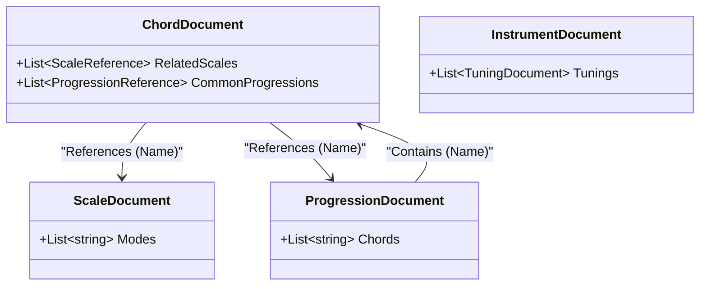

# Guitar Alchemist - Domain Models

This document outlines the consolidated domain models for the Guitar Alchemist platform, focusing on the MongoDB persistence layer and Vector Search integration.

## 📚 Core Domain Models

### 🧬 Base Classes

#### `DocumentBase`
The fundamental base class for all MongoDB documents.
- **Fields**:
  - `Id` (ObjectId): Unique identifier.
  - `CreatedAt` (DateTime): Creation timestamp.
  - `UpdatedAt` (DateTime): Last modification timestamp.
  - `Metadata` (Dictionary<string, string>): Extensible metadata.

#### `RagDocumentBase` : `DocumentBase`
Base class for entities supporting **Vector Search** (RAG).
- **Fields**:
  - `Embedding` (float[]): Vector representation (e.g., 1536d for OpenAI text-embedding-3-small).
  - `SearchText` (string): Text content used to generate the embedding.
- **Methods**:
  - `GenerateSearchText()`: Abstract method to populate `SearchText` from entity properties.

---

### 🎵 Musical Entities

#### `ChordDocument` : `RagDocumentBase`
Represents a musical chord concept.
- **Key Fields**:
  - `Name`, `Root`, `Quality`: Core identity.
  - `Intervals`, `Notes`: Musical structure.
  - `RelatedScales` (List<ScaleReference>): Scales this chord fits into.
  - `CommonProgressions` (List<ProgressionReference>): Progressions containing this chord.
- **Vector Search Context**: Name, Root, Quality, Intervals, Notes, Related Scales, Common Progressions.

#### `ScaleDocument` : `RagDocumentBase`
Represents a musical scale.
- **Key Fields**:
  - `Name`: Scale name.
  - `Notes`, `Intervals`: Scale structure.
  - `IntervalClassVector`, `ModalFamily`: Set theory and modal classification.
  - `Modes`: List of related mode names.
  - `Usage`: Musical application description.
- **Vector Search Context**: Name, Notes, Intervals, Description, Usage, Tags.

#### `ProgressionDocument` : `RagDocumentBase`
Represents a chord progression template.
- **Key Fields**:
  - `Name`: Progression name (e.g., "ii-V-I").
  - `Key`: Tonic key.
  - `Chords`: List of chord names.
  - `RomanNumerals`: Analysis (e.g., ["ii7", "V7", "Imaj7"]).
  - `Category`: Genre or style (e.g., "Jazz").
- **Vector Search Context**: Name, Key, Category, Description, Chords, Roman Numerals.

#### `InstrumentDocument` : `RagDocumentBase`
Represents a musical instrument configuration.
- **Key Fields**:
  - `Name`, `Category` (e.g., "Guitar"), `Family`.
  - `StringCount`: Number of strings.
  - `Tunings` (List<TuningDocument>): Supported tunings.
  - `Range`: Pitch range.
- **Vector Search Context**: Name, Category, StringCount, Description, Family, Range, Tuning Names.

---

### 🧱 Reference & Value Objects

These entities are typically embedded or used as lookups.

#### `TuningDocument`
- **Fields**: `Name`, `Notes`, `IsStandard`, `Description`.
- **Usage**: Embedded in `InstrumentDocument`.

#### `FretboardPosition` (Concept)
- **Fields**: `String`, `Fret`, `Note`, `Interval`, `Finger`.
- **Usage**: Used in `VoicingEntity` (implicit) and API responses for visualization.

#### `VoicingEntity`
*Note: A specialized entity for physical chord realizations with extensive analysis.*
- **Fields**: `Diagram`, `MidiNotes`, `Difficulty`, `ConsonanceScore`, `Embedding` (double[]).
- **Usage**: Detailed fretboard analysis and chatbot retrieval.

---

### 🔗 Entity Relationships

## 🛠️ Mapping & Conventions

- **Bson Conventions**: All properties are mapped to **camelCase** in MongoDB via global convention (assumed) or explicit `[BsonElement]` attributes (as seen in `VoicingEntity`).
- **Vector Indexing**:
  - Index Name: `vector_index` (standard)
  - Dimensions: 1536
  - Similarity: Cosine
  - Field: `embedding` (mapped from `Embedding`)

## 📋 Consolidation Actions Taken

1.  **Unified RAG Capability**: `ChordDocument`, `InstrumentDocument`, and `ProgressionDocument` now inherit from `RagDocumentBase` alongside `ScaleDocument`.
2.  **Consistent Search Text**: All RAG-enabled entities implement `GenerateSearchText()` to serialize relevant metadata for embedding generation.
3.  **Namespace Cleanup**: Standardized usages of `GA.Data.MongoDB.Models.Rag` and `References`.
