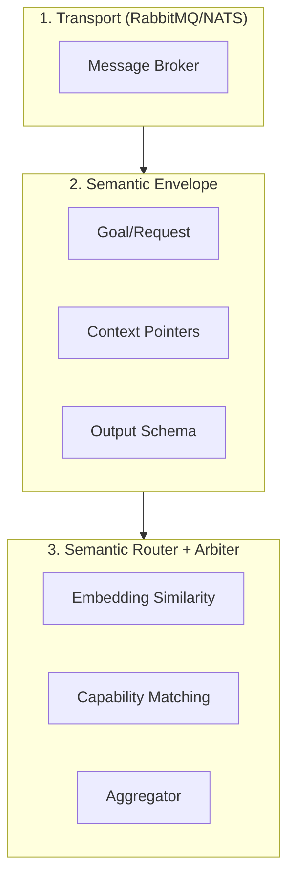

# Semantic Event Routing Architecture

**Status:** Proposed  
**Owner:** Gemini  
**Source:** [ChatGPT Research](file:///C:/Users/spare/source/repos/ga/Common/GA.Business.ML/Documentation/Research/ChatGPT-Semantic%20Event%20Routing.md)

## Overview

Multi-agent orchestration using semantic routing instead of topic-based message passing. Enables fuzzy responses with explicit confidence/evidence protocols.

## Architecture Layers



## Semantic Envelope Schema

```json
{
  "goal": "Explain this tab + propose chord naming options",
  "context_pointers": ["doc://tabs/001", "session://current"],
  "constraints": { "time_budget_ms": 5000, "confidence_threshold": 0.7 },
  "output_schema": "TaskResult"
}
```

## Confidence Protocol

Every agent response MUST include:

| Field | Purpose |
|-------|---------|
| `confidence` | Calibrated 0-1 score (not vibes) |
| `evidence` | Pointers, quotes, hashes |
| `assumptions` | Explicit preconditions |
| `repro_steps` | How to verify |
| `contradictions` | What disagrees |

## Agent Registry (Proposed)

| Agent | Responsibility |
|-------|----------------|
| TabAgent | Parse ASCII/GP tabs → notes, rhythms, positions |
| TheoryAgent | Pitch classes → chords, functions, tonality |
| TechniqueAgent | Fingerings, constraints, alternatives |
| ComposerAgent | Variations, reharmonizations |
| CriticAgent | Detect contradictions, score outputs |

## Integration Points

- **GaChatbot**: Phase 4 roadmap item for multi-agent orchestration
- **TARS**: Natural fit for `.trsx` workflow execution
- **OPTIC-K**: Semantic routing by embedding similarity

## Related

- [AI Testing Roadmap](file:///C:/Users/spare/source/repos/ga/Common/GA.Business.ML/Documentation/Architecture/ai_testing_roadmap.md)
- [Spectral RAG Chatbot Track](../spectral-rag-chatbot/index.md)
