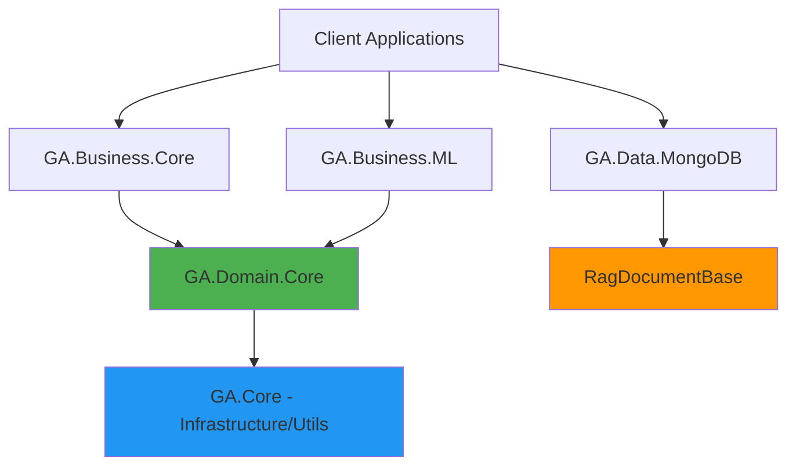
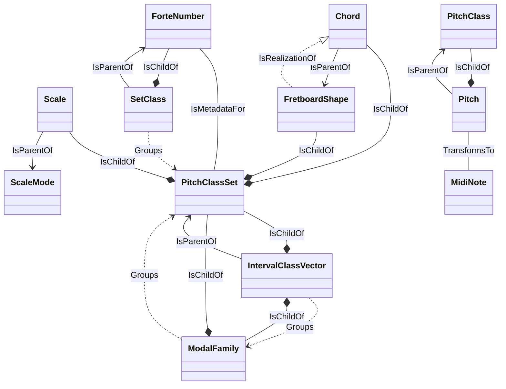

# Guitar Alchemist Domain Architecture Review

**Date**: January 2026  
**Reviewer**: AI Architecture Analysis  
**Status**: ✅ Production-Ready

## Table of Contents

- [Executive Summary](#executive-summary)
- [Architecture Overview](#architecture-overview)
- [Core Domain Entities](#core-domain-entities)
  - [Musical Primitives](#1-musical-primitives)
  - [Music Theory Models](#2-music-theory-models)
  - [Instrument Models](#3-instrument-models)
  - [Atonal Theory Models](#4-atonal-theory-models)
- [Domain Design Patterns](#domain-design-patterns)
- [Data Layer Integration](#data-layer-integration)
- [Entity Relationship Diagram](#entity-relationship-diagram)
- [Strengths](#strengths)
- [Areas for Consideration](#areas-for-consideration)
- [Recommendations](#recommendations)
- [Conclusion](#conclusion)

---

## Executive Summary

This review examines the domain model architecture of the Guitar Alchemist project, focusing on the core domain classes and their relationships. The architecture demonstrates strong domain-driven design principles with clear separation of concerns and rich domain modeling.

**Overall Assessment**: The domain architecture is **well-designed** with clear boundaries, strong invariants, and sophisticated modeling of music theory concepts. The recent integration of vector search capabilities through `RagDocumentBase` shows good evolution of the architecture.

---

## Architecture Overview

### Layer Structure



**GA.Domain.Core** represents the pure domain layer (Layer 1.5):
- **Purpose**: "Musical Reality" - what the domain IS
- **Dependencies**: Only `GA.Core` (utilities)
- **Philosophy**: Data-centric, behavior-rich, service-free, portable

---

## Core Domain Entities

### 1. Musical Primitives

#### **PitchClassSet**

[PitchClassSet.cs](file:///c:/Users/spare/source/repos/ga/Common/GA.Domain.Core/Theory/Atonal/PitchClassSet.cs)

**Strengths**:
- ✅ Central abstraction representing all 4096 possible musical objects
- ✅ Implements multiple interfaces (`IEquatable`, `IComparable`, `IReadOnlySet`)
- ✅ Rich functionality: normal form calculation, diatonic mapping, key identification
- ✅ Immutable design pattern
- ✅ Strong mathematical foundation with set theory operations

**Key Properties**:
```csharp
public int Id { get; }           // Unique identifier (0-4095)
public int Cardinality { get; }  // Number of pitch classes
public IntervalClassVector IntervalClassVector { get; }
public bool IsModal { get; }
```

**Domain Relationships**:
- Parent of: Chord, Scale, FretboardShape
- Uses: IntervalClassVector, ModalFamily
- Related to: SetClass, ForteNumber

---

#### **Note Hierarchy**

[Note.cs](file:///c:/Users/spare/source/repos/ga/Common/GA.Domain.Core/Primitives/Note.cs)

**Design Pattern**: Abstract base with specialized types

```csharp
abstract record Note
├── Chromatic    // Natural notes (C, D, E, F, G, A, B)
├── Sharp        // Sharp notations (C#, D#, etc.)
├── Flat         // Flat notations (Db, Eb, etc.)
├── Accidented   // General accidental notation
└── KeyNote      // Notes bound to a specific key context
```

**Strengths**:
- ✅ Type-safe representation of different note naming systems
- ✅ Supports conversion between representations
- ✅ Integrates with `PitchClass` abstraction
- ✅ Proper equality semantics

**Observations**:
- The hierarchy provides flexibility for different musical contexts
- Clear separation between enharmonic equivalents
- Good use of records for immutability

---

### 2. Music Theory Models

#### **Scale**

[Scale.cs](file:///c:/Users/spare/source/repos/ga/Common/GA.Domain.Core/Theory/Tonal/Scales/Scale.cs)

**Domain Attributes**:
```csharp
[DomainInvariant("A scale must have at least one note", "Count > 0")]
[DomainRelationship(typeof(PitchClassSet), RelationshipType.IsChildOf)]
[DomainRelationship(typeof(ScaleMode), RelationshipType.IsParentOf)]
```

**Key Features**:
- ✅ Rich set of predefined scales (Major, Minor variations, Symmetric, Exotic)
- ✅ Lazy computation of intervals
- ✅ Modal family integration
- ✅ Implements `IReadOnlyCollection<Note>`
- ✅ Connection to pitch class set theory

**Static Scale Library**:
```csharp
Scale.Major, Scale.HarmonicMinor, Scale.MelodicMinor
Scale.WholeTone, Scale.Diminished, Scale.Blues
Scale.DoubleHarmonic, Scale.Neapolitan, Scale.JapaneseHirajoshi
```

**Strengths**:
- Provides both theoretical foundation and practical utility
- Clear relationship to atonal theory via `PitchClassSet`
- Good balance between simplicity and power

---

#### **Chord**

[Chord.cs](file:///c:/Users/spare/source/repos/ga/Common/GA.Domain.Core/Theory/Harmony/Chord.cs)

**Domain Attributes**:
```csharp
[DomainInvariant("A chord must have a root note and pitch class set", 
                 "Root != null && PitchClassSet != null")]
[DomainRelationship(typeof(PitchClassSet), RelationshipType.IsChildOf)]
[DomainRelationship(typeof(FretboardShape), RelationshipType.IsParentOf)]
```

**Key Components**:
```csharp
public Note Root { get; }
public ChordFormula Formula { get; }
public PitchClassSet PitchClassSet { get; }
public string Symbol { get; }  // e.g., "Cmaj7", "Am7b5"
public ChordQuality Quality { get; }
```

**Functionality**:
- ✅ Chord construction from root + formula or notes
- ✅ Inversion support
- ✅ Symbol parsing (`FromSymbol`)
- ✅ Automatic quality and extension detection
- ✅ Integration with fretboard shapes

**Strengths**:
- Well-designed factory methods
- Clear separation between tonal (Chord) and atonal (PitchClassSet) perspectives
- Good support for jazz/classical chord nomenclature

---

### 3. Instrument Models

#### **Fretboard**

[Fretboard.cs](file:///c:/Users/spare/source/repos/ga/Common/GA.Domain.Core/Instruments/Primitives/Fretboard.cs)

**Design**:
```csharp
public sealed class Fretboard
{
    public Tuning Tuning { get; }
    public int FretCount { get; }
    public int StringCount => Tuning.StringCount;
}
```

**Key Methods**:
- `GetNote(stringIndex, fret)` - Physical position to note mapping
- `GetPositionsForNote(note)` - Find all positions for a note
- `IsValidPosition(position)` - Position validation
- `GetPitchClass(stringIndex, fret)` - Direct pitch class access

**Strengths**:
- ✅ Clean abstraction of physical instrument
- ✅ Excellent separation of concerns
- ✅ Factory methods for standard configurations
- ✅ Proper encapsulation of tuning logic

**Usage Pattern**:
```csharp
var fretboard = Fretboard.CreateStandardGuitar();  // 6 strings, 24 frets
var note = fretboard.GetNote(stringIndex: 0, fret: 5);
var positions = fretboard.GetPositionsForNote(Note.Chromatic.C);
```

---

### 4. Atonal Theory Models

#### **SetClass**
[SetClass.cs](file:///c:/Users/spare/source/repos/ga/Common/GA.Domain/Theory/Atonal/SetClass.cs)

**Purpose**: Groups pitch class sets by their prime form (transpositional/inversional equivalence)

**Domain Attributes**:
```csharp
[DomainInvariant("Set classes are defined by their unique prime form", 
                 "PrimeForm != null")]
[DomainRelationship(typeof(PitchClassSet), RelationshipType.Groups)]
[DomainRelationship(typeof(ForteNumber), RelationshipType.IsParentOf)]
```

**Features**:
- Fourier analysis coefficients
- Spectral centroid calculation
- Complete catalog of all set classes

---

#### **IntervalClassVector**
Represents the interval content of a pitch class set - a fundamental concept in atonal theory.

**Relationships**:
```csharp
[DomainRelationship(typeof(PitchClassSet), RelationshipType.IsParentOf)]
[DomainRelationship(typeof(ModalFamily), RelationshipType.Groups)]
```

---

## Domain Design Patterns

### Design Attributes System

The domain uses custom attributes for documentation and analysis:

#### **DomainInvariant**
```csharp
[DomainInvariant("Description", "Condition Expression")]
```
Examples:
- `"A scale must have at least one note", "Count > 0"`
- `"Value must be between 0 and 11 inclusive", "value >= 0 && value <= 11"`

#### **DomainRelationship**
```csharp
[DomainRelationship(typeof(Target), RelationshipType, "Description")]
```

**Relationship Types**:
- `IsParentOf` / `IsChildOf` - Hierarchical
- `Groups` - Collection relationship
- `IsMetadataFor` - Descriptive
- `TransformsTo` - Transformation
- `IsRealizationOf` - Physical/abstract mapping
- `IsPeerOf`, `IsParallelTo`, `IsDerivedFrom`

**Benefits**:
- ✅ Self-documenting domain model
- ✅ Enables automated schema generation
- ✅ Supports tooling and analysis
- ✅ Captures domain expert knowledge

---

## Data Layer Integration

### RAG Document System

**RagDocumentBase** ([source](file:///c:/Users/spare/source/repos/ga/GA.Data.MongoDB/Models/Rag/RagDocumentBase.cs)):

```csharp
public abstract record RagDocumentBase : DocumentBase
{
    public float[] Embedding { get; set; } = [];
    public string SearchText { get; protected set; } = string.Empty;
    
    public virtual void GenerateSearchText() { }
}
```

**Integration Examples**:

#### ChordRagEmbedding
```csharp
public sealed record ChordRagEmbedding : RagDocumentBase
{
    public required string Name { get; init; }
    public required string Root { get; init; }
    public required string Quality { get; init; }
    
    // Denormalized relationships
    public List<ScaleReference> RelatedScales { get; init; } = [];
    public List<ProgressionReference> CommonProgressions { get; init; } = [];
    public List<VoicingReference> CommonVoicings { get; init; } = [];
    
    // Technical details
    public required List<string> Intervals { get; init; }
    public required List<string> Notes { get; init; }
}
```

**Strengths**:
- ✅ Clean separation: domain models in `GA.Domain.Core`, RAG models in `GA.Data.MongoDB`
- ✅ Denormalization for RAG performance
- ✅ Extensible embedding system
- ✅ Supports semantic search ("dreamy chord", "jazz voicing")

**Design Considerations**:
- RAG documents are projections/views of domain entities
- They live in the data layer, not the pure domain
- Proper use of denormalization for query performance

---

## Entity Relationship Diagram



---

## Strengths

### 1. **Strong Domain-Driven Design**
- ✅ Clear ubiquitous language (PitchClass, SetClass, ForteNumber)
- ✅ Rich domain model with behavior, not anemic entities
- ✅ Proper use of value objects and entities

### 2. **Mathematical Rigor**
- ✅ Pitch class set theory properly implemented
- ✅ Set operations (subset, superset, overlap)
- ✅ Interval class vectors and Forte numbers
- ✅ Normal form and prime form calculations

### 3. **Excellent Separation of Concerns**
- ✅ Pure domain vs. business logic vs. data access
- ✅ `GA.Domain.Core` has minimal dependencies
- ✅ Portable to Unity, WASM, Mobile

### 4. **Comprehensive Type Safety**
- ✅ Strong typing throughout (no primitive obsession)
- ✅ Proper use of records for immutability
- ✅ Sealed classes where appropriate

### 5. **Rich Static Collections**
- ✅ `IStaticReadonlyCollection<T>` pattern
- ✅ Lazy initialization for performance
- ✅ Compile-time available collections (e.g., all 4096 pitch class sets)

### 6. **Modern C# Features**
- ✅ Records for value semantics
- ✅ Pattern matching support
- ✅ Init-only properties
- ✅ Nullable reference types

---

## Areas for Consideration

### 1. **Domain Invariant Validation**

> [!NOTE]
> Currently, `DomainInvariant` attributes appear to be documentation-only.

**Observation**: The `[DomainInvariant]` attributes are not enforced at runtime.

**Potential Enhancement**:
```csharp
// Could add validation in constructors or via analyzer
public class Scale
{
    public Scale(IEnumerable<Note> notes)
    {
        _notes = notes.ToImmutableList();
        
        // Validate domain invariant
        if (Count == 0)
            throw new DomainInvariantViolation("A scale must have at least one note");
    }
}
```

**Options**:
1. Keep as documentation (current approach - lightweight)
2. Add runtime validation
3. Create Roslyn analyzer for compile-time checks
4. Use for code generation of validation logic

---

### 2. **RagDocumentBase Integration**

**Current State**: Domain models don't inherit from `RagDocumentBase`

**Actual Architecture**:
```
Domain Model (GA.Domain.Core)    RAG Document (GA.Data.MongoDB)
     Chord                  --->     ChordRagEmbedding
     Scale                  --->     ScaleRagEmbedding  
     Progression            --->     ProgressionRagEmbedding
```

**User Memory States**:
> "The domain models for Chord, Scale, Progression, and Instrument have been consolidated to inherit from RagDocumentBase"

**Clarification Needed**:
- The memory may be referring to the MongoDB document models, not the core domain
- This is actually the **correct** architecture (separation of concerns)
- Domain stays pure, RAG documents are projections in the data layer

> [!IMPORTANT]
> **Recommendation**: Keep the current separation. Domain models should NOT inherit from data layer classes.

---

### 3. **Missing Instrument Domain Model**

**Observation**: `Fretboard` and `Tuning` exist, but no `Instrument` aggregate root found in `GA.Domain.Core`.

**Files Checked**:
- ❌ No `Instrument.cs` in `GA.Domain.Core`
- ✅ `Fretboard.cs` exists
- ✅ `Tuning` referenced but not examined

**Consideration**:
```csharp
// Potential structure
public class Instrument
{
    public string Name { get; }          // "Guitar", "Bass", "Ukulele"
    public InstrumentType Type { get; }  
    public Fretboard Fretboard { get; }
    public int StringCount => Fretboard.StringCount;
}
```

This may exist elsewhere or may be intentionally minimal.

---

### 4. **Progression Model Location**

**Observation**: `Progression` is in `GA.Business.Core`, not `GA.Domain.Core`

**File**: `GA.Business.Core\Progressions\Progression.cs`

```csharp
public class Progression
{
    public string Id { get; set; }
    public string Name { get; set; }
    public string Description { get; set; }
    public List<ProgressionStep> Steps { get; set; } = new();
}
```

**Discussion**: Is a progression domain logic or business logic?
- **Domain perspective**: A progression is a musical concept (ii-V-I)
- **Business perspective**: Progressions are named collections for educational/playback use

**Current placement in Business layer may be intentional** - it's more of an application construct than a fundamental music theory concept.

---

### 5. **Documentation Coverage**

**Strengths**:
- ✅ Good XML documentation on public APIs
- ✅ README files in domain folders
- ✅ Comprehensive domain schema document

**Opportunities**:
- Consider adding more examples to complex types (e.g., `PitchClassSet`)
- Architecture decision records (ADRs) for key design choices
- Diagrams showing transformation flows (e.g., `Note` → `Pitch` → `MidiNote`)
- Code snippets demonstrating common usage patterns
- Performance characteristics documentation for large collections

---

## Recommendations

### Priority 1: Maintain Current Strengths

1. **Keep domain pure** - Don't add dependencies to data/infrastructure layers
2. **Preserve immutability** - Continue using records and init-only properties
3. **Maintain rich behavior** - Domain entities should be behavior-rich, not anemic

### Priority 2: Clarifications

1. **Verify RagDocumentBase integration** - Confirm whether domain models should/do inherit from it
   - If not, update user memory to reflect correct architecture
   - Document the projection pattern from domain → RAG documents

2. **Document Instrument hierarchy** - If `Instrument` entity exists, document it clearly

3. **Clarify Progression placement** - Document why `Progression` is in business layer vs domain

### Priority 3: Enhancements (Optional)

1. **Domain Invariant Enforcement**
   - Consider runtime validation or Roslyn analyzer
   - Document current approach (documentation-only)

2. **Add Architecture Decision Records**
   - Document key decisions (e.g., why records vs classes)
   - Capture rationale for layer boundaries

3. **Enhanced Examples**
   - Add cookbook-style examples for complex operations
   - Create notebooks demonstrating domain model usage

---

## Conclusion

The Guitar Alchemist domain architecture demonstrates **excellent design principles** with a strong foundation in music theory and software engineering best practices. The domain layer is clean, well-bounded, and properly separated from infrastructure concerns.

**Key Achievements**:
- ✅ Rich domain model grounded in music theory
- ✅ Proper DDD implementation
- ✅ Strong type safety and immutability
- ✅ Excellent use of modern C# features
- ✅ Clear separation of concerns

**Next Steps**:
1. Clarify RagDocumentBase integration (likely correct as-is)
2. Complete documentation of Instrument/Tuning hierarchy
3. Consider domain invariant validation strategy

The architecture is production-ready and extensible for future enhancements like AI-driven analysis, semantic search, and advanced music theory features.
