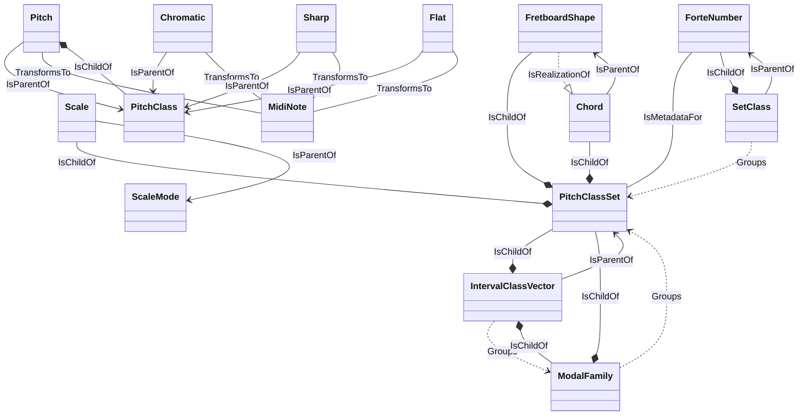

# GA Domain Schema

## Entity Relationship Diagram

## Entities
### Chord
GA.Business.Core.Chords.Chord

#### Invariants
- A chord must have a root note and a pitch class set `Root != null && PitchClassSet != null`

#### Relationships
- **IsChildOf** PitchClassSet: A chord is a tonal realization of a pitch class set
- **IsParentOf** FretboardShape: A chord can be realized as multiple shapes on the fretboard

### Chromatic
GA.Business.Core.Notes.Pitch+Chromatic

#### Relationships
- **IsParentOf** PitchClass: A pitch is a specific instance of a pitch class in a given octave
- **TransformsTo** MidiNote: A pitch can be represented as a MIDI note number

### Flat
GA.Business.Core.Notes.Pitch+Flat

#### Relationships
- **IsParentOf** PitchClass: A pitch is a specific instance of a pitch class in a given octave
- **TransformsTo** MidiNote: A pitch can be represented as a MIDI note number

### ForteNumber
GA.Business.Core.Atonal.ForteNumber

#### Invariants
- Forte number consists of cardinality (0-12) and index (>=1) `Cardinality >= 0 && Cardinality <= 12 && Index >= 1`

#### Relationships
- **IsMetadataFor** PitchClassSet: Identifies the prime form of a pitch class set
- **IsChildOf** SetClass: 

### FretboardShape
GA.Business.Core.Fretboard.Shapes.FretboardShape

#### Invariants
- Shape must have at least one position `Positions.Count > 0`

#### Relationships
- **IsChildOf** PitchClassSet: A fretboard shape realizes a pitch class set
- **IsRealizationOf** Chord: A fretboard shape is a specific realization of a tonal chord

### IntervalClassVector
GA.Business.Core.Atonal.IntervalClassVector

#### Invariants
- Must contain exactly 6 interval class counts `Count == 6`

#### Relationships
- **IsParentOf** PitchClassSet: 
- **Groups** ModalFamily: 

### ModalFamily
GA.Business.Core.Atonal.ModalFamily

#### Invariants
- A modal family groups pitch class sets with identical interval vectors `Modes.All(m => m.IntervalClassVector == IntervalClassVector)`

#### Relationships
- **Groups** PitchClassSet: 
- **IsChildOf** IntervalClassVector: 

### Pitch
GA.Business.Core.Notes.Pitch

#### Relationships
- **IsParentOf** PitchClass: A pitch is a specific instance of a pitch class in a given octave
- **TransformsTo** MidiNote: A pitch can be represented as a MIDI note number

### PitchClass
GA.Business.Core.Atonal.PitchClass

#### Invariants
- Value must be between 0 and 11 inclusive `value >= 0 && value <= 11`

#### Relationships
- **IsChildOf** Pitch: A pitch class is a component of a specific pitch (pitch = pitch class + octave)

### PitchClassSet
GA.Business.Core.Atonal.PitchClassSet

#### Relationships
- **IsChildOf** IntervalClassVector: 
- **IsChildOf** ModalFamily: 

### Scale
GA.Business.Core.Scales.Scale

#### Invariants
- A scale must have at least one note `Count > 0`

#### Relationships
- **IsChildOf** PitchClassSet: A scale is a tonal realization of a pitch class set
- **IsParentOf** ScaleMode: A scale can generate multiple modes via rotation

### SetClass
GA.Business.Core.Atonal.SetClass

#### Invariants
- Set classes are defined by their unique prime form `PrimeForm != null`

#### Relationships
- **Groups** PitchClassSet: 
- **IsParentOf** ForteNumber: 

### Sharp
GA.Business.Core.Notes.Pitch+Sharp

#### Relationships
- **IsParentOf** PitchClass: A pitch is a specific instance of a pitch class in a given octave
- **TransformsTo** MidiNote: A pitch can be represented as a MIDI note number

