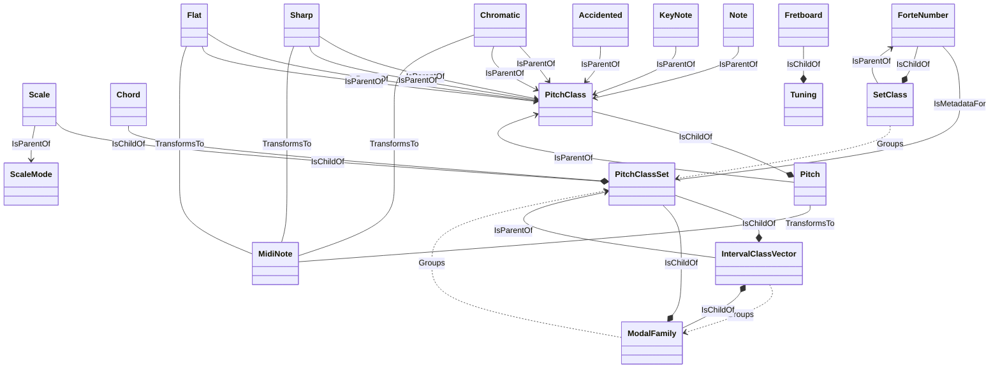

# GA Domain Schema

## Entity Relationship Diagram

## Entities
### Accidented
GA.Domain.Core.Primitives.Notes.Note+Accidented

#### Relationships
- **IsParentOf** PitchClass: A note contains a pitch class as one of its components

### Chord
GA.Domain.Core.Theory.Harmony.Chord

#### Invariants
- A chord must have a root note and a pitch class set `Root != null && PitchClassSet != null`

#### Relationships
- **IsChildOf** PitchClassSet: A chord is a tonal realization of a pitch class set

### Chromatic
GA.Domain.Core.Primitives.Notes.Note+Chromatic

#### Relationships
- **IsParentOf** PitchClass: A note contains a pitch class as one of its components

### Chromatic
GA.Domain.Core.Primitives.Notes.Pitch+Chromatic

#### Relationships
- **IsParentOf** PitchClass: A pitch is a specific instance of a pitch class in a given octave
- **TransformsTo** MidiNote: A pitch can be represented as a MIDI note number

### Flat
GA.Domain.Core.Primitives.Notes.Note+Flat

#### Relationships
- **IsParentOf** PitchClass: A note contains a pitch class as one of its components

### Flat
GA.Domain.Core.Primitives.Notes.Pitch+Flat

#### Relationships
- **IsParentOf** PitchClass: A pitch is a specific instance of a pitch class in a given octave
- **TransformsTo** MidiNote: A pitch can be represented as a MIDI note number

### ForteNumber
GA.Domain.Core.Theory.Atonal.ForteNumber

#### Invariants
- Forte number consists of cardinality (0-12) and index (>=1) `Cardinality >= 0 && Cardinality <= 12 && Index >= 1`

#### Relationships
- **IsMetadataFor** PitchClassSet: Identifies the prime form of a pitch class set
- **IsChildOf** SetClass: 

### Fretboard
GA.Domain.Core.Instruments.Primitives.Fretboard

#### Invariants
- Fretboard must have at least one string `StringCount > 0`
- Fretboard must have a valid number of frets `FretCount >= 0`

#### Relationships
- **IsChildOf** Tuning: A fretboard has a specific tuning

### IntervalClassVector
GA.Domain.Core.Theory.Atonal.IntervalClassVector

#### Invariants
- Must contain exactly 6 interval class counts `Count == 6`

#### Relationships
- **IsParentOf** PitchClassSet: 
- **Groups** ModalFamily: 

### KeyNote
GA.Domain.Core.Primitives.Notes.Note+KeyNote

#### Relationships
- **IsParentOf** PitchClass: A note contains a pitch class as one of its components

### ModalFamily
GA.Domain.Core.Theory.Atonal.ModalFamily

#### Invariants
- A modal family groups pitch class sets with identical interval vectors `Modes.All(m => m.IntervalClassVector == IntervalClassVector)`

#### Relationships
- **Groups** PitchClassSet: 
- **IsChildOf** IntervalClassVector: 

### Note
GA.Domain.Core.Primitives.Notes.Note

#### Relationships
- **IsParentOf** PitchClass: A note contains a pitch class as one of its components

### Pitch
GA.Domain.Core.Primitives.Notes.Pitch

#### Relationships
- **IsParentOf** PitchClass: A pitch is a specific instance of a pitch class in a given octave
- **TransformsTo** MidiNote: A pitch can be represented as a MIDI note number

### PitchClass
GA.Domain.Core.Theory.Atonal.PitchClass

#### Invariants
- Value must be between 0 and 11 inclusive `value >= 0 && value <= 11`

#### Relationships
- **IsChildOf** Pitch: A pitch class is a component of a specific pitch (pitch = pitch class + octave)

### PitchClassSet
GA.Domain.Core.Theory.Atonal.PitchClassSet

#### Invariants
- Pitch class set must be a valid subset of 12-tone chromatic scale `Cardinality >= 0 && Cardinality <= 12`

#### Relationships
- **IsChildOf** IntervalClassVector: 
- **IsChildOf** ModalFamily: 

### Scale
GA.Domain.Core.Theory.Tonal.Scales.Scale

#### Invariants
- A scale must have at least one note `Count > 0`

#### Relationships
- **IsChildOf** PitchClassSet: A scale is a tonal realization of a pitch class set
- **IsParentOf** ScaleMode: A scale can generate multiple modes via rotation

### SetClass
GA.Domain.Core.Theory.Atonal.SetClass

#### Invariants
- Set classes are defined by their unique prime form `PrimeForm != null`

#### Relationships
- **Groups** PitchClassSet: 
- **IsParentOf** ForteNumber: 

### Sharp
GA.Domain.Core.Primitives.Notes.Note+Sharp

#### Relationships
- **IsParentOf** PitchClass: A note contains a pitch class as one of its components

### Sharp
GA.Domain.Core.Primitives.Notes.Pitch+Sharp

#### Relationships
- **IsParentOf** PitchClass: A pitch is a specific instance of a pitch class in a given octave
- **TransformsTo** MidiNote: A pitch can be represented as a MIDI note number

### Tuning
GA.Domain.Core.Instruments.Tuning

#### Invariants
- Tuning must have at least one string `StringCount > 0`

