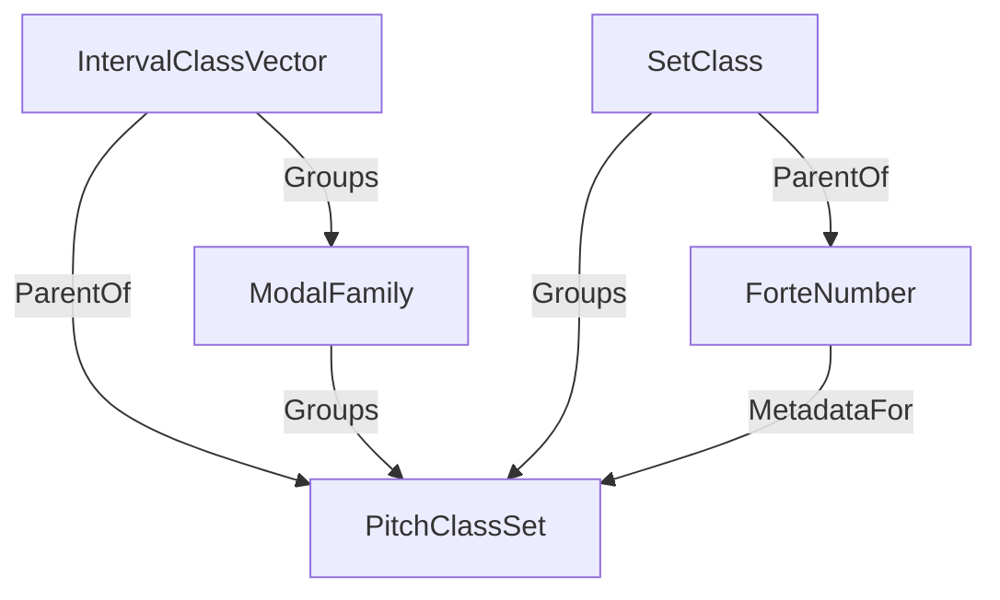

# Domain Schema Documentation

This document describes the parent-child and group relationships between domain classes in the Guitar Alchemist (GA)
project.

## Relationship Annotations

Relationships are programmatically annotated using the `DomainRelationshipAttribute` located in
`GA.Business.Core.Design`.

### IntervalClassVector

- **Groups**: `ModalFamily`
- **IsParentOf**: `PitchClassSet`

The `IntervalClassVector` represents the intervallic "DNA" of a set of pitch classes. Multiple `PitchClassSet` instances
can share the same `IntervalClassVector` (e.g., all modes of the Major scale).

### ModalFamily

- **Groups**: `PitchClassSet`
- **IsChildOf**: `IntervalClassVector`

A `ModalFamily` is a collection of `PitchClassSet`s that are related by rotation (modes) and share the same
`IntervalClassVector`.

### PitchClassSet

- **IsChildOf**: `IntervalClassVector`
- **IsChildOf**: `ModalFamily`

A `PitchClassSet` is a distinct collection of pitch classes. It is characterized by its `IntervalClassVector` and
belongs to a specific `ModalFamily`.

### SetClass

- **Groups**: `PitchClassSet`
- **IsParentOf**: `ForteNumber`

A `SetClass` is an equivalence class of pitch class sets related by transposition or inversion. It is identified by its
prime form.

### ForteNumber

- **IsMetadataFor**: `PitchClassSet`
- **IsChildOf**: `SetClass`

A `ForteNumber` provides a standardized musical nomenclature for a `SetClass`.

## Visual Schema

