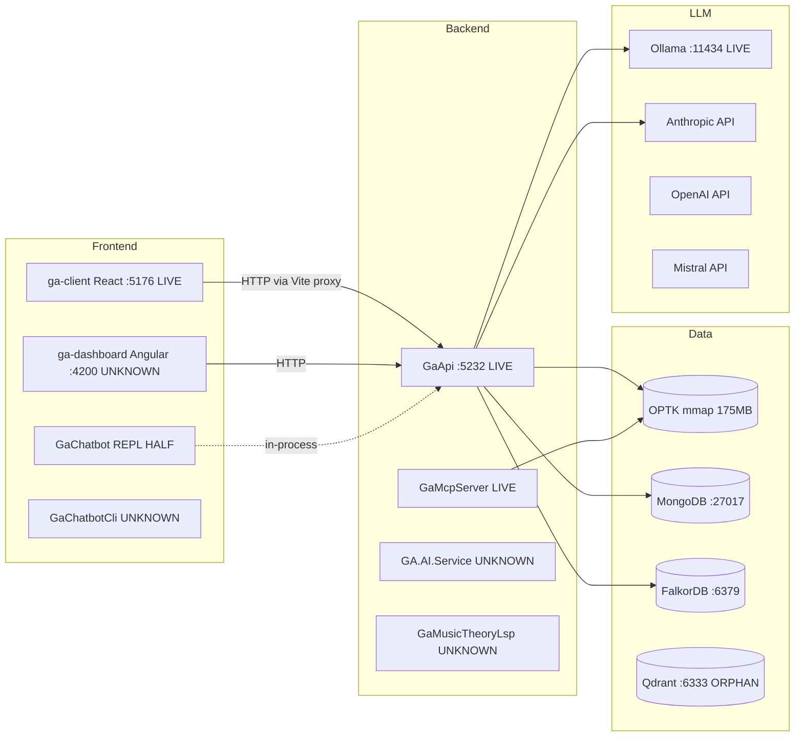

# Guitar Alchemist — Architecture

Authoritative entry point for understanding what runs, what stores data, what serves chat, and what is wired into what. Detail lives in the six subsystem docs linked below; this file is an index, a status snapshot, and a small set of conventions.

If a section here disagrees with a subsystem doc, the subsystem doc wins (it was verified more recently against the code). If a subsystem doc disagrees with the running code, the code wins — open an issue and update the doc.

## How to use these docs

- **New to the codebase?** Read this file top-to-bottom, then `apps-and-processes.md`, then whichever subsystem you're touching.
- **Making a change?** Find the relevant subsystem doc and update the `last_verified` date if you confirm or correct anything.
- **Adding a new subsystem doc?** Use kebab-case (`my-subsystem.md`), include the standard frontmatter, and add a row in the index below. Do not create new SCREAMING_SNAKE files at this level — the legacy ones are pending sweep (see audit).

## Layered architecture (recap)

Five-layer strict bottom-up dependency model, per `CLAUDE.md`:

1. **Core** — pure primitives (Note, Interval, Fretboard). `GA.Core`, `GA.Domain.Core`.
2. **Domain** — logic, YAML, BSP. `GA.Business.Core`, `GA.Business.Config`, `GA.BSP.Core`.
3. **Analysis** — chord/scale, voice leading, spectral. `GA.Business.Core.Harmony`, `GA.Business.Core.Fretboard`.
4. **AI/ML** — embeddings, vector search, RAG, OPTIC-K schema. `GA.Business.ML`.
5. **Orchestration** — `GA.Business.Core.Orchestration`, `GA.Business.Assets`, `GA.Business.Intelligence`.

Apps live in `Apps/`; AI code in layer 4; orchestration in layer 5; never in lower layers. Detail of who-uses-what is in `apps-and-processes.md`.

## Subsystem index

| Doc | Scope | One-line state |
|---|---|---|
| [apps-and-processes.md](apps-and-processes.md) | Every runnable .NET app, frontend, microservice, external dep | 19 .NET apps, 4 frontends, 13 external services; many half-built or referenced-but-deleted |
| [chatbot-overview.md](chatbot-overview.md) | Short onboarding map for the chatbot runtime, roadmap, and skill/DSL architecture | Current first read for engineers touching chatbot work |
| [chatbot-claude-handoff.md](chatbot-claude-handoff.md) | Prompt-ready context for Claude Code / coding agents before chatbot changes | Use for agent handoffs and long-running chatbot tasks |
| [chat-surfaces.md](chat-surfaces.md) | All chat/agent entry points (REST, SignalR, GraphQL, agents, IChatService) | Multiple live chat surfaces: Nebula canonical, public demo via GaApi SignalR, AG-UI/REST parallel surfaces |
| [data-storage.md](data-storage.md) | OPTIC-K mmap, MongoDB collections, FalkorDB, Qdrant, config YAMLs | OPTK + 20 Mongo collections; 4 RAG collections registered but never populated; Qdrant orphaned |
| [rag-pipeline.md](rag-pipeline.md) | Voicing-grounded chat, knowledge-grounded chat, partitioned RAG, agent grounding | One live RAG path (voicings via OPTK); knowledge-grounded path scaffolded but not wired |
| [frontends.md](frontends.md) | React, Angular, Blazor (none, actually), CLIs, MCP servers | ga-client React is the only verified-live UI; "GaChatbot" is a console REPL, the Blazor app's source is gone |
| [llm-providers.md](llm-providers.md) | IChatClient, IChatService, embeddings, TTS, selection rules | Three parallel chat abstractions in flight (MEAI IChatClient, legacy IChatService, raw HTTP in NebulaSidekick) |

## High-level process topology



## Status Snapshot (verified 2026-05-12)

What's actually running and answering requests today:

- **LIVE and serving traffic**: `GaApi /api/nebula/chat` for Harmonic Nebula, `GaApi /hubs/chatbot` for the public `/chatbot/` demo, AG-UI `/api/chatbot/agui/stream` for ga-client / Prime Radiant surfaces, `ga-client`, MongoDB, Ollama, and OPTIC-K mmap loaded by GaApi.
- **CANONICAL SUBSTRATE**: `IChatApplicationService` in `GA.Business.Core.Orchestration`, wrapped by trace/readiness/fallback decorators and backed by `ProductionOrchestrator`.
- **PARALLEL / FROZEN**: `GaChatbot.Api` is compiled but not the deployed public chatbot host; `GA.AI.Service` is frozen and should not receive new code without a concrete deploy reason.
- **DRIFT / CLEANUP CANDIDATES**: `ChatbotSessionOrchestrator.GetResponseAsync` / `StreamResponseAsync` remain registered but not on the canonical request path; stale startup and Docker references still mention historical chatbot services.

A more granular Keep / Consolidate / Delete decision table lives in [audit-2026-04-25.md](audit-2026-04-25.md).

## Conventions

**Filenames in this directory:** kebab-case for canonical docs (`apps-and-processes.md`). The remaining SCREAMING_SNAKE files in this folder are legacy and pending the sweep recommended in the audit.

**Frontmatter on every doc:**
```yaml
---
title: <Human-readable title>
scope: <One-sentence scope statement — what this doc covers and does not cover>
status: authoritative | draft | superseded
last_verified: YYYY-MM-DD
parent: docs/architecture/README.md     # optional, for child docs
---
```

**Status tokens** (use text, not emoji — project rule): `LIVE`, `HALF`, `DEAD`, `UNKNOWN`, `DRIFT`.

**File paths in claims:** forward slashes, repo-relative (e.g. `Apps/ga-server/GaApi/Program.cs:42`).

**Cross-doc references:** relative markdown links (`[chat-surfaces.md](chat-surfaces.md)`).

**No recommendations in subsystem docs.** Recommendations and decisions live in audit docs (dated `audit-YYYY-MM-DD.md`).

**Freshness check:** run `pwsh Scripts/check-architecture-docs.ps1` from the
repo root to verify required frontmatter on canonical kebab-case architecture
docs and flag docs older than 60 days unless marked stale. Legacy
SCREAMING_SNAKE files are skipped until the architecture sweep retires or
renames them.

## Out of scope for this index

- Implementation history ("how we got here") — see `docs/archive/` and git log.
- One-off plans and refactor progress trackers — `docs/plans/` and `docs/archive/`.
- Methodology and invariants — `docs/methodology/`.
- Quality baselines — `docs/quality/` and `state/quality/`.

## See also

- `CLAUDE.md` — project conventions, build commands, the layered architecture rule.
- `docs/architecture/audit-2026-04-25.md` — current Keep/Consolidate/Delete decisions.
- `docs/methodology/` — invariants, methodologies that constrain architecture.
