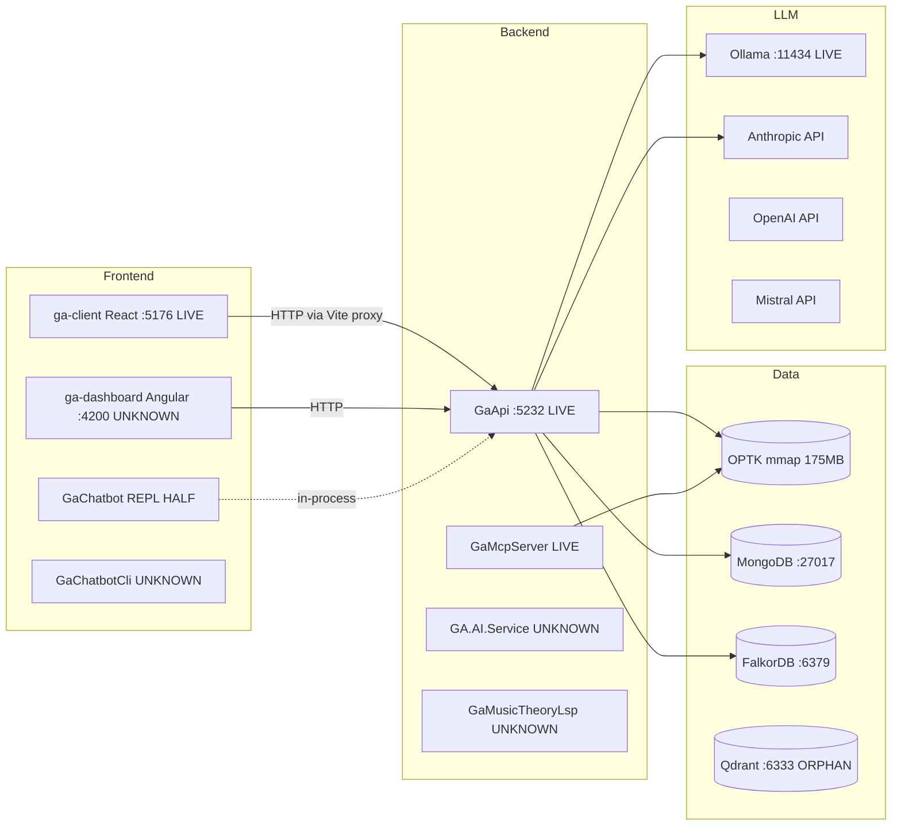

# Guitar Alchemist — Architecture

Authoritative entry point for understanding what runs, what stores data, what serves chat, and what is wired into what. This file is an index, a status snapshot, and a small set of conventions; detail lives in the topic docs under [Document index](#document-index).

If a section here disagrees with a topic doc, the topic doc wins (it was verified more recently against the code). If a topic doc disagrees with the running code, the code wins — open an issue and update the doc.

> **Index accuracy note (2026-05-31).** This index was reconciled against the files that actually exist in `docs/architecture/`. The earlier version linked to `data-storage.md`, `rag-pipeline.md`, `frontends.md`, and `llm-providers.md`, none of which were ever written — every link 404'd. They are now listed under [Planned docs](#planned-docs-not-yet-written) instead of as broken links. Until they exist, [audit-2026-04-25.md](audit-2026-04-25.md) is the fullest inventory of data stores, the RAG pipeline, frontends, and providers.

## How to use these docs

- **New to the codebase?** Read this file top-to-bottom, then [apps-and-processes.md](apps-and-processes.md) and [chatbot-overview.md](chatbot-overview.md), then whichever topic you're touching.
- **Making a change?** Find the relevant topic doc and update its `last_verified` date if you confirm or correct anything.
- **Adding a new doc?** Use kebab-case (`my-topic.md`), include the standard frontmatter (see [Conventions](#conventions)), add a row in the [Document index](#document-index), and verify the link resolves before committing. Do not create new SCREAMING_SNAKE files at this level — the legacy ones are pending sweep (see audit).

## Layered architecture (recap)

Five-layer strict bottom-up dependency model, per `CLAUDE.md` (full detail in [layers.md](layers.md)):

1. **Core** — pure primitives (Note, Interval, Fretboard). `GA.Core`, `GA.Domain.Core`.
2. **Domain** — logic, YAML, BSP. `GA.Business.Core`, `GA.Business.Config`, `GA.BSP.Core`.
3. **Analysis** — chord/scale, voice leading, spectral. `GA.Business.Core.Harmony`, `GA.Business.Core.Fretboard`.
4. **AI/ML** — embeddings, vector search, RAG, OPTIC-K schema. `GA.Business.ML`.
5. **Orchestration** — `GA.Business.Core.Orchestration`, `GA.Business.Assets`, `GA.Business.Intelligence`.

Apps live in `Apps/`; AI code in layer 4; orchestration in layer 5; never in lower layers. Detail of who-uses-what is in [apps-and-processes.md](apps-and-processes.md).

## Document index

These docs exist in `docs/architecture/` today (status reflects each doc's own frontmatter):

| Doc | Scope | Status |
|---|---|---|
| [apps-and-processes.md](apps-and-processes.md) | Inventory of every runnable .NET app, frontend, microservice, external dep | authoritative (2026-04-25) |
| [chatbot-overview.md](chatbot-overview.md) | Onboarding map for the chatbot runtime, roadmap, and skill/DSL architecture | authoritative (2026-05-12) |
| [chatbot-claude-handoff.md](chatbot-claude-handoff.md) | Prompt-ready context for Claude Code / coding agents before chatbot changes | authoritative (2026-05-12) |
| [chat-surfaces.md](chat-surfaces.md) | All chat/agent entry points (REST, SignalR, GraphQL, agents, IChatService) and the host that serves each | **authoritative (2026-05-13)** |
| [layers.md](layers.md) | The five-layer dependency model in detail | living |
| [cherny-loops-cross-repo.md](cherny-loops-cross-repo.md) | Cherny self-improvement loops across ga / ix / Demerzel / tars | living |
| [audit-2026-04-25.md](audit-2026-04-25.md) | Keep/Consolidate/Delete decision table — apps, data stores, frontends, providers | draft |

(`DOMAIN_SCHEMA.md` is a legacy SCREAMING_SNAKE file pending the rename sweep; not part of the canonical kebab-case set.)

### Planned docs (not yet written)

These per-subsystem deep-dives were intended but **do not exist yet** — do not link to these paths until the files exist. Until then, [audit-2026-04-25.md](audit-2026-04-25.md) and [apps-and-processes.md](apps-and-processes.md) cover this ground:

- `data-storage.md` — OPTIC-K mmap, MongoDB collections, FalkorDB, Qdrant, config YAMLs.
- `rag-pipeline.md` — voicing-grounded + knowledge-grounded chat, partitioned RAG, agent grounding.
- `frontends.md` — React, Angular, CLIs, MCP servers.
- `llm-providers.md` — IChatClient, IChatService, embeddings, TTS, selection rules.

## High-level process topology



## Status snapshot

For the authoritative, code-verified breakdown of which chat surface is served by which host, see **[chat-surfaces.md](chat-surfaces.md)** (verified 2026-05-13) — it supersedes any chat-host claim previously inlined here. In summary:

- **LIVE and serving traffic**: `ga-client`, `GaApi`, MongoDB, Ollama, and the OPTIC-K mmap loaded by GaApi. The chatbot surfaces (Harmonic Nebula, the public `/chatbot/` demo, AG-UI streaming) are enumerated with their exact hosts in [chat-surfaces.md](chat-surfaces.md).
- **CANONICAL SUBSTRATE**: `IChatApplicationService` in `GA.Business.Core.Orchestration`, wrapped by trace/readiness/fallback decorators and backed by `ProductionOrchestrator`.
- **PARALLEL / FROZEN**: `GA.AI.Service` is frozen and should not receive new code without a concrete deploy reason. The `GaApi` vs `GaChatbot.Api` host question is tracked in [chat-surfaces.md](chat-surfaces.md).
- **DRIFT / CLEANUP CANDIDATES**: see the decision table in [audit-2026-04-25.md](audit-2026-04-25.md).

> The public demo is fronted by `demos.guitaralchemist.com`, a cloudflared tunnel to local dev servers — not a hermetic deploy. Treat its availability as best-effort.

## Conventions

**Filenames in this directory:** kebab-case for canonical docs (`chat-surfaces.md`). The remaining SCREAMING_SNAKE files (e.g. `DOMAIN_SCHEMA.md`) are legacy and pending the sweep recommended in the audit.

**Frontmatter on every doc:**
```yaml
---
title: <Human-readable title>
scope: <One-sentence scope statement — what this doc covers and does not cover>
status: authoritative | draft | superseded
last_verified: YYYY-MM-DD
parent: docs/architecture/README.md     # optional, for child docs
---
```

**Status tokens** (use text, not emoji — project rule): `LIVE`, `HALF`, `DEAD`, `UNKNOWN`, `DRIFT`.

**File paths in claims:** forward slashes, repo-relative (e.g. `Apps/ga-server/GaApi/Program.cs:42`).

**Cross-doc references:** relative markdown links (`[chat-surfaces.md](chat-surfaces.md)`) — and verify the target exists before committing (the previous index linked four files that were never written). `Scripts/audit-doc-links.py` scans the whole `docs/` tree for broken internal links.

**No recommendations in topic docs.** Recommendations and decisions live in audit docs (dated `audit-YYYY-MM-DD.md`).

**Freshness check:** run `pwsh Scripts/check-architecture-docs.ps1` from the repo root to verify required frontmatter on canonical kebab-case architecture docs and flag docs older than 60 days unless marked stale. Legacy SCREAMING_SNAKE files are skipped.

## Out of scope for this index

- Implementation history ("how we got here") — see `docs/archive/` and git log.
- One-off plans and refactor progress trackers — `docs/plans/` and `docs/archive/`.
- Methodology and invariants — `docs/methodology/`.
- Quality baselines — `docs/quality/` and `state/quality/`.

## See also

- `CLAUDE.md` — project conventions, build commands, the layered architecture rule.
- [audit-2026-04-25.md](audit-2026-04-25.md) — current Keep/Consolidate/Delete decisions and the fullest app/data/frontend/provider inventory.
- `docs/methodology/` — invariants, methodologies that constrain architecture.
