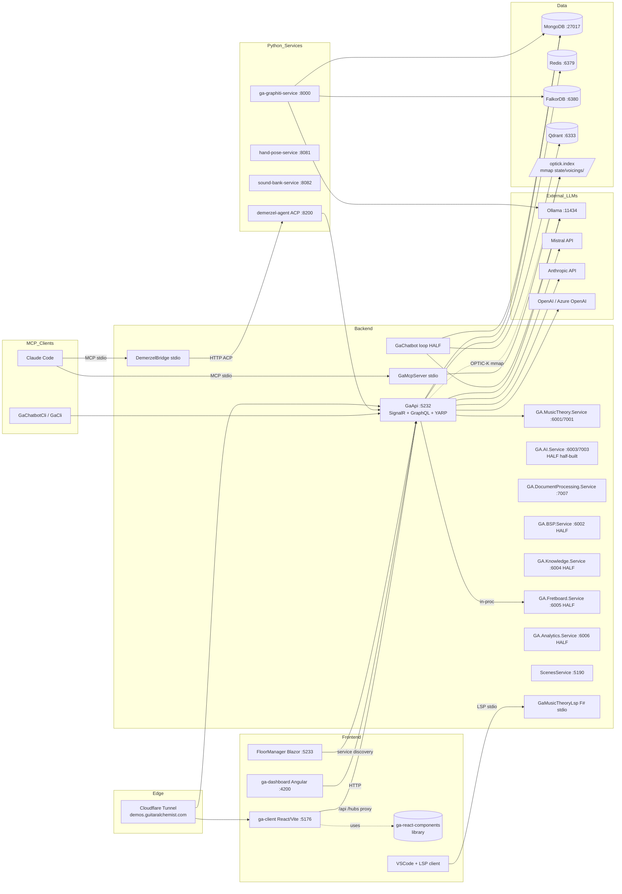

# Apps & Processes

Authoritative inventory of every runnable process in the Guitar Alchemist solution: .NET apps, frontends, microservices, and external dependencies. Scope: things that *run as a process*. Sibling docs cover chat surfaces, data storage, RAG pipelines, and LLM provider selection.

## Status legend

| Symbol | Meaning |
|---|---|
| OK live | Has code, builds, and a running process has been observed (port listening, request answered, or container running). |
| HALF half-built | Has code and may build, but DI is incomplete, dependencies are commented out in the Aspire host, or the process has never been verified end-to-end. |
| DEAD deprecated | Source still in repo, but referenced only from `docker-compose.yml` or stale config; no active path runs it. |
| ? unknown | Source compiles, but no evidence of when it was last invoked. |

The same legend symbols are used in the tables below.

## .NET apps under `Apps/`

Ports listed are the development defaults from `Properties/launchSettings.json` unless noted. "Aspire override" means `AllProjects.AppHost/Program.cs` may bind a different port at runtime.

| App | Path | Type | Default port(s) | Purpose | Status |
|---|---|---|---|---|---|
| **GaApi** | `Apps/ga-server/GaApi` | ASP.NET Core Web API + SignalR + GraphQL (HotChocolate) + YARP gateway | http 5232 / https 7184 | Main backend gateway: chat, voicing search, fretboard, OPTIC-K, GraphQL. Project type `Microsoft.NET.Sdk.Web`. | OK live (verified: `POST /api/nebula/chat` returns correct theory answers; ~97s on Ollama CPU) |
| **GA.MusicTheory.Service** | `Apps/ga-server/GA.MusicTheory.Service` | ASP.NET Core microservice | http 6001 / https 7001 | Theory operations (chords, scales, keys, intervals). Wired into Aspire host as `music-theory-service` and referenced by GaApi. | OK live (Aspire-registered) |
| **GA.AI.Service** | `Apps/ga-server/GA.AI.Service` | ASP.NET Core microservice | http 6003 / https 7003 | Independent AI/ML surface with its own `ChatController`, `AIAnalysisController`, `AdaptiveAIController`, etc. Has its own Dockerfile. Aspire registration is **commented out** (`AllProjects.AppHost/Program.cs:86-90`). | HALF half-built (code exists, not started by Aspire) |
| **GA.DocumentProcessing.Service** | `Apps/ga-server/GA.DocumentProcessing.Service` | ASP.NET Core microservice | http 7007 / https 7107 | YouTube ingestion, autonomous curation, retroaction loop (`AutonomousCurationController`, `DocumentProcessingController`, `RetroactionLoopController`, `YouTubeController`). Not in Aspire host. | HALF half-built |
| **GA.BSP.Service** | `Apps/ga-server/GA.BSP.Service` | ASP.NET Core microservice | http 6002 / https 7002 | BSP (binary space partition) dungeon/floor logic. Aspire registration commented out (`AllProjects.AppHost/Program.cs:79-83`). | HALF half-built |
| **GA.Knowledge.Service** | `Apps/ga-server/GA.Knowledge.Service` | ASP.NET Core microservice | http 6004 / https 7004 | Knowledge graph queries. Aspire registration commented out (`AllProjects.AppHost/Program.cs:92-96`). | HALF half-built |
| **GA.Fretboard.Service** | `Apps/ga-server/GA.Fretboard.Service` | ASP.NET Core microservice | http 6005 / https 7005 | Fretboard/voicing analysis. Referenced as a *project* by `GaApi.csproj` but Aspire registration commented out (`AllProjects.AppHost/Program.cs:99-103`). | HALF half-built (in-process via project ref; not running standalone) |
| **GA.Analytics.Service** | `Apps/ga-server/GA.Analytics.Service` | ASP.NET Core microservice | http 6006 / https 7006 | Analytics surface. Aspire registration commented out (`AllProjects.AppHost/Program.cs:106-110`). | HALF half-built |
| **AllProjects.AppHost** | `AllProjects.AppHost` | .NET Aspire orchestrator (`Aspire.Hosting.AppHost`) | Aspire dashboard (random) | Single entry point that boots Redis, MongoDB, FalkorDB, Graphiti, hand-pose, sound-bank, GaApi, MusicTheory service, chatbot, ScenesService, FloorManager, GaMcpServer, ga-client. | OK live |
| **GaChatbot** | `Apps/GaChatbot` | .NET Generic Host (Console with `Microsoft.Extensions.Hosting`) — *not Blazor; csproj is plain `Microsoft.NET.Sdk`* | none (console) | Spectral RAG chatbot driver loop ("Phase 15 — Qdrant Backend"). Many services are `<Compile Remove>`'d from the csproj — their replacements live in `GA.Business.Core.Orchestration`. | HALF half-built (DI partially gutted; runs interactive loop but RAG path is uncertain) |
| **GuitarAlchemistChatbot** | `Apps/GuitarAlchemistChatbot` | (was Blazor) | docker-compose: 7002 → 8080 | **Source folder is empty except for `obj/`.** `Apps/GuitarAlchemistChatbot/Dockerfile` and `docker-compose.yml:104-133` still reference it; `AllProjects.AppHost/Program.cs:135` still calls `builder.AddProject("chatbot", ...)`. The `.csproj` is missing — the Aspire/Docker references will fail. | DEAD deprecated (source removed; references stale) |
| **GaChatbotCli** | `Apps/GaChatbotCli` | .NET console (`OutputType=Exe`, `Microsoft.Extensions.Hosting`) | none | One-shot/interactive CLI for `ProductionOrchestrator`. Reads ANTHROPIC_API_KEY for SKILL.md skills. Usage: `dotnet run --project Apps/GaChatbotCli -- "parse Am7"`. | ? unknown (compiles; no telemetry on actual invocations) |
| **GaCli** | `Apps/GaCli` | F# console (`OutputType=Exe`) | none | Closure-runtime CLI: invokes `GaClosureRegistry.Global` — Domain, Pipeline, Agent, IO, Tab closures. Reads stdin when piped. | ? unknown |
| **GaMusicTheoryLsp** | `Apps/GaMusicTheoryLsp` | F# console — Language Server (LSP over stdio) | stdio | Music-theory DSL language server: chord progressions, fretboard navigation, scale transformations. VSCode client lives at `Apps/GaMusicTheoryLsp/client-vscode`. | ? unknown |
| **GaMcpServer** | `GaMcpServer` (repo root, *not* under `Apps/`) | .NET console — MCP server (stdio) | stdio | Exposes GA domain operations as MCP tools (`mcp__ga-dsl__*`). Holds `state/voicings/optick.index` mmap-locked at runtime — must be stopped before re-indexing. Aspire-registered as `ga-mcp-server`. | OK live (Aspire boots it; mmap-lock observable during OPTIC-K rebuild) |
| **FloorManager** | `Apps/FloorManager` | Blazor Server (`AddRazorComponents().AddInteractiveServerComponents()`) | http 5233 / https 7233 | BSP dungeon floor viewer. Talks to GaApi via Aspire service-discovery (`http://gaapi`). Aspire-registered as `floor-manager`. | OK live (Aspire-registered) |
| **ScenesService** | `Apps/ScenesService` | ASP.NET Core Web API (Swagger + MongoDB/GridFS) | http 5190 / https 7190 | GLB scene generator/server with cells/portals metadata. CORS allows `http://localhost:5173` and `:3000`. Aspire-registered as `scenes-service`. | OK live (Aspire-registered) |
| **InteractiveTutorial** | `Apps/InteractiveTutorial` | .NET console (Spectre.Console TUI) | none | Spectre-rendered interactive learning experience (figlet banner + menu). Note: csproj `<Compile Remove="Program.cs"/>` actually excludes Program.cs from build — only `DummyMain.cs` ships. | DEAD deprecated (Program.cs explicitly excluded from compilation) |
| **VoicingSearchDemo** | `Apps/VoicingSearchDemo` | .NET console (`OutputType=Exe`) | none | Standalone demo of the voicing semantic-search RAG path against the legacy `VoicingIndexingService`. | ? unknown (single-file demo; no Aspire registration) |
| **DemerzelBridge** | `Apps/demerzel-bridge/DemerzelBridge` | .NET console — MCP server (stdio) | stdio | MCP-to-ACP bridge: translates Claude Code MCP tool calls into HTTP runs against the Python ACP agent at `localhost:8200`. Configured in `.mcp.json` under key `demerzel`. | OK live (referenced from `.mcp.json:13-21`) |

### Python/F# apps under `Apps/`

| App | Path | Type | Default port(s) | Purpose | Status |
|---|---|---|---|---|---|
| **demerzel-agent** | `Apps/demerzel-agent` | Python ACP agent (FastAPI/uvicorn, `acp-sdk`) | http 8200 | Governance / pipeline / epistemic / what's-next agents over ACP. All run endpoints require `Authorization: Bearer ${DEMERZEL_API_KEY}`. | OK live (running paired with DemerzelBridge MCP) |
| **ga-graphiti-service** | `Apps/ga-graphiti-service` | Python FastAPI | http 8000 | Temporal knowledge graph (Graphiti) on top of FalkorDB + MongoDB. Aspire boots it as a Docker container with Dockerfile build. | OK live (port 8000 listening; Aspire-registered) |
| **hand-pose-service** | `Apps/hand-pose-service` | Python FastAPI (MediaPipe Hands) | http 8081 → container 8080 | Guitar hand-pose detection from images/video frames. Aspire-registered as `hand-pose-service`. | ? unknown (registered in Aspire; runtime not verified this session) |
| **sound-bank-service** | `Apps/sound-bank-service` | Python FastAPI (MusicGen) | http 8082 → container 8080 | AI-powered guitar sound-sample generation. Aspire-registered with Redis + MongoDB references. | ? unknown |

## Frontends

| Frontend | Path | Tech | Default port | Backend it talks to | Status |
|---|---|---|---|---|---|
| **ga-client** | `Apps/ga-client` | React 18 + Vite 5 + R3F (`@react-three/fiber`) + MUI v5 | 5176 (dev script `Scripts/start-dev.ps1`); Aspire binds 5173 via `AddNpmApp` | GaApi at `http://localhost:5232` — proxied via `vite.config.ts` for `/api` and `/hubs` (SignalR ws). Override via `GA_API_URL`. | OK live (port 5176 LISTENING) |
| **ga-dashboard** | `Apps/ga-dashboard` | Angular 21 + three.js 0.182 | 4200 (Angular default; docker-compose maps 4200→80 via nginx) | Not pinned in code; intended as standalone admin/dashboard. | ? unknown (no observed running process; not in Aspire) |
| **ga-react-components** | `ReactComponents/ga-react-components` | React 18 component library + Vite (build mode) — also has SignalR client and ag-grid | n/a (library, but ships a Vite dev mode + Playwright tests) | Component library consumed by `ga-client` via `file:../../ReactComponents/ga-react-components`. Not deployed standalone. | OK live (build target — consumed by ga-client) |
| **GaMusicTheoryLsp/client-vscode** | `Apps/GaMusicTheoryLsp/client-vscode` | VSCode extension (TypeScript) | n/a | Speaks LSP (stdio) to `GaMusicTheoryLsp` F# server. | ? unknown |

## External services

External processes the solution depends on. Aspire-managed = `AllProjects.AppHost/Program.cs` boots it as a container. Compose-managed = listed in `docker-compose.yml` only.

| Service | Port(s) | Source | Purpose | Status |
|---|---|---|---|---|
| **MongoDB** | 27017 | Aspire (`builder.AddMongoDB("mongodb")`) + `docker-compose.yml:7` (`mongo:7.0.5-alpine`) | Primary document store; database `guitar-alchemist`. | OK live (27017 LISTENING) |
| **Mongo Express** | 8081 (compose) | Aspire (`.WithMongoExpress()`) + `docker-compose.yml:33` | Mongo admin UI. | OK live |
| **Redis** | 6379 (default; falkordb shares via remap below) | Aspire (`builder.AddRedis("redis").WithRedisCommander().WithDataVolume(...)`) | Distributed cache (`Aspire.StackExchange.Redis.DistributedCaching`); shared LLM concurrency gate, hybrid cache. | OK live (port 6379 LISTENING) |
| **FalkorDB** | 6380 (host) → 6379 (container) | Aspire (`builder.AddContainer("falkordb", "falkordb/falkordb", "edge")`) + `docker-compose.yml:194` (4.0.0) | Redis-compatible graph DB used by Graphiti. Aspire remaps to 6380 to avoid clash with stock Redis. | OK live (containers running; FalkorDB UI at compose port 3000 if compose-launched) |
| **Qdrant** | 6333 (HTTP), 6334 (gRPC) | `docker-compose.yml:278` (`qdrant/qdrant:v1.10.1`); **not in Aspire host** | Vector DB for legacy/Phase-15 RAG (referenced from `GaChatbot/Program.cs:21` comment). | OK live (port 6333 LISTENING) |
| **Ollama** | 11434 | `docker-compose.yml:301` (`ollama/ollama:0.1.32`); also runs natively on host | Local LLM runner; default model `qwen:0.5b` per compose; production uses larger Ollama models for chat. | OK live (port 11434 LISTENING; ~97s latency on CPU verified through GaApi) |
| **Jaeger** | 16686 (UI), 4317/4318 (OTLP) | `docker-compose.yml:256` (`jaegertracing/all-in-one:1.51.0`); **not in Aspire host** (Aspire dashboard handles tracing locally) | Distributed tracing UI for OTLP exports. | ? unknown (compose-only; not running this session) |
| **Graphiti service** | 8000 | Aspire container build from `Apps/ga-graphiti-service` + `docker-compose.yml:217` | Temporal knowledge graph API (Python FastAPI). Depends on FalkorDB + MongoDB. | OK live (port 8000 LISTENING) |
| **MCP Gateway (Docker AI)** | 8811 | `docker-compose.yml:322` (`docker/mcp-gateway:latest`) | Docker MCP gateway (SSE) bridging mongodb/redis/memory MCP servers. | ? unknown (compose-only) |
| **Meshy AI MCP** | n/a (idle container) | `docker-compose.yml:339` builds from `mcp-servers/meshy-ai`; also referenced from `.mcp.json:8` as a stdio Node process | Meshy AI 3D-model generation MCP server. Compose runs it idle (`tail -f /dev/null`); active usage is via stdio per `.mcp.json`. | OK live (stdio invocation when Claude Code uses it) |
| **Mistral API** | (cloud HTTPS) | External — `MISTRAL_API_KEY` env var; Voxtral TTS (`voxtral-mini-tts-2603`) and `guitar-alchemist` agent on Mistral Medium | Cloud LLM/TTS provider (theory tribunal cross-validator + Demerzel "Oliver" voice). | OK live (per memory: `MISTRAL_API_KEY` set) |
| **Anthropic API** | (cloud HTTPS) | External — `ANTHROPIC_API_KEY`; package `Anthropic 12.8.0` in `GaApi.csproj` | Claude API for SKILL.md-driven skills in `GaChatbotCli` and other surfaces. | OK live |
| **Cloudflare Tunnel** | n/a (outbound tunnel) | External — `cloudflared` daemon, no in-repo config | Exposes `demos.guitaralchemist.com` to the public internet. Domain at Network Solutions; DNS on Cloudflare. | OK live (per memory `reference_cloudflare_deployment`) |
| **OpenAI / Azure OpenAI** | (cloud HTTPS) | External — packages `Azure.AI.OpenAI 2.2.0-beta.1`, `Microsoft.Extensions.AI.OpenAI` | Optional OpenAI/Azure OpenAI provider for chat/embeddings. | ? unknown (referenced; runtime usage not confirmed) |

## Process topology

## Open questions

- **GaChatbotCli** — is this still invoked in any workflow, or vestigial from pre-orchestrator era? `Program.cs` mentions "SKILL.md-driven skills" suggesting recent maintenance, but no script under `Scripts/` calls it.
- **GaCli** (F#) — same question. Closure registry has been actively extended (Domain/Pipeline/Agent/IO/Tab closures), but no production caller is visible.
- **VoicingSearchDemo** — single-file demo against the *legacy* `VoicingIndexingService`. Has the OPTIC-K migration superseded it? No Aspire registration, no `Scripts/` reference.
- **InteractiveTutorial** — csproj `<Compile Remove="Program.cs"/>` removes the entry point; only `DummyMain.cs` is compiled. Is this intentionally stubbed or pending revival?
- **GuitarAlchemistChatbot** — folder contains only `obj/`; the `.csproj` is gone but `AllProjects.AppHost/Program.cs:135` and `docker-compose.yml:104` still reference it. Confirm: is this fully retired, or expected to be restored?
- **ga-dashboard (Angular)** — is this an active second frontend or an experiment? It is in `docker-compose.yml` but not in the Aspire host. No backend wiring observed in the Angular source.
- **Six microservices commented out in Aspire** (`GA.AI.Service`, `GA.BSP.Service`, `GA.Knowledge.Service`, `GA.Fretboard.Service`, `GA.Analytics.Service`, `GA.DocumentProcessing.Service`) — code exists with controllers, ports defined; orchestration disabled with TODO comments. Status of completion criteria unclear.
- **GA.AI.Service vs GaApi chat** — both expose chat controllers. Which one is the canonical chat backend going forward, given GaApi already proxies and runs in-process?
- **Jaeger** — listed in compose but not in the Aspire host (Aspire has its own dashboard). Is compose-Jaeger still used for any production tracing?
- **MCP Gateway (Docker AI)** — runtime usage unknown; has it been superseded by direct stdio MCP entries in `.mcp.json`?
- **Hand-pose / sound-bank services** — registered in Aspire but no observed runtime traffic this session. Are these used by ga-client, or experimental?
- **HTTPS profile for GaApi (port 7184)** — referenced from `launchSettings.json` but `Apps/ga-client/vite.config.ts` defaults to `http://localhost:5232`. Is HTTPS dev workflow still supported?

## File references

- Aspire host: `AllProjects.AppHost/Program.cs:1-160`
- GaApi entry: `Apps/ga-server/GaApi/Program.cs:1-60`, `Apps/ga-server/GaApi/Properties/launchSettings.json:17`
- Vite proxy: `Apps/ga-client/vite.config.ts:14-43`
- MCP registry: `.mcp.json:1-23`
- Compose stack: `docker-compose.yml:1-368`
- Stale Blazor reference: `AllProjects.AppHost/Program.cs:135`, `docker-compose.yml:104-133`, `Apps/GuitarAlchemistChatbot/` (only `obj/`)
- Microservice TODOs: `AllProjects.AppHost/Program.cs:79-110`
