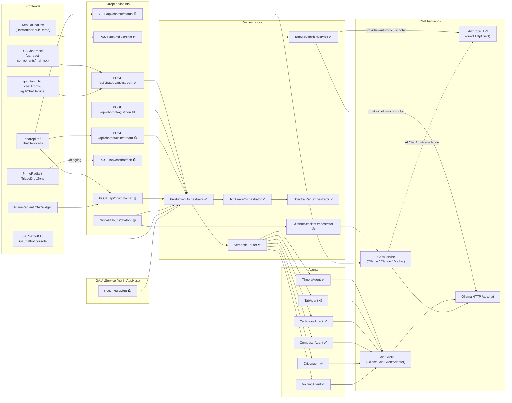

# Chat & Agent Surfaces

Authoritative map of every chat / agent entry point in the Guitar Alchemist solution. Sibling docs cover non-chat concerns (`apps-and-processes.md` for the full app inventory, `data-storage.md` for stores, `rag-pipeline.md` for the RAG corpus, `llm-providers.md` for provider configuration).

Conventions used throughout:
- Status tags: ✅ canonical, 🟡 parallel-to-canonical, 🪦 deprecated-candidate, ❓ unknown / unverified.

## 0. Status update — 2026-05-13

`GaChatbot.Api` (port 5252) is now the canonical deployable for `/chatbot/` and `/api/chatbot/*` — cloudflared (`~/.cloudflared/config.yml`) routes the prefixes accordingly. The chatbot HTML lives in `Apps/GaChatbot.Api/wwwroot/index.html` (single source of truth) and is served via `UseDefaultFiles` + `UseStaticFiles`. Two distinct canonicals coexist today:

1. **Harmonic Nebula UI canonical** — `POST /api/nebula/chat` → `NebulaChatController` → `NebulaSidekickService` (Claude Haiku 4.5 / Ollama). Unchanged. Section 1 below.
2. **Public demo chatbot canonical** — `https://demos.guitaralchemist.com/chatbot/` is served by **GaChatbot.Api** (`Apps/GaChatbot.Api/wwwroot/index.html`). Network calls: `POST /api/chatbot/chat` (REST, JSON in / JSON out with `trace.steps` for the agentic trace badge), `GET /api/chatbot/{status,examples,demo}`. The HTML uses **fetch + REST** — no SignalR. Section 2 below.

GaApi's `wwwroot/chatbot/index.html` and `ChatbotHub` (SignalR) are now dead in the deployed flow — the cloudflared `/chatbot/*` ingress points to GaChatbot.Api, not GaApi. The GaApi `/api/chatbot/*` controller endpoints remain reachable only via direct `localhost:5232` (kept for tests + back-compat callers; not exercised by the demo).

### Canonical surfaces matrix (post-2026-05-13)

| Functional cluster | Canonical today | Notes |
|---|---|---|
| Harmonic Nebula UI | `POST /api/nebula/chat` (GaApi) | unchanged |
| Public chatbot demo at `demos.guitaralchemist.com/chatbot/` | `POST /api/chatbot/chat` on **GaChatbot.Api** (5252) | HTML at `Apps/GaChatbot.Api/wwwroot/index.html`; trace badge fed by `result.trace` |
| AG-UI streaming for Prime Radiant / ga-client | `POST /api/chatbot/agui/stream` on **GaApi** | also duplicated in GaChatbot.Api but ga-client still hits GaApi directly |
| In-process chat (CLI / console) | `IHarmonicChatOrchestrator` (`= ProductionOrchestrator`) via DI | unchanged |

### Verification notes — 2026-05-12

- `Apps/ga-server/GaApi/wwwroot/chatbot/index.html` loads SignalR and calls
  `withUrl("/hubs/chatbot")`.
- `Apps/ga-server/GaApi/Program.cs` maps
  `app.MapHub<ChatbotHub>("/hubs/chatbot")`.
- `ReactComponents/ga-react-components/src/components/PrimeRadiant/TriageDropZone.tsx`
  calls `/api/chatbot/ask`; no matching controller or route was found under
  `Apps/`.
- `AllProjects.AppHost/Program.cs` starts `GaApi`, does not register
  `GaChatbot.Api`, and keeps `GA.AI.Service` commented out as `ai-service`.
- `Scripts/start-chatbot-api.ps1` can start `GaChatbot.Api` manually; that is
  not the same as making it the public deployed chatbot host.

---

## 1. HTTP chat endpoints (REST + GraphQL)

| Route | Verb | Controller | App | Request shape | Response shape | Status | Notes |
|---|---|---|---|---|---|---|---|
| `/api/nebula/chat` | POST | `NebulaChatController.Chat` (`Apps/ga-server/GaApi/Controllers/NebulaChatController.cs:19`) | GaApi | `NebulaChatRequest { Message: string; History?: NebulaChatTurn[]; Context?: NebulaChatContext; Mode?: "fast" \| "scholar" }` | `NebulaChatReply { Reply: string; ToolCalls: NebulaToolCall[]; Error: string? }` | ✅ live, verified working | Single dependency: `NebulaSidekickService`. Returns `400` if `Message` is blank. Provider switches via `Nebula:Provider` (`anthropic` / `ollama`); `Mode = "scholar"` forces local frankenmerge model with no tool-use. |
| `/api/chatbot/agui/json` | POST | `AgUiChatController.AgUiJson` (`Apps/ga-server/GaApi/Controllers/AgUiChatController.cs:45`) | GaApi | `RunAgentInput { ThreadId: string; RunId: string; Messages: AgUiMessage[]; State?: object }` (mirrors `@ag-ui/core`) | `{ answer; routing; candidates; filters; progression }` | 🟡 parallel-to-canonical | Non-streaming sibling of `/agui/stream`. Behind `ILlmConcurrencyGate`. Picks the **last** message with role `user`. |
| `/api/chatbot/agui/stream` | POST | `AgUiChatController.AgUiStream` (`Apps/ga-server/GaApi/Controllers/AgUiChatController.cs:92`) | GaApi | `RunAgentInput` | `text/event-stream` — AG-UI SSE: `RUN_STARTED` → `STATE_SNAPSHOT` → text → `STEP_STARTED` → `CUSTOM` (`ga:diatonic`, `ga:scale`, `ga:candidates`, `ga:progression`) → `STATE_DELTA` → `RUN_FINISHED` (or `RUN_ERROR`). | 🟡 parallel-to-canonical | Hits `IHarmonicChatOrchestrator.AnswerStreamingAsync` (production binding = `ProductionOrchestrator`). Used by `<GAChatPanel>` mounted in `ga-react-components/src/main.tsx:358`. |
| `/api/chatbot/skills` | GET | `AgUiChatController.ListSkills` (`Apps/ga-server/GaApi/Controllers/AgUiChatController.cs:33`) | GaApi | _(none)_ | `[ { Name, Description } ]` per registered `IOrchestratorSkill` | 🟡 metadata helper | Used by MCP / agent discovery. Not chat traffic per se. |
| `/api/chatbot/chat/stream` | POST | `ChatbotController.ChatStream` (`Apps/ga-server/GaApi/Controllers/ChatbotController.cs:36`) | GaApi | `ChatRequest { Message: string [Required, MaxLen 2000]; ConversationHistory?: ChatMessage[]; UseSemanticSearch: bool = true }` (`Apps/ga-server/GaApi/Controllers/ChatRequest.cs:6`) | `text/event-stream`: first frame is `{"type":"routing", agentId, confidence, routingMethod}`, subsequent frames are sentence chunks (`Helpers.SseChunker.SplitIntoChunks`), final frame `data: [DONE]`. Errors delivered as `{ "error": "…" }` SSE frame. | 🟡 parallel-to-canonical | Pre-AG-UI streaming protocol. Backed by `ProductionOrchestrator.AnswerAsync` (NOT the streaming overload — text is split client-side after the full answer is generated). Behind `ILlmConcurrencyGate`. |
| `/api/chatbot/chat` | POST | `ChatbotController.Chat` (`Apps/ga-server/GaApi/Controllers/ChatbotController.cs:119`) | GaApi | `ChatRequest` (same as above) | `ChatJsonResponse { NaturalLanguageAnswer; AgentId; Confidence; RoutingMethod; ElapsedMs; TraceId? }` (`ChatRequest.cs:15`) | 🟡 parallel-to-canonical | Non-streaming JSON for MCP tool callers. |
| `/api/chatbot/status` | GET | `ChatbotController.GetStatus` (`Apps/ga-server/GaApi/Controllers/ChatbotController.cs:159`) | GaApi | _(none)_ | `ChatbotStatus { IsAvailable; Message; Timestamp }` (`Apps/ga-server/GaApi/Controllers/ChatbotStatus.cs:3`) | 🟡 health helper | Probes `IChatService.IsAvailableAsync` (Ollama by default). |
| `/api/chatbot/examples` | GET | `ChatbotController.GetExamples` (`Apps/ga-server/GaApi/Controllers/ChatbotController.cs:177`) | GaApi | _(none)_ | `string[]` of canned prompts | 🟡 helper | Hard-coded list, no orchestrator hop. |
| `/api/chatbot/ask` | POST | _(no controller)_ | GaApi (?) | unknown — frontend sends `{question?, query?}` (`ReactComponents/.../PrimeRadiant/TriageDropZone.tsx:82`) | _N/A_ | 🪦 deprecated-candidate / dangling | No matching server-side action found via grep across `Apps/ga-server/`. Frontend caller likely fails with 404 today. |
| `/api/Chat` | POST | `GA.AI.Service.Controllers.ChatController.Chat` (`Apps/ga-server/GA.AI.Service/Controllers/ChatController.cs:14`) | **GA.AI.Service** (separate microservice) | `GA.Business.Core.Orchestration.Models.ChatRequest { Message; SessionId?; KeyContext?; History? }` (`Common/GA.Business.Core.Orchestration/Models/ChatModels.cs:11`) | `ChatResponse { NaturalLanguageAnswer; Candidates; Progression?; Routing?; QueryFilters?; DebugParams? }` (`ChatModels.cs:86`) | 🪦 deprecated-candidate | Service is **not started** by Aspire AppHost — `AddProject("ai-service", …)` is commented out at `AllProjects.AppHost/Program.cs:87`. Reachable only if launched manually. |
| GraphQL `/graphql` chat mutations | _N/A_ | _N/A_ | GaApi | _(none)_ | _(none)_ | ❌ none exist | The HotChocolate schema is built from `Query` + four `TypeExtension`s only (`Apps/ga-server/GaApi/Program.cs:113-121`). Grep for `[Mutation]`, `MutationType`, `Subscription` in `Apps/ga-server/GaApi/GraphQL/**` returns no matches. |

### Detail — `NebulaChatRequest` shape

```csharp
// Apps/ga-server/GaApi/Services/NebulaSidekickService.cs:595
public sealed record NebulaChatRequest(
    string Message,
    List<NebulaChatTurn>? History,
    NebulaChatContext? Context,
    string? Mode = null);                      // "fast" | "scholar"

public sealed record NebulaChatTurn(string Role, string Content);

public sealed record NebulaChatContext(
    NebulaSelectedVoicing? SelectedVoicing,
    Dictionary<string, int>? InstrumentCounts);

public sealed record NebulaSelectedVoicing(
    string GlobalId, string ClusterId, string ClusterLabel,
    string Instrument, string ChordName, string Family,
    int[] Midi, string[] Frets, int[] PitchClasses);

public sealed record NebulaChatReply(
    string Reply,
    List<NebulaToolCall> ToolCalls,
    string? Error);

public sealed record NebulaToolCall(string Name, string InputJson, string ResultJson);
```

Tool catalogue exposed to the model: `search_voicings`, `describe_selected_voicing`, `get_corpus_stats` — defined inline at `NebulaSidekickService.cs:414` (Anthropic shape) and `NebulaSidekickService.cs:450` (Ollama / OpenAI shape). Tool-loop budget = 6 iterations (`MaxToolIterations`).

---

## 2. SignalR hubs

| Hub | Path | App | Methods | Status |
|---|---|---|---|---|
| `ChatbotHub` (`Apps/ga-server/GaApi/Hubs/ChatbotHub.cs:15`) | `/hubs/chatbot` (mapped at `Apps/ga-server/GaApi/Program.cs:404`) | GaApi | `SendMessage(string, bool useSemanticSearch = true)`, `ClearHistory()`, `GetHistory() : List<ChatMessage>`, `SearchKnowledge(string, int = 10) : List<SemanticSearchResult>`, `OnConnectedAsync`, `OnDisconnectedAsync`. Server pushes: `Connected`, `Error`, `MessageRoutingMetadata { agentId, confidence, routingMethod }`, `ReceiveMessageChunk(string)`, `MessageComplete(string)`. | ✅ de-facto canonical for the deployed public `/chatbot/` demo |

Per-connection conversation history kept in a static `ConcurrentDictionary<string, List<ChatMessage>>` capped at 50 messages; pipeline budget is `25s` (`ChatbotHub.cs:24`). Uses `[Authorize]` and `ILlmConcurrencyGate`. Backed by `ProductionOrchestrator` + `ChatbotSessionOrchestrator` for history normalisation.

Other hubs (`PipelineHub`, `GovernanceHub`) handle non-chat traffic and are out of scope here.

---

## 3. Agent orchestrators

| Orchestrator | Where used | Inputs | Outputs | Status |
|---|---|---|---|---|
| `NebulaSidekickService` (`Apps/ga-server/GaApi/Services/NebulaSidekickService.cs:21`) | `NebulaChatController` only | `NebulaChatRequest` + `CancellationToken` | `NebulaChatReply` | ✅ canonical for the Harmonic Nebula UI. Holds its own long-timeout `HttpClient` (5 min) to bypass the default Polly 30s timeout. Three providers: `anthropic` (Claude Haiku 4.5), `ollama` (default, OpenAI-shape tool_calls), and `scholar` mode (Ollama, no tools, big system prompt). |
| `ProductionOrchestrator` (`Common/GA.Business.Core.Orchestration/Services/ProductionOrchestrator.cs:18`) | `ChatbotController` (REST), `ChatbotHub` (SignalR), `AgUiChatController` (AG-UI) — registered by `AddChatbotOrchestration()` (`Common/GA.Business.Core.Orchestration/Extensions/ChatbotOrchestrationExtensions.cs:23`) and resolved as `IHarmonicChatOrchestrator`. Also wired into `GaChatbotCli` (`Apps/GaChatbotCli/Program.cs:55`). | `ChatRequest` (orchestration model), optional streaming callback | `ChatResponse` (with `Routing`, `QueryFilters`, `Candidates`, `Progression`) | ✅ canonical for the agentic stack (theory/tab/etc.). Pipeline: hooks → fast-path skills (`IOrchestratorSkill`) → parallel `QueryUnderstandingService` + `SemanticRouter` → tab/path-optimization branch _or_ `TabAwareOrchestrator`. Persists turns via `ConversationHistoryStore`. |
| `TabAwareOrchestrator` (`Common/GA.Business.Core.Orchestration/Services/TabAwareOrchestrator.cs:12`) | Called by `ProductionOrchestrator` for non-skill, non-tab paths | `ChatRequest` | `ChatResponse` | ✅ canonical sub-orchestrator. Detects ASCII tablature via `TabTokenizer` and either routes to `tabAnalyzer` + `presenter` or delegates to `SpectralRagOrchestrator`. |
| `SpectralRagOrchestrator` (`Common/GA.Business.Core.Orchestration/Services/SpectralRagOrchestrator.cs:18`) | Called by `TabAwareOrchestrator` for knowledge queries; also implements `IHarmonicChatOrchestrator` directly | `ChatRequest` | `ChatResponse` (with grounded `Candidates`) | ✅ canonical voicing-grounded path. Steps: staleness check → comparison shortcut → identity lookup → chord parser → embedding gen → `SpectralRetrievalService.Search` → `IGroundedNarrator.NarrateAsync` (production binding = `OllamaGroundedNarrator`) → progression extraction. |
| `ChatbotSessionOrchestrator` (`Apps/ga-server/GaApi/Services/ChatbotSessionOrchestrator.cs:14`) | Used by `ChatbotHub.SendMessage` for `NormalizeHistory` only; broader `GetResponseAsync`/`StreamResponseAsync` paths register but no controller invokes them | `ChatSessionRequest { Message; ConversationHistory?; UseSemanticSearch }` | `string` (full) or `IAsyncEnumerable<string>` (stream) | 🟡 partially used. Owns its own `IChatService`-based prompt-construction pipeline that bypasses `ProductionOrchestrator` entirely (semantic search → system prompt → `IChatService.ChatStreamAsync`). Currently a vestigial parallel path. |
| `SemanticRouter` (`Common/GA.Business.ML/Agents/SemanticRouter.cs:17`) | Injected into `ProductionOrchestrator` and `AgentCoordinator` | `query: string` (or `AgentRequest`) | `RoutingResult { SelectedAgent, Confidence, AllScores, RoutingMethod }`; also `ProcessAsync`, `AggregateAsync` (parallel fan-out), `DebateAsync` (top-2 with `CriticAgent` adjudication) | ✅ canonical router. Three-tier strategy: cached agent-description embeddings (cosine, threshold 0.85) → LLM router (threshold 0.6) → keyword fallback. Optional `IRoutingFeedback` learned-bias overlay. Memory cache for query embeddings (256 entries, 5 min sliding TTL). |

`ChatbotSessionOrchestrator.NormalizeHistory` is the only method called from production today (`ChatbotHub.cs:74`); the rest of the class is dead-code-adjacent.

---

## 4. Specialized agents

All concrete subclasses of `GuitarAlchemistAgentBase` (`Common/GA.Business.ML/Agents/GuitarAlchemistAgentBase.cs:26`). Base class signature: `(IChatClient chatClient, ILogger logger)`; `IChatClient` is `Microsoft.Extensions.AI.IChatClient`. The production `IChatClient` binding in GaApi is `OllamaChatClientAdapter` (`Apps/ga-server/GaApi/Extensions/AIServiceExtensions.cs:102`).

| Agent | Class | Purpose | Constructor deps | Currently invoked from | Status |
|---|---|---|---|---|---|
| Theory | `TheoryAgent` (`Common/GA.Business.ML/Agents/TheoryAgent.cs:20`) | Pitch-class set analysis, harmonic function, key/mode detection, voice leading. Uses `ChatWithCritiqueAsync` (3-pass draft → critique → refine). | `IChatClient`, `ILogger<TheoryAgent>` | `SemanticRouter` (selected when `AgentIds.Theory` wins) | ✅ live |
| Tab | `TabAgent` (`Common/GA.Business.ML/Agents/TabAgent.cs:20`) | ASCII tab parsing, fret/string extraction, tab-to-pitch conversion. Heuristic `ContainsTabNotation` switches prompt. | `IChatClient`, `ILogger<TabAgent>` | `SemanticRouter`; also `ProductionOrchestrator` short-circuits to `HandleTabAnalysisAsync` (uses `TabAnalysisService`, not the LLM agent) when the agent ID matches **and** `filters.Intent in {AnalyzeTab, OptimizePath}` | 🟡 partly bypassed by deterministic tab pipeline |
| Technique | `TechniqueAgent` (`Common/GA.Business.ML/Agents/SpecializedAgents.cs:8`) | Fingering validation, ergonomics, barre optimisation, playability scoring. | `IChatClient`, `ILogger<TechniqueAgent>` | `SemanticRouter` | ✅ live |
| Composer | `ComposerAgent` (`Common/GA.Business.ML/Agents/SpecializedAgents.cs:70`) | Reharmonization, substitutions, progression generation. Delegates key-context queries to `TheoryAgent` via `IAgentCoordinator`. | `IChatClient`, `ILogger<ComposerAgent>` | `SemanticRouter` | ✅ live |
| Critic | `CriticAgent` (`Common/GA.Business.ML/Agents/SpecializedAgents.cs:153`) | Contradiction detection, accuracy/consistency scoring, improvement suggestions. | `IChatClient`, `ILogger<CriticAgent>` | `SemanticRouter` (direct routing) and `SemanticRouter.DebateAsync` adjudication path | ✅ live |
| Voicing | `VoicingAgent` (`Common/GA.Business.ML/Agents/VoicingAgent.cs:19`) | OPTIC-K voicing retrieval by chord/mode/tag. Encodes intent via `MusicalQueryEncoder` → 112-dim compact vector → `EnhancedVoicingSearchService`. Returns ranked diagrams; **does not necessarily call the LLM** for fully-structured queries. | `IChatClient`, `ILogger<VoicingAgent>`, `EnhancedVoicingSearchService`, `IMusicalQueryExtractor`, `MusicalQueryEncoder` | `SemanticRouter` (when `AgentIds.Voicing` wins) | ✅ live |

Agent IDs: `AgentIds.{Tab, Theory, Technique, Composer, Critic, Voicing}` (`Common/GA.Business.ML/Agents/AgentConstants.cs`).

Streaming: only `GuitarAlchemistAgentBase.ProcessStreamingAsync` (line 178) yields tokens. `ProductionOrchestrator.AnswerStreamingAsync` (`ProductionOrchestrator.cs:134-153`) takes the streaming path **only** when the selected agent is a `GuitarAlchemistAgentBase` AND the request is not a tab/path-optimization intent — otherwise it word-splits the final answer to simulate streaming.

---

## 5. `IChatService` implementations

`IChatService` (`Apps/ga-server/GaApi/Services/IChatService.cs:3`) is the **GaApi-local** abstraction used by `ChatbotSessionOrchestrator` and surfaced via `ChatbotController.GetStatus`. Selection happens at startup in `Apps/ga-server/GaApi/Extensions/AIServiceExtensions.cs:92-99` based on the `AI:ChatProvider` config key.

| Implementation | Backend | When selected | Path |
|---|---|---|---|
| `OllamaChatService` | Local Ollama HTTP `/api/chat` (named HttpClient `Ollama`, model from `Ollama:ChatModel` or `ChatbotOptions.Model`, default `llama3.2:3b`). Streaming JSON-lines. | `AI:ChatProvider` ∉ {claude, docker} (default) | `Apps/ga-server/GaApi/Services/OllamaChatService.cs:13` |
| `ClaudeChatService` | Anthropic SDK `MessagesService.CreateStreaming` (default model `claude-haiku-4-5-20251001`). Reads `Anthropic:ApiKey` or `ANTHROPIC_API_KEY`. | `AI:ChatProvider == "claude"` | `Apps/ga-server/GaApi/Services/ClaudeChatService.cs:12` |
| `DockerModelRunnerChatService` | Docker Desktop's OpenAI-compatible `/v1/chat/completions` on port 12434 (default model `docker.io/ai/llama3.2:latest`). | `AI:ChatProvider == "docker"` | `Apps/ga-server/GaApi/Services/DockerModelRunnerChatService.cs:16` |

Important: `IChatService` is **not** the same channel as the `IChatClient` (Microsoft.Extensions.AI) used by the specialized agents. GaApi registers `IChatClient` as `OllamaChatClientAdapter` regardless of `AI:ChatProvider` (`AIServiceExtensions.cs:102`). The Nebula pipeline bypasses both interfaces and talks to providers directly via its own `HttpClient`.

---

## 6. Frontend consumers

| Caller (file) | Endpoint | Notes |
|---|---|---|
| `<NebulaChat>` (`ReactComponents/ga-react-components/src/components/NebulaChat.tsx:64`) | `POST /api/nebula/chat` | Mounted by `HarmonicNebulaDemo` (`ReactComponents/ga-react-components/src/pages/HarmonicNebulaDemo.tsx:1707`). Sends `{ message, mode, history, context: { selectedVoicing, instrumentCounts } }`. Renders `reply` and surfaces `toolCalls` for inspection. Verified working 2026-04-21. |
| `<GAChatPanel agentUrl={…/api/chatbot/agui/stream}>` (`ReactComponents/ga-react-components/src/main.tsx:358`) | `POST /api/chatbot/agui/stream` | Wraps the AG-UI SSE protocol. Parses `TEXT_MESSAGE_CONTENT`, `CUSTOM` (`ga:diatonic`), `RUN_ERROR` events (`Apps/ga-client/src/services/agUiChatService.ts:88`). |
| `Apps/ga-client/src/store/chatAtoms.ts:110` (Jotai send-message atom) | `POST /api/chatbot/agui/stream` | Drives the ga-client React UI's chat composer. |
| `Apps/ga-client/src/services/chatApi.ts` (`ChatApiService.streamChat`, `sendMessage`, `checkStatus`, `getExamples`) | `POST /api/chatbot/chat/stream`, `POST /api/chatbot/chat`, `GET /api/chatbot/status`, `GET /api/chatbot/examples` | Pre-AG-UI SSE protocol still imported by some ga-client surfaces. Singleton exported as `chatApi`. |
| `Apps/ga-client/src/services/chatService.ts:94` (`sendChatMessageStream`) | `POST /api/chatbot/chat/stream` | Same protocol, alternate functional API. |
| `<ChatWidget>` (`ReactComponents/ga-react-components/src/components/PrimeRadiant/ChatWidget.tsx:917`) | `POST /api/chatbot/chat` | Non-streaming. Used inside the Prime Radiant operator console. |
| `<TriageDropZone>` (`ReactComponents/ga-react-components/src/components/PrimeRadiant/TriageDropZone.tsx:82`) | `POST /api/chatbot/ask` | **No matching server endpoint exists.** Likely 404 today — see Open Questions. |
| `<ForceRadiant>` (`…/PrimeRadiant/ForceRadiant.tsx:3502`), `HealthBindingEngine.ts:198` | `GET/HEAD /api/chatbot/status` | Health probe only. |
| Apps/GaChatbot Console (`Apps/GaChatbot/Program.cs:25`) | _(no HTTP)_ | In-process: instantiates `ProductionOrchestrator` directly via DI and calls `AnswerAsync`. Console REPL. |
| Apps/GaChatbotCli (`Apps/GaChatbotCli/Program.cs:55,91`) | _(no HTTP)_ | In-process: resolves `IHarmonicChatOrchestrator` (= `ProductionOrchestrator`) via DI. Single-shot or `--interactive` REPL. JSON output mode for tooling. |
| Apps/ga-dashboard (`Apps/ga-dashboard/src/app/chat/chat.component.ts`) | `(grep hit; not deeply audited here)` | Angular shell. Not on the critical path for 2026-04 work. |
| `Apps/GA.AI.Service/Controllers/ChatController` | _(no caller found)_ | The microservice itself isn't started by the Aspire AppHost (commented at `AllProjects.AppHost/Program.cs:87`), so no live consumer is reachable through the standard dev flow. |

`Apps/GaChatbot` Blazor pages: **none found** under `Apps/GaChatbot/**/*.razor`. The `GaChatbot` project is a console host, not a Blazor app — earlier MEMORY notes about "Blazor in-process chat" are stale.

---

## 5b. GaChatbot.Api — the parallel host (added 2026-05-07)

`Apps/GaChatbot.Api` is a thin ASP.NET Web API host whose stated purpose is "the public chatbot, separately deployable, talks to the same orchestrator". It compiles, has 90 passing tests (post-2026-05-07-fix), exposes a controller surface that **collides path-for-path with GaApi's `ChatbotController`**, but is not started by Aspire AppHost and is not on `demos.guitaralchemist.com`'s ingress.

### Routes (GaChatbot.Api)

| Route | Verb | Controller | Notes vs the GaApi sibling |
|---|---|---|---|
| `/api/chatbot/chat` | POST | `GaChatbot.Api.Controllers.ChatbotController.Chat` | Returns `ChatJsonResponse { …, Grounding, ElapsedMs, TraceId, Trace }` — the GaApi sibling drops `Grounding` and `Trace`. |
| `/api/chatbot/chat/stream` | POST | `ChatbotController.ChatStream` | SSE; first frame includes `grounding` if present, the GaApi `/chat/stream` does not. |
| `/api/chatbot/status` | GET | `ChatbotController.GetStatus` | Returns a richer `ChatbotStatus` (`ProviderReachable`, `ChatModel`, `EmbeddingModel`, `OrchestratorRoundTripOk`) — beyond GaApi's `IsAvailable`/`Message`/`Timestamp`. |
| `/api/chatbot/examples` | GET | `ChatbotController.GetExamples` | Identical canned-list shape. |
| `/api/chatbot/agui/json` | POST | `AgUiChatController.AgUiJson` | AG-UI non-streaming. |
| `/api/chatbot/agui/stream` | POST | `AgUiChatController.AgUiStream` | AG-UI SSE. |
| `/api/a2a/*` | various | `A2AController` | A2A / agent-to-agent surface. Not present in GaApi. |

### Service composition

`GaChatbot.Api` is layered on `IChatApplicationService` (interface) → `OrchestratedChatApplicationService` (production binding) → `IHarmonicChatOrchestrator` (= `ProductionOrchestrator`). `OrchestratedChatApplicationService` adds:
- Deterministic readiness probe (`ChatProviderReadinessProbe`) gating low-confidence requests.
- Fallback path with bounded `_fallbackTimeoutSeconds`, distinct routing-method tag.
- `AgenticTrace` accumulator emitted in `ChatJsonResponse.Trace` (GaApi's sibling has no equivalent).

GaApi's `ChatbotController` skips all that and calls `ProductionOrchestrator` directly.

### Why this is not just "duplicate code"

The two controllers are **not feature-equivalent**:

1. **Grounding wire shape** — `GaChatbot.Api.ChatJsonResponse` carries `Grounding`; the GaApi sibling does not. The 2026-05-07 fix that made algebra-route grounding propagate through `IntentResult → ChatResponse` is fully observable on `GaChatbot.Api` callers and only partially observable on GaApi callers (because GaApi's `ChatJsonResponse` doesn't even define a `Grounding` field).
2. **Readiness gating** — `OrchestratedChatApplicationService` has a probe + fallback path that protects against the "chat returns garbage when Ollama isn't ready" symptom. GaApi has no equivalent.
3. **Trace contract** — `Trace` (`AgenticTrace`) is only emitted by `GaChatbot.Api`. Multi-LLM observability work assumes this contract.

### Canonical-deployable decision (open)

The deployed `https://demos.guitaralchemist.com/chatbot/` static SPA calls `/hubs/chatbot` (SignalR on GaApi). To make `GaChatbot.Api` the canonical deployable for the public chatbot, one of these three paths has to be chosen:

| Option | Description | Blast radius | Notes |
|---|---|---|---|
| **A. Promote `GaChatbot.Api` and switch the SPA to its REST/SSE surface** | Rebuild `wwwroot/chatbot/index.html` to call `/api/chatbot/chat/stream` (SSE) instead of SignalR. Add `GaChatbot.Api` to Aspire AppHost. Rewrite cloudflared ingress: `^/chatbot(/.*)?$` and `^/api/chatbot/.*$` → `GaChatbot.Api`'s port; `/hubs/chatbot` either retired or kept on GaApi for non-SPA callers. | High — touches three components (frontend, AppHost, tunnel config); SignalR consumers (none currently in JS, but possibly future ones) lose the hub. | Recommended if the goal is "thin public host for the demo, full app gateway for everything else." |
| **B. Move `ChatbotHub` into `GaChatbot.Api`** | Keep the SignalR contract, just relocate the hub. SPA changes from `/hubs/chatbot → GaApi` to `/hubs/chatbot → GaChatbot.Api`. AppHost adds the new project; tunnel routes `^/hubs/chatbot$` and `^/chatbot(/.*)?$` to `GaChatbot.Api`. | Medium — the hub's deps (`ProductionOrchestrator`, `LlmConcurrencyGate`, `ConversationHistoryStore`, etc.) all live in `GA.Business.Core.Orchestration`, so they cross the host boundary cleanly via DI. | Recommended if you want minimum frontend change. |
| **C. Cut `GaChatbot.Api`** | Treat `GaChatbot.Api` as exploratory; keep its `Grounding`/`Trace`/readiness improvements but port them into `GaApi.ChatbotController` and `GaApi.ChatbotHub`. Delete `Apps/GaChatbot.Api`. | Lowest external — no deployable changes. Highest internal — refactor of GaApi controllers. | Recommended only if the multi-host story has no near-term need (independent scaling, public-vs-internal separation, etc.). |

**Until a path is picked**, treat both `GaChatbot.Api` AND `GaApi.ChatbotController` as 🟡 parallel-to-canonical for the public chatbot REST surface, and treat `GaApi.ChatbotHub` as the de-facto canonical for the deployed demo. Don't add features to one without the other.

---

## 6b. Legacy REST/SSE route support status — `/api/chatbot/chat` & `/chat/stream` (#204)

`GaApi`'s `POST /api/chatbot/chat` (`ChatbotController.Chat`) and `POST /api/chatbot/chat/stream` (`ChatbotController.ChatStream`) are the **pre-AG-UI** REST/SSE surfaces. AG-UI (`/api/chatbot/agui/*`) and SignalR (`/hubs/chatbot`) are the active public paths, so #204 asked for an explicit support decision rather than leaving these as ambiguous parallels.

**Decision: SUPPORTED (not deprecated) — `🟡 parallel-to-canonical`, kept for back-compat.** They are *not* dead: they still have first-party runtime callers (inventory below). Retiring them is gated on migrating those callers to AG-UI first, which is out of scope here. This is the conservative, non-breaking choice; it resolves the open question at §9 ("can the legacy SSE endpoints be retired?") as **not yet**.

### Caller inventory (runtime, first-party)

| Route | Backend | Active callers |
|---|---|---|
| `POST /api/chatbot/chat` | `GaApi ChatbotController.Chat` → `ProductionOrchestrator` | `<ChatWidget>` (`ReactComponents/ga-react-components/src/components/PrimeRadiant/ChatWidget.tsx:917`, non-streaming, Prime Radiant operator console); `ChatApiService.sendMessage` (`Apps/ga-client/src/services/chatApi.ts:179`) |
| `POST /api/chatbot/chat/stream` | `GaApi ChatbotController.ChatStream` → `ProductionOrchestrator` | `ChatApiService.streamChat` (`Apps/ga-client/src/services/chatApi.ts:85`); `sendChatMessageStream` (`Apps/ga-client/src/services/chatService.ts:94`) |

(Test suites, `Scripts/*.ps1`, and the `GaChatbot.Api` same-path siblings in §5b are excluded — they don't determine support status. The `GaChatbot.Api` host is governed by the separate §5b canonical-deployable decision.)

### Wire-parity expectations (the cost of keeping them)

While supported, both routes MUST stay wire-equivalent with the canonical orchestrator output wherever the public demo or shared tooling depends on common metadata:

- Both back onto the same `ProductionOrchestrator`, so routing (`agentId`, `confidence`, `routingMethod`) and answer text stay consistent across REST/SSE/SignalR/AG-UI by construction — don't fork the orchestrator call.
- The GaApi `ChatJsonResponse` intentionally omits `Grounding` and `Trace` (those live only on the `GaChatbot.Api` sibling, §5b). That asymmetry is documented, not a bug — don't "fix" one surface in isolation; change the shared contract or neither.
- `/chat/stream`'s SSE shape (`routing` frame → sentence chunks → `data: [DONE]`) is a distinct protocol from AG-UI. Callers above depend on it; don't alter frame shapes without updating `chatApi.ts` / `chatService.ts` in the same change.

### Revisit trigger

Reclassify to `🪦 deprecated-candidate` once `chatApi.ts`, `chatService.ts`, and `<ChatWidget>` have all migrated to the AG-UI surface (`/api/chatbot/agui/{stream,json}`). At that point these two routes have zero first-party callers and can be retired in one cleanup PR.

## 7. Canonical-vs-redundant analysis

| Functional cluster | Canonical path | Parallels / redundancies |
|---|---|---|
| **HTTP endpoint serving the Harmonic Nebula React UI** | ✅ `POST /api/nebula/chat` → `NebulaChatController` → `NebulaSidekickService` → Anthropic Claude Haiku 4.5 (`ANTHROPIC_API_KEY`) or local Ollama tool-loop. | None — only `NebulaChat.tsx` consumes this route. |
| **HTTP endpoint serving the legacy ga-client / Prime Radiant chat UIs** | ✅ AG-UI: `POST /api/chatbot/agui/stream` → `AgUiChatController.AgUiStream` → `IHarmonicChatOrchestrator.AnswerStreamingAsync` (= `ProductionOrchestrator`). | 🟡 `POST /api/chatbot/chat/stream` (`ChatbotController`) — same orchestrator backend, different SSE shape; still consumed by `chatApi.ts` + `chatService.ts`. 🟡 `POST /api/chatbot/agui/json` — non-streaming sibling, same orchestrator, used by MCP / agent callers. 🟡 `POST /api/chatbot/chat` — non-streaming sibling, same orchestrator, used by `<ChatWidget>`. |
| **In-process chat for console / CLI** | ✅ `IHarmonicChatOrchestrator` (= `ProductionOrchestrator`) resolved via DI in `GaChatbotCli` and `GaChatbot`. | None notable — both apps share the same `AddChatbotOrchestration` registrations. |
| **AG-UI protocol bridge** | ✅ `AgUiChatController` (`/agui/stream` for SSE, `/agui/json` for non-streaming). | None (single implementation). |
| **SignalR streaming chat** | ✅ `ChatbotHub` at `/hubs/chatbot` — same orchestrator substrate as the REST surfaces and the de-facto canonical path for the deployed public `/chatbot/` demo. | 🟡 Parallel REST/SSE surfaces exist (`/api/chatbot/chat`, `/api/chatbot/chat/stream`) and must stay wire-equivalent where the public demo depends on shared metadata (`Grounding`, `Trace`, routing). |
| **GraphQL chat mutation** | ❌ none defined; `GaApi/Program.cs:113-121` registers Query types only. | _N/A_ |
| **`IChatService` (GaApi-local)** | ✅ used by `ChatbotSessionOrchestrator.NormalizeHistory` and `ChatbotController.GetStatus` only. Provider chosen via `AI:ChatProvider`. | 🟡 `ChatbotSessionOrchestrator.GetResponseAsync` / `StreamResponseAsync` exist but are not called from any controller or hub today. |
| **Specialized agent invocation** | ✅ via `SemanticRouter.RouteAsync` (called by `ProductionOrchestrator`). | 🟡 `SemanticRouter.AggregateAsync` and `DebateAsync` exist but are not currently exposed through any HTTP/SignalR surface. |
| **Voicing-grounded retrieval inside chat** | ✅ `SpectralRagOrchestrator` reached via `TabAwareOrchestrator`. | 🟡 `VoicingAgent` performs an independent OPTIC-K retrieval path through `EnhancedVoicingSearchService` whenever the router selects it — produces a structured-list response rather than a narrated one. Two independent retrieval surfaces over the same corpus. |
| **GA.AI.Service / `POST /api/Chat`** | _N/A_ | 🪦 **deleted** (campaign slice #6, #467) — GaApi is the single canonical chat host; see [ADR-0005](../adr/0005-gaapi-single-canonical-chat-host.md). |
| **`POST /api/chatbot/ask`** | _N/A_ | 🪦 dangling frontend call (TriageDropZone) with no server implementation. |

---

## 8. Topology diagram



---

## 9. Open questions (unverified claims)

- Is `Apps/GaChatbot` (console REPL) still reachable in the Aspire `start-all` flow? `AllProjects.AppHost/Program.cs:135` adds a different project (`GuitarAlchemistChatbot.csproj`); the `Apps/GaChatbot` project appears to be a separate console host that is never started by Aspire.
- Does `AgUiChatController` have any active frontend consumer beyond `<GAChatPanel>` and the ga-client `chatAtoms`? ~~Confirm whether the legacy SSE endpoints (`/chat/stream`, `/chat`) can be retired.~~ **Resolved (#204):** not yet — both still have first-party callers; see §6b for the support decision + revisit trigger.
- Are there any `ChatbotHub` consumers besides the deployed public `/chatbot/` static SPA (`Apps/ga-server/GaApi/wwwroot/chatbot/index.html`)? Confirm before relocating or retiring the hub.
- `POST /api/chatbot/ask` is called by `TriageDropZone` but no controller action implements it — does this fail silently or is it served by a route fallback elsewhere?
- Is `GA.AI.Service` (whose `ChatController` shadows `ProductionOrchestrator` directly) ever launched in CI/dev? AppHost registration is commented out (`AllProjects.AppHost/Program.cs:87`); confirm no other entry point spins it up.
- `ChatbotSessionOrchestrator.GetResponseAsync` / `StreamResponseAsync` are registered but not invoked from any controller. Should they be removed, or are they intended for an upcoming SignalR/REST surface?
- `SemanticRouter.AggregateAsync` and `DebateAsync` (multi-agent fan-out / Critic adjudication) are implemented but no HTTP endpoint exposes them. Plan to surface, or dead code?
- The Nebula tool `get_corpus_stats` falls back to a hard-coded `{guitar=667125, bass=12614, ukulele=8612}` distribution when `InstrumentCounts` is missing from context (`NebulaSidekickService.cs:545`). Does the React frontend ever populate `instrumentCounts`, or is the fallback the only value the LLM ever sees?
- `ProductionOrchestrator.AnswerStreamingAsync` only true-streams when the selected agent is a `GuitarAlchemistAgentBase`; tab/path branches and skill fast-paths emit word-level simulated tokens. Is this intentional given the AG-UI contract that frontends interpret as token streaming?
- `NebulaSidekickService` constructs its own `HttpClient` with a 5-min timeout to bypass Polly. Is this still required, or can a named `HttpClient` with a configured policy replace it?
