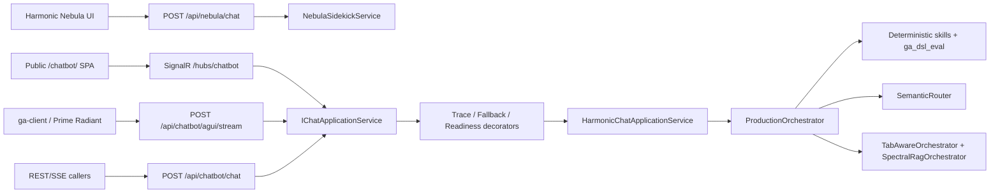

# GA Chatbot Overview

This is the short read before changing chatbot code. It points to the detailed
docs and summarizes the current runtime shape.

## Source of Truth

- Endpoint and runtime inventory:
  [chat-surfaces.md](chat-surfaces.md)
- Current execution roadmap:
  [../plans/2026-05-07-chatbot-roadmap.md](../plans/2026-05-07-chatbot-roadmap.md)
- Skills / `ga_dsl_eval` / F# closure-registry design:
  [../plans/2026-05-06-skills-orchestration-architecture.md](../plans/2026-05-06-skills-orchestration-architecture.md)
- Long-term OPTIC-K / wavelet / spectral-RAG vision:
  [../chatbot/Chatbot_Technical_Roadmap.md](../chatbot/Chatbot_Technical_Roadmap.md)

When these disagree, trust `chat-surfaces.md` for runtime wiring and the
2026-05-07 roadmap for shipped orchestration decisions.

## Runtime Shape

GA currently has multiple live chat surfaces:

| Surface | Current role |
|---|---|
| `POST /api/nebula/chat` | Harmonic Nebula UI canonical path. Uses `NebulaChatController` and `NebulaSidekickService`. |
| SignalR `/hubs/chatbot` | De-facto public `/chatbot/` demo path served by GaApi. |
| `POST /api/chatbot/agui/stream` | AG-UI streaming path for ga-client / Prime Radiant surfaces. |
| `POST /api/chatbot/chat` and `/chat/stream` | REST/SSE sibling surfaces over the same orchestrator substrate. |
| `Apps/GaChatbot.Api` | Compiles, but is not the deployed public chatbot host. Keep frozen until there is a concrete deploy reason. |
| `GA.AI.Service` | Frozen. Do not add new code unless the architecture decision changes. |



## Core Orchestration

The shared runtime substrate is:

```text
GaApi controller / hub
  -> IChatApplicationService
  -> Traceable / Fallback / Readiness decorators
  -> HarmonicChatApplicationService
  -> IHarmonicChatOrchestrator
  -> ProductionOrchestrator
```

`ProductionOrchestrator` owns the main agentic path: hooks, deterministic
skills, semantic routing, tab handling, `TabAwareOrchestrator`, and
`SpectralRagOrchestrator`.

## Skills And DSL

The chatbot uses repo-versioned `skills/` plus C# wrappers. The highest-value
bridge is `ga_dsl_eval`, which exposes curated F# `GaClosureRegistry` domain
operations to skill-driven answers without creating one MCP tool per musical
operation.

Current guidance:

- Keep deterministic music-theory operations grounded through DSL closures or
  keyhole MCP tools.
- Do not let the chatbot silently degrade when a deterministic skill fails to
  call the expected tool.
- Surface `Grounding`, `Trace`, routing metadata, and failure reasons on public
  chat wires where clients depend on them.

## Known Sync Points

- Keep `ChatbotHub` and REST/SSE chatbot surfaces wire-equivalent where public
  metadata matters.
- Do not promote `GaChatbot.Api` until the deploy target and ingress path are
  explicit.
- Treat `ChatbotSessionOrchestrator.GetResponseAsync` / `StreamResponseAsync`
  as cleanup candidates unless a new consumer appears.

## Verification Notes

Verified by grep on 2026-05-12:

- `Apps/ga-server/GaApi/wwwroot/chatbot/index.html` loads SignalR and calls
  `withUrl("/hubs/chatbot")`.
- `Apps/ga-server/GaApi/Program.cs` maps
  `app.MapHub<ChatbotHub>("/hubs/chatbot")`.
- `ReactComponents/ga-react-components/src/components/PrimeRadiant/TriageDropZone.tsx`
  previously called `/api/chatbot/ask`; it now calls existing chatbot surfaces
  instead.
- `AllProjects.AppHost/Program.cs` starts `GaApi` but does not register
  `GaChatbot.Api`; `GA.AI.Service` remains commented out as `ai-service`.
