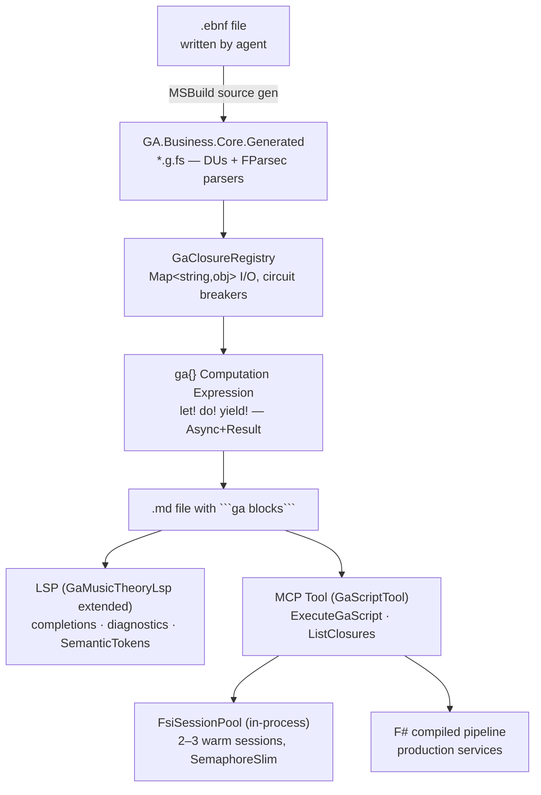

# GA Language (GAL) — Composable DSL with Computation Expressions, EBNF Source Gen, Closure Factory, LSP & MCP

## Overview

Guitar Alchemist deserves its own language. GAL (Guitar Alchemist Language) is a composable, multi-modal language embedded in markdown that serves both human developers and Claude Code simultaneously. It replaces and subsumes `GA.Business.DSL` and `GaMusicTheoryLsp`, built around three interlocking primitives:

1. **Closure Factory** — named, typed, discoverable F# computations with heterogeneous I/O via `Map<string,obj>`, circuit breakers, and predicate memoization (adapted from TARS v1/v2 patterns)
2. **`ga { }` Computation Expression** — monadic composition over `GaAsync<'T> = Async<Result<'T, GaError>>`, aligned with the existing ROP stack in `GA.Core.Functional`
3. **EBNF Build-Time Source Generator** — AI agents write `.ebnf` grammar files; an MSBuild task simultaneously generates F# DU domain types (domain level) and FParsec parser combinators (grammar level), both output to the existing `GA.Business.Core.Generated` project

Scripts live in `.md` files as ` ```ga ``` ` blocks (inspired by TARS `.tars.md`). The LSP provides intellisense inside those blocks for all editors including Claude Code (via the `cclsp` plugin). The MCP tool lets Claude execute `ga` blocks programmatically. Execution is hybrid: an in-process warm FSI session pool for dev/Claude mode; compiled F# for production pipelines.



## Problem Statement

The existing `GA.Business.DSL` is a collection of notation parsers (VexTab, MIDI, GuitarPro, AsciiTab) with no compositional model. There is no way to express "pull BSP rooms → embed → store in Qdrant → report failures" as a typed, executable, inspectable pipeline. Domain extension requires editing C# or F# source directly — there is no mechanism for AI agents to introduce new domain types or language constructs safely.

The result: domain logic accumulates in ad-hoc C# service methods, agent orchestration is scattered across `ProductionOrchestrator` and `QueryUnderstandingService`, and Claude Code has no structured executable surface beyond raw MCP tool calls.

## Proposed Solution

A layered language stack built incrementally in four phases, each delivering standalone value.

### Phase 1 — Closure Factory + `ga { }` CE + FSI Session Pool + MCP

The foundation. Proves the computational model with zero parser risk.

#### GaClosureRegistry

`Common/GA.Business.DSL/Closures/GaClosureRegistry.fs`

TARS v1 taught us: uniform heterogeneity is more practical than generic typing. The registry uses `Map<string, obj>` as the unified I/O interface, with type-safe extraction helpers — identical to TARS v2's `Tool.Execute: string -> Async<Result<string, string>>` pattern but richer.

```fsharp
// Unified closure I/O — Map<string,obj> for heterogeneity (TARS v1 pattern)
// Type-safe helpers extract typed values from the map
type GaClosure =
    { Name: string
      Category: ClosureCategory
      Description: string
      Tags: string list
      InputSchema : Map<string, string>  // param name → type name, for LSP + MCP introspection
      OutputType  : string               // for MCP GetClosureSchema
      Exec: Map<string, obj> -> GaAsync<obj> }

type ClosureCategory = Domain | Pipeline | Agent | IO

// Type-safe extraction helpers (same pattern as TARS v1 McpToolAdapter.fs:14-38)
module ClosureInput =
    let tryString  key (m: Map<string,obj>) = m |> Map.tryFind key |> Option.bind (function :? string as s -> Some s | _ -> None)
    let tryInt     key (m: Map<string,obj>) = m |> Map.tryFind key |> Option.bind (function :? int as i -> Some i | _ -> None)
    let tryList<'T> key (m: Map<string,obj>) = m |> Map.tryFind key |> Option.bind (function :? ('T list) as l -> Some l | _ -> None)
    let require    key m = tryString key m |> Option.defaultWith (fun () -> failwith $"Required input missing: {key}")

// Registry with circuit breakers (TARS v2 Registry.fs pattern)
type GaClosureRegistry() =
    let store = System.Collections.Concurrent.ConcurrentDictionary<string, GaClosure>()

    member _.Register(c: GaClosure) = store.[c.Name] <- c
    member _.TryGet(name) = store.TryGetValue(name) |> function true, c -> Some c | _ -> None
    member _.List(?cat) =
        store.Values
        |> Seq.filter (fun c -> cat |> Option.forall (fun k -> c.Category = k))
        |> Seq.toList

    member this.ExecuteByName(name, inputs: Map<string,obj>) : GaAsync<obj> =
        match this.TryGet(name) with
        | None -> async { return Error (GaError.ClosureNotFound name) }
        | Some c -> c.Exec inputs

    static member val Global = GaClosureRegistry() with get, set
```

#### `ga { }` Computation Expression

`Common/GA.Business.DSL/Closures/GaAsync.fs` and `GaComputationExpression.fs`

> **Foundation**: Build on top of **FsToolkit.ErrorHandling** (`NuGet: FsToolkit.ErrorHandling`) rather than from scratch. Its `asyncResult { }` / `taskResult { }` builders are production-correct. The `GaBuilder` below inherits from it and adds GA-specific `CustomOperation` keywords. Using `taskResult { }` as the underlying primitive (over `task { }` rather than `async { }`) gives zero-allocation state machines on the hot path via F# 6+ `ResumableCode` — a meaningful improvement over `async { }` which still uses a trampoline on .NET 10.

```fsharp
// GaAsync.fs
type GaError =
    | ClosureNotFound   of name: string
    | TypeMismatch      of expected: string * actual: string
    | ExecutionFailed   of closureName: string * inner: exn
    | AgentError        of agentId: string * message: string
    | IoError           of operation: string * inner: exn
    | PartialFailure    of succeeded: int * failed: (string * GaError) list

// Use Task<Result<_,_>> internally for zero-allocation state machines (F# 6+ ResumableCode).
// Expose as Async<Result<_,_>> at the public API boundary for F# callers.
type GaAsync<'T> = Async<Result<'T, GaError>>
type GaTask<'T>  = System.Threading.Tasks.Task<Result<'T, GaError>>

module GaAsync =
    let ofResult (r: Result<'T,GaError>) : GaAsync<'T> = async { return r }
    let ofAsync  (a: Async<'T>)          : GaAsync<'T> = async { let! v = a in return Ok v }
    let map  f (m: GaAsync<'T>) : GaAsync<'U> = async { let! r = m in return Result.map f r }
    let bind f (m: GaAsync<'T>) : GaAsync<'U> = async {
        let! r = m
        match r with
        | Error e -> return Error e
        | Ok v    -> return! f v }

    // Parallel fan-out: all branches run concurrently via Async.Parallel.
    // None of them throw — errors are returned as Result.Error, so Async.Parallel
    // cannot produce AggregateException. PartialFailure preserves successful results.
    let parallel (xs: GaAsync<'T> seq) : GaAsync<'T[]> = async {
        let! results = xs |> Seq.toArray |> Async.Parallel
        let oks    = results |> Array.choose (function Ok v -> Some v | _ -> None)
        let errors = results |> Array.mapi (fun i r ->
                         match r with Error e -> Some ($"branch[{i}]", e) | _ -> None)
                     |> Array.choose id
        if errors.Length = 0 then return Ok oks
        elif oks.Length  = 0 then return Error (PartialFailure(0, List.ofArray errors))
        else return Error (PartialFailure(oks.Length, List.ofArray errors)) }

    // Sequential collect — short-circuits on first Error (monadic traversal).
    // For applicative traversal (collect ALL errors), use parallelAll below.
    let collect (xs: GaAsync<'T> seq) : GaAsync<'T list> = async {
        let acc = System.Collections.Generic.List()
        use e = (xs |> Seq.map id).GetEnumerator()
        let mutable stop = false
        let mutable err  = None
        while not stop && e.MoveNext() do
            let! r = e.Current
            match r with
            | Error ex -> err <- Some ex; stop <- true
            | Ok v     -> acc.Add(v)
        return match err with Some e -> Error e | None -> Ok (List.ofSeq acc) }

    // Applicative traversal — runs all branches, collects ALL errors.
    let parallelAll (xs: GaAsync<'T> seq) : GaAsync<'T list> = async {
        let! results = xs |> Seq.toArray |> Async.Parallel
        let errors = results |> Array.choose (function Error e -> Some ("?", e) | _ -> None)
        let oks    = results |> Array.choose (function Ok v -> Some v | _ -> None)
        if errors.Length = 0 then return Ok (List.ofArray oks)
        else return Error (PartialFailure(oks.Length, List.ofArray errors)) }

// GaComputationExpression.fs
//
// CRITICAL builder implementation notes (from F# RFC FS-1087 and FsToolkit source):
//
// 1. Delay returns a THUNK (unit -> _), NOT the executed value.
//    Without this, the compiler builds the entire continuation chain before the first
//    Bind fires — causes O(n)-deep lambda stack overflow on large sequences.
// 2. Run executes the thunk: f().
// 3. Combine(a, b) — both a and b are Delay'd thunks at the call site.
// 4. Zero() MUST return Ok () — NOT Error. Compiler inserts Zero() for
//    if-then-without-else, which must be a no-op, not a short-circuit.
// 5. For loop: enumerator MUST be disposed via TryFinally even on Error short-circuit.
// 6. BindReturn optimisation: used by compiler for `let! x = m; return f x` — saves one Bind.
// 7. MergeSources enables `and!` — use Async.Parallel inside for true concurrency.

type GaBuilder() =
    member _.Return(x)        : GaAsync<'T>   = async { return Ok x }
    member _.ReturnFrom(m)    : GaAsync<'T>   = m
    member _.Zero()           : GaAsync<unit> = async { return Ok () }   // MUST be Ok ()

    member _.Bind(m: GaAsync<'T>, f: 'T -> GaAsync<'U>) : GaAsync<'U> = GaAsync.bind f m

    // BindReturn: compiler optimisation for `let! x = m; return f x`
    member _.BindReturn(m: GaAsync<'T>, f: 'T -> 'U) : GaAsync<'U> = GaAsync.map f m

    // Delay/Run pair — REQUIRED for stack-safe loops and lazy evaluation
    member _.Delay(f: unit -> GaAsync<'T>) : unit -> GaAsync<'T> = f
    member _.Run(f: unit -> GaAsync<'T>)   : GaAsync<'T>         = f ()

    // Combine: a and b are Delay'd thunks; short-circuit on Error in a
    member _.Combine(a: unit -> GaAsync<unit>, b: unit -> GaAsync<'T>) : unit -> GaAsync<'T> =
        fun () -> GaAsync.bind (fun () -> b()) (a())

    // Exception handling — delegate to async CE (which uses ExceptionDispatchInfo internally)
    member _.TryWith(m: unit -> GaAsync<'T>, h: exn -> GaAsync<'T>) : unit -> GaAsync<'T> =
        fun () -> async.TryWith(m(), h)
    member _.TryFinally(m: unit -> GaAsync<'T>, compensation: unit -> unit) : unit -> GaAsync<'T> =
        fun () -> async.TryFinally(m(), compensation)
    member this.Using(res: #System.IDisposable, body: _ -> unit -> GaAsync<'T>) : unit -> GaAsync<'T> =
        this.TryFinally(body res, fun () -> if not (obj.ReferenceEquals(res, null)) then res.Dispose())

    // While — stack-safe because each iteration is a fresh Delay thunk
    member this.While(guard: unit -> bool, body: unit -> GaAsync<unit>) : unit -> GaAsync<unit> =
        fun () -> async {
            if guard() then
                let! r = body()
                match r with
                | Error e -> return Error e
                | Ok ()   -> return! (this.While(guard, body))()
            else return Ok () }

    // For — enumerator disposed via TryFinally even when Error short-circuits
    member this.For(xs: seq<'T>, body: 'T -> unit -> GaAsync<unit>) : unit -> GaAsync<unit> =
        fun () ->
            let e = xs.GetEnumerator()
            (this.TryFinally(
                this.While(e.MoveNext, this.Delay(fun () -> body e.Current ())),
                fun () -> e.Dispose()))()

    // MergeSources: enables `and!` applicative syntax; runs both branches in parallel
    member _.MergeSources(a: GaAsync<'T>, b: GaAsync<'U>) : GaAsync<'T * 'U> = async {
        let! results = Async.Parallel [| a |> Async.map box; b |> Async.map box |]
        // Unbox is safe here — types are preserved by the CE desugaring
        let ra = results.[0] :?> Result<'T, GaError>
        let rb = results.[1] :?> Result<'U, GaError>
        return match ra, rb with
               | Ok va, Ok vb -> Ok (va, vb)
               | Error e, _   -> Error e
               | _, Error e   -> Error e }

    // Source overloads — implicit coercions at `let!` call sites
    member _.Source(m: GaAsync<'T>)                    = m
    member _.Source(r: Result<'T, GaError>)            = async { return r }
    member _.Source(a: Async<'T>)                      = GaAsync.ofAsync a
    member _.Source(t: System.Threading.Tasks.Task<'T>) =
        async { let! v = Async.AwaitTask t in return Ok v }

let ga = GaBuilder()

// DSL-layer builder: adds CustomOperation keywords for pipeline/agent scenarios.
// CustomOperation replaces let!/do! desugaring with named keywords at call sites.
type GaDslBuilder() =
    inherit GaBuilder()

    // fanOut: parallel fan-out; `MaintainsVariableSpace = false` because output type changes.
    // `ProjectionParameter` gives the lambda access to CE-bound variable names.
    [<CustomOperation("fanOut", MaintainsVariableSpace = false)>]
    member _.FanOut(state: unit -> GaAsync<'a>,
                   [<ProjectionParameter>] branches: 'a -> seq<GaAsync<'b>>) : unit -> GaAsync<'b list> =
        fun () -> async {
            let! r = state()
            match r with
            | Error e -> return Error e
            | Ok value -> return! GaAsync.parallelAll (branches value) }

    // sink: write side-effect, pass value through unchanged.
    // `MaintainsVariableSpace = true` keeps the upstream value accessible after the operation.
    [<CustomOperation("sink", MaintainsVariableSpace = true)>]
    member _.Sink(state: unit -> GaAsync<'a>,
                 [<ProjectionParameter>] writer: 'a -> GaAsync<unit>) : unit -> GaAsync<'a> =
        fun () -> async {
            let! r = state()
            match r with
            | Error e -> return Error e
            | Ok value ->
                let! w = writer value
                match w with
                | Error e -> return Error e
                | Ok ()   -> return Ok value }   // pass value through unchanged

let gaDsl = GaDslBuilder()
```

**`for x in xs do let!` pitfalls** — four confirmed failure modes:

| Pitfall | Symptom | Fix |
|---|---|---|
| Missing `Delay`/`Run` pair | Stack overflow on sequences > ~1000 items | `Delay` returns thunk; `Run` executes it |
| Missing `TryFinally` in `For` | `IEnumerator` leak when iteration short-circuits on `Error` | Wrap `While` in `TryFinally(_, enum.Dispose)` |
| `for` accumulates nothing | Short-circuits on first `Error`; does not collect all results | Use `GaAsync.parallelAll` outside CE for applicative traversal |
| Mutable list inside `Async.Parallel` | Data race | Collect from returned array, never mutate shared state across parallel branches |

**Example pipeline** (in a `.md` file):

```fsharp
ga {
    let! rooms   = IO.bspRooms ()
    let! chords  = rooms |> Seq.map Domain.extractChords |> GaAsync.collect
    let! vectors = chords |> Seq.map Pipeline.opticKEmbed |> GaAsync.parallel
    do!  vectors |> Seq.map (Pipeline.qdrantStore "bsp-rooms") |> GaAsync.collect
    return $"Indexed {Array.length vectors} chord vectors"
}
```

#### FSI Session Pool

`Common/GA.Business.DSL/Interpreter/GaFsiSessionPool.fs`

Critical finding from FCS tracker (issues #798, #900, #482): **multiple concurrent `FsiEvaluationSession` instances in the same process are not safe** — the F# type-checker has process-wide mutable state. The pool enforces one-at-a-time per session via `SemaphoreSlim`.

```fsharp
// GaFsiSessionPool.fs
open FSharp.Compiler.Interactive.Shell

type FsiSession =
    { Session   : FsiEvaluationSession
      OutWriter  : System.IO.StringWriter
      ErrWriter  : System.IO.StringWriter
      UseCount   : int }

type GaFsiSessionPool(poolSize: int, preludePath: string) =
    let pool = System.Threading.Channels.Channel.CreateBounded<FsiSession>(poolSize)
    let gate = new System.Threading.SemaphoreSlim(1, 1)  // one eval at a time globally

    let createSession () =
        let outWriter = new System.IO.StringWriter()
        let errWriter = new System.IO.StringWriter()
        System.Console.SetOut(outWriter)     // redirect BEFORE Create (FCS issue #201)
        System.Console.SetError(errWriter)
        System.Console.InputEncoding  <- System.Text.Encoding.UTF8
        System.Console.OutputEncoding <- System.Text.Encoding.UTF8
        let config = FsiEvaluationSession.GetDefaultConfiguration()
        let argv   = [| "fsi"; "--nologo"; "--noninteractive"; "--langversion:preview" |]
        let session = FsiEvaluationSession.Create(config, argv,
                          new System.IO.StringReader(""), outWriter, errWriter,
                          collectible = true)   // always collectible = true
        // Load GA prelude (open modules, bind registry, expose ga { } CE)
        let refs = typeof<GaClosureRegistry>.Assembly.Location
        let prelude = System.IO.File.ReadAllText(preludePath)
        let choice, _ = session.EvalInteractionNonThrowing($"#r @\"{refs}\"\n{prelude}")
        match choice with
        | Choice2Of2 ex -> failwithf "Prelude failed: %s" ex.Message
        | _ -> ()
        { Session = session; OutWriter = outWriter; ErrWriter = errWriter; UseCount = 0 }

    do for _ in 1..poolSize do pool.Writer.TryWrite(createSession()) |> ignore

    member _.EvalAsync(script: string, ct: System.Threading.CancellationToken) =
        async {
            let! session = pool.Reader.ReadAsync(ct).AsTask() |> Async.AwaitTask
            do! gate.WaitAsync(ct) |> Async.AwaitTask
            try
                session.OutWriter.GetStringBuilder().Clear() |> ignore
                let sw = System.Diagnostics.Stopwatch.StartNew()
                let choice, diags = session.Session.EvalInteractionNonThrowing(script, ct)
                sw.Stop()
                let errors = diags |> Array.filter (fun d ->
                    d.Severity = FSharpDiagnosticSeverity.Error)
                let result =
                    match choice with
                    | Choice2Of2 ex ->
                        {| Success = false; Output = ""; Diagnostics = errors
                           ElapsedMs = sw.Elapsed.TotalMilliseconds; Exception = ex.Message |}
                    | Choice1Of2 _ when errors.Length > 0 ->
                        {| Success = false; Output = session.OutWriter.ToString()
                           Diagnostics = errors; ElapsedMs = sw.Elapsed.TotalMilliseconds
                           Exception = "" |}
                    | Choice1Of2 _ ->
                        {| Success = true; Output = session.OutWriter.ToString()
                           Diagnostics = [||]; ElapsedMs = sw.Elapsed.TotalMilliseconds
                           Exception = "" |}
                // Recycle clean sessions; discard after exception (corrupted type-checker state)
                let recycled = { session with UseCount = session.UseCount + 1 }
                let returnSession =
                    if choice |> (function Choice2Of2 _ -> true | _ -> false)
                    then createSession()   // fresh session after crash
                    else recycled
                pool.Writer.TryWrite(returnSession) |> ignore
                return result
            finally
                gate.Release() |> ignore
        }
```

#### MCP Tool

`GaMcpServer/Tools/GaScriptTool.cs`

Return type is JSON-serialized typed record (forward-compatible with MCP SDK v1.0 `UseStructuredContent`). Script errors → `isError: true` body so Claude can self-correct. Infrastructure errors → throw (protocol-level error).

```csharp
[McpServerToolType]
public class GaScriptTool(GaFsiSessionPool pool)
{
    [McpServerTool]
    [Description("Execute a ga { } F# script in the GA prelude context. Returns JSON with output, diagnostics, and timing. Script errors are returned in the response body (not thrown) so you can read diagnostics and self-correct.")]
    public async Task<string> ExecuteGaScript(
        [Description("F# code to evaluate — the ga { } block content")] string script,
        IProgress<int>? progress = null,  // wired to MCP notifications/progress automatically
        CancellationToken ct = default)
    {
        progress?.Report(10);
        // Throws only on pool exhaustion (infrastructure failure) → protocol-level error
        var result = await pool.EvalAsync(script, ct);
        progress?.Report(100);
        return JsonSerializer.Serialize(result, JsonSerializerOptions.Web);
    }

    [McpServerTool]
    [Description("List available GA closures. Filter by category: domain, pipeline, agent, io.")]
    public string ListClosures([Description("Optional category filter")] string? category = null)
    {
        var closures = GaClosureRegistry.Global.List(category);
        return JsonSerializer.Serialize(closures, JsonSerializerOptions.Web);
    }

    [McpServerTool]
    [Description("Get the input/output schema for a named GA closure.")]
    public string GetClosureSchema([Description("Closure name, e.g. 'IO.bspRooms'")] string name)
    {
        var schema = GaClosureRegistry.Global.GetSchema(name);
        return JsonSerializer.Serialize(schema, JsonSerializerOptions.Web);
    }
}
```

### Phase 2 — EBNF Build-Time Source Generator (Grammar + Domain, Layered)

An MSBuild C# custom task reads `.ebnf` files and generates two things simultaneously:
- **Domain level**: F# discriminated union types and records
- **Grammar level**: FParsec parser combinators auto-registered as closures in `GaClosureRegistry`

Output goes into `Common/GA.Business.Core.Generated/` — this project **already exists** in the codebase (visible in `obj/` paths). This solves the F# file ordering problem cleanly (generated project compiles first, everything else references it).

**Why MSBuild source gen and not a real F# type provider**: Generative type providers that emit F# DUs are extraordinarily complex — F# DU encoding in IL requires `[<CompilationRepresentation>]` attributes and nested `Tags` types that `ProvidedTypeDefinition` cannot reproduce. The build-time source gen approach gives identical results (real compiled types) with a fraction of the implementation complexity.

#### EBNF → FParsec Combinator Mapping

| EBNF Construct | Syntax | Generated FParsec |
|---|---|---|
| Terminal string | `"drop2"` | `pstring "drop2"` |
| Rule reference | `ChordRoot` | `parseChordRoot` (forward-declared if recursive) |
| Sequence | `A B C` | `A >>. B >>. C` (or `pipe3 A B C (fun a b c -> ...)`) |
| Alternation | `A \| B \| C` | `choice [attempt A; attempt B; C]` (`attempt` required when branches share prefix) |
| Optional | `A?` | `opt A` → `'T option` |
| Zero-or-more | `A*` | `many A` → `'T list` |
| One-or-more | `A+` | `many1 A` → `'T list` |
| Recursive | self-referential rule | `createParserForwardedToRef<'T, unit>()` + `do ref := body` |

**Agent-authored `.ebnf`** → **generated `.g.fs`**:

Input `grammars/extended-voicings.ebnf`:
```ebnf
ExtendedVoicing ::= ChordRoot Voicing Alteration*
Voicing         ::= "drop2" | "drop3" | "drop2-4" | "spread" | "cluster"
Alteration      ::= "#" Interval | "b" Interval
Interval        ::= "5" | "7" | "9" | "11" | "13"
```

Generated `GA.Business.Core.Generated/extended-voicings.g.fs`:
```fsharp
// AUTO-GENERATED from grammars/extended-voicings.ebnf — DO NOT EDIT
module GA.Business.Core.Generated.ExtendedVoicings

open FParsec

type Interval = I5 | I7 | I9 | I11 | I13
type Voicing  = Drop2 | Drop3 | Drop24 | Spread | Cluster
type Alteration = Sharp of Interval | Flat of Interval
type ExtendedVoicing = { Root: string; Voicing: Voicing; Alterations: Alteration list }

let parseInterval : Parser<Interval, unit> =
    choice [ attempt (pstring "11" >>% I11); attempt (pstring "13" >>% I13)
             pstring "5" >>% I5; pstring "7" >>% I7; pstring "9" >>% I9 ]

let parseVoicing : Parser<Voicing, unit> =
    choice [ attempt (pstring "drop2-4" >>% Drop24)
             pstring "drop2" >>% Drop2; pstring "drop3" >>% Drop3
             pstring "spread" >>% Spread; pstring "cluster" >>% Cluster ]

let parseAlteration : Parser<Alteration, unit> =
    choice [ pchar '#' >>. parseInterval |>> Sharp
             pchar 'b' >>. parseInterval |>> Flat ]

let parseExtendedVoicing : Parser<ExtendedVoicing, unit> =
    pipe3
        (many1Chars letter)   // ChordRoot — simplified
        parseVoicing
        (many parseAlteration)
        (fun root v alts -> { Root = root; Voicing = v; Alterations = alts })

// Auto-register as closure on module load
do
    GA.Business.DSL.Closures.GaClosureRegistry.Global.Register(
        { Name = "extended-voicings.parse"
          Category = Domain
          Description = "Parse ExtendedVoicing from string (generated from extended-voicings.ebnf)"
          Tags = ["generated"; "parser"; "voicing"]
          InputSchema = Map ["input", "string"]
          OutputType = "ExtendedVoicing"
          Exec = fun m ->
            let s = ClosureInput.require "input" m
            match run parseExtendedVoicing s with
            | Success(v, _, _) -> async { return Ok (box v) }
            | Failure(msg, _, _) -> async { return Error (GaError.ExecutionFailed("extended-voicings.parse", exn msg)) } })
```

#### MSBuild Task Structure

```
Common/
  GA.Business.DSL.SourceGen/        ← new C# project (MSBuild task)
    EbnfGeneratorTask.cs            ← ITask implementation
    EbnfParser.cs                   ← EBNF text → EbnfGrammar AST
    FSharpEmitter.cs                ← EbnfGrammar → F# source string
    build/
      GA.Business.DSL.SourceGen.targets
  GA.Business.Core.Generated/       ← ALREADY EXISTS — home for all *.g.fs
    chord-progression.g.fs          ← generated
    extended-voicings.g.fs          ← generated
    GA.Business.Core.Generated.fsproj

Common/GA.Business.DSL/grammars/    ← committed .ebnf files
  chord-progression.ebnf
  extended-voicings.ebnf
```

The `.targets` file uses MSBuild `Inputs`/`Outputs` for incremental builds — skips regeneration when `.g.fs` is newer than its `.ebnf`. Hash-based change detection (SHA-256 stamp files) supplements timestamp comparison to handle clock-skew in CI.

#### NuGet Packages

| Package | Version | Purpose |
|---|---|---|
| `FsToolkit.ErrorHandling` | 4.x | Production-correct `asyncResult { }` / `taskResult { }` CE — `GaBuilder` extends this |
| `FParsec` | 1.1.1 | Parser combinators (already in `GA.Business.DSL`) |
| `FParsec-Pipes` | 0.3.1.0 | Cleaner EBNF-style combinator notation (optional) |
| `Microsoft.Build.Framework` | 17.x | MSBuild `ITask` interface (SourceGen project only) |
| `Microsoft.Build.Utilities.Core` | 17.x | MSBuild `Task` base class (SourceGen project only) |
| `FSharp.TypeProviders.SDK` | 8.1.0 | Design-time type provider (Phase 2b, optional IDE feature) |
| `FSharp.Compiler.Service` | latest | `FsiEvaluationSession` for the FSI pool (Phase 1) |

### Phase 3 — LSP Extension for Markdown `ga` Blocks

Extend `GaMusicTheoryLsp` to handle `ga` code blocks inside `.md` files, using **Approach A** (self-contained, server-side block detection) — the only approach compatible with Neovim, Zed, and Claude Code simultaneously.

#### Pre-conditions: Fix Existing Wire-Format Bugs

These bugs in `LanguageServer.fs` must be fixed before adding any new capability. They cause silent corruption in all editors:

1. **Line 352** — `Console.WriteLine` adds a trailing `\n` after the LSP body, corrupting the framing. Replace with `Console.Write` and explicit `Console.Out.Flush()`.
2. **Mixed readers** — `Console.ReadLine()` (TextReader) + `Console.OpenStandardInput().Read()` (Stream) race on the stdin buffer. Unify to a single `BinaryReader` for all stdin reads.
3. **Encoding** — Add at program entry: `Console.InputEncoding <- Encoding.UTF8; Console.OutputEncoding <- Encoding.UTF8`. Windows default OEM codepage corrupts non-ASCII notation (♭, ♯).
4. **`id` type** — Line 72 casts `id` to `int`. LSP spec allows string IDs. Store as `JToken` and echo verbatim.
5. **`diagnosticProvider` capability** — Declared as `JValue(true)`. Spec requires object: `{ "interFileDependencies": false, "workspaceDiagnostics": false }`. Neovim silently ignores the boolean form.
6. **`initialize` response** — Hard-codes `id = 1`. Must echo the request's actual `id`.

#### Embedded Block Detection

```fsharp
// GaMarkdownHandler.fs
type GaBlock =
    { DocumentStartLine : int   // 0-based, in the outer .md document
      DocumentEndLine   : int
      InnerText         : string
      StartByteOffset   : int   // for absolute-position math in existing handlers }

let findGaBlocks (documentText: string) : GaBlock list =
    // Scan for ```ga ... ``` fences, return list of block ranges
    // Critical: translate inner-block line numbers back to document coordinates
    // before emitting diagnostics (inner line 2 + block start line 14 = document line 16)
    ...
```

All existing handlers (`handleCompletion`, `handleHover`, `getDiagnostics`) gain a pre-filter:

```fsharp
let isInGaBlock (blocks: GaBlock list) (absolutePosition: int) =
    blocks |> List.exists (fun b ->
        absolutePosition >= b.StartByteOffset && absolutePosition <= b.StartByteOffset + b.InnerText.Length)
```

#### New Capabilities

Declare in `initialize` → `capabilities`:

```json
{
  "semanticTokensProvider": {
    "legend": {
      "tokenTypes": ["keyword", "type", "number", "string", "operator", "function"],
      "tokenModifiers": ["declaration", "readonly"]
    },
    "full": true
  },
  "inlayHintProvider": true,
  "completionProvider": {
    "triggerCharacters": [".", " ", "|", "!"],
    "resolveProvider": false
  }
}
```

| Feature | Value | Notes |
|---|---|---|
| `semanticTokens/full` | Highest-leverage | Syntax coloring inside `ga` blocks: closure names = function, chord roots = type, numbers = number |
| `inlayHints` | High | After `Cmaj7` → inject hint showing `C E G B`; after closure call → show `'Out` type |
| `completion` | Already exists | Gate on block membership; source from `GaClosureRegistry.List()` |
| `publishDiagnostics` | Already exists | Coordinate-translate inner offsets → document offsets |
| `hover` | Already exists | Show closure signature from registry: `name · 'In → 'Out · description` |

#### Claude Code LSP Integration

Claude Code uses standard LSP 3.17 over stdio — no custom protocol. Configure via `cclsp` plugin (`github.com/ktnyt/cclsp`):

```json
{
  "servers": {
    "ga": {
      "command": "dotnet",
      "args": ["/path/to/GaMusicTheoryLsp.dll"],
      "filetypes": ["ga", "markdown"]
    }
  }
}
```

The server registers for both `ga` and `markdown` language IDs. Claude Code sends the full `.md` document; the server detects `ga` blocks internally (Approach A).

### Phase 4 — FParsec Surface Syntax (North Star)

Once Phases 1-3 are in daily use, add a cleaner FParsec surface syntax that transpiles to the Phase 1 CE core. Inspired by TARS v2's extended `.trsx` format (from `active_research.wot.trsx`):

```ga
meta {
  name    = "embed-bsp-rooms"
  version = "1.0"
}

policy {
  allowed-closures = ["IO.*", "Pipeline.*", "Agent.logFailure"]
  max-parallel     = 8
}

pipeline embed-bsp-rooms {
  node "rooms"   kind=io     { closure = "IO.bspRooms"               output = rooms   }
  node "chords"  kind=domain { closure = "Domain.extractChords"      input  = [rooms]  output = chords  }
  node "vectors" kind=pipe   { closure = "Pipeline.opticKEmbed"      input  = [chords] output = vectors parallel = true }
  node "store"   kind=io     { closure = "IO.qdrantStore"            input  = [vectors] args = { index = "bsp-rooms" } }
  node "on-err"  kind=agent  { closure = "Agent.logFailure"          input  = [*] }

  edge "rooms"   -> "chords"
  edge "chords"  -> "vectors"
  edge "vectors" -> "store"
}

workflow compare-agents {
  node "ask"      kind=reason { goal = "What is a maj7 chord?"        output = question }
  node "theory"   kind=agent  { closure = "Agent.theory"   input = [question] output = theory_resp   }
  node "composer" kind=agent  { closure = "Agent.composer" input = [question] output = composer_resp }
  node "critique" kind=agent  { closure = "Agent.critic"   input = [theory_resp, composer_resp] }

  edge "ask" -> "theory"
  edge "ask" -> "composer"
  edge "theory"   -> "critique"
  edge "composer" -> "critique"
}
```

The `kind=work|reason` distinction from TARS v2, the `${variable}` data-flow binding, and the `policy` block for allowed-closures and parallelism limits all translate cleanly onto the Phase 1 CE execution model.

## Technical Approach

### Architecture

```
Common/
  GA.Business.DSL/
    Closures/
      GaAsync.fs                     # Phase 1 — GaAsync<'T>, GaError, GaAsync module
      GaComputationExpression.fs     # Phase 1 — ga { } builder
      GaClosureRegistry.fs           # Phase 1 — ConcurrentDictionary registry, circuit breakers
      BuiltinClosures/
        DomainClosures.fs            # chord analysis, scale ops, fretboard
        PipelineClosures.fs          # OPTIC-K embed, Qdrant index/query
        AgentClosures.fs             # route, fanOut, critique, aggregate
        IoClosures.fs                # BSP rooms, MongoDB, filesystem
    Interpreter/
      GaFsiSessionPool.fs            # Phase 1 — warm session pool, SemaphoreSlim, prelude
      GaPrelude.fsx                  # Phase 1 — loaded into FSI: opens, registry binding
    grammars/                        # Phase 2 — .ebnf files (committed, agent-authored)
      chord-progression.ebnf
      extended-voicings.ebnf

  GA.Business.Core.Generated/        # ALREADY EXISTS — home for *.g.fs
    chord-progression.g.fs           # generated by MSBuild task
    extended-voicings.g.fs           # generated by MSBuild task

  GA.Business.DSL.SourceGen/         # Phase 2 — new C# MSBuild task project
    EbnfGeneratorTask.cs
    EbnfParser.cs
    FSharpEmitter.cs
    build/
      GA.Business.DSL.SourceGen.targets

Apps/
  GaMusicTheoryLsp/
    Extensions/                      # Phase 3
      GaMarkdownHandler.fs           # embedded block detection + coordinate translation
      GaSemanticTokensProvider.fs    # semantic tokens for ga blocks
      GaInlayHintProvider.fs         # inlay hints (chord spelling, type info)

GaMcpServer/
  Tools/
    GaScriptTool.cs                  # Phase 1 — ExecuteGaScript, ListClosures, GetClosureSchema
```

### Layer Alignment (Five-Layer Model)

| Layer | Where GAL lives |
|---|---|
| 2 – Domain | `GA.Business.DSL` — CE, closure registry, builtin closures |
| 3 – Analysis | Domain/Pipeline closures calling `GA.Business.Core.Harmony`, `GA.Business.Core.Fretboard` |
| 4 – AI/ML | Agent closures calling `GA.Business.ML` agents (TheoryAgent, ComposerAgent, CriticAgent) |
| 5 – Orchestration | Pipeline closures calling `GA.Business.Core.Orchestration` |

MCP server and LSP are application-layer concerns (outside the five-layer model). `GA.Business.Core.Generated` sits at Layer 2 as generated domain types.

### FSI Session Lifecycle

```
Pool created at startup
  → 2–3 sessions created (1–4s each, cold JIT)
  → Each session loads GA prelude (#r + open modules + ga CE + registry)

Request arrives → pool.EvalAsync(script)
  → Reader.ReadAsync (blocks if no session available)
  → gate.WaitAsync (SemaphoreSlim — one eval at a time globally)
  → Clear outWriter buffer
  → session.EvalInteractionNonThrowing(script, ct)
  → gate.Release()
  → If success: recycle session (UseCount++)
  → If exception: discard, create fresh replacement (type-checker corruption)
  → pool.Writer.TryWrite(returnSession)
  → Return GaScriptResponse
```

Pool decisions:
- **`collectible = true`** always — prevents permanent memory leak from dynamic assemblies
- **Recycle after N uses** (default 50) — bounds memory growth
- **Never reuse after crash** — corrupted type-checker state is unrecoverable (FCS design)
- **Subprocess mode** — for untrusted user-submitted scripts (future); in-process is safe for Claude Code agent input

## System-Wide Impact

### Interaction Graph

`GaScriptTool.ExecuteGaScript` →
  `GaFsiSessionPool.EvalAsync` →
    `FsiEvaluationSession.EvalInteractionNonThrowing` (within `SemaphoreSlim`) →
      GA prelude: `GaClosureRegistry.Global.ExecuteByName(...)` →
        (e.g.) `AgentClosures.fanOut` →
          `SemanticRouter.AggregateAsync` →
            `TheoryAgent.ProcessAsync` ∥ `ComposerAgent.ProcessAsync` (Async.Parallel) →
              Ollama HTTP calls (parallel, isolated) →
            `CriticAgent.ProcessAsync` →
          Returns `GaAsync<AggregatedResponse>`
        (e.g.) `IoClosures.qdrantStore` →
          `QdrantVectorIndex.UpsertAsync`

### Error Propagation

Script syntax/type errors → `FSharpDiagnostic[]` array from `EvalInteractionNonThrowing` → mapped to `ScriptDiagnostic[]` → returned in `GaScriptResponse` body (not thrown) — Claude Code reads diagnostics and self-corrects without a round-trip error. Infrastructure failure (FSI pool exhausted) → `throw` → MCP protocol-level error.

Inside `ga { }` CE: errors short-circuit through `let!` monadic bind. `GaAsync.parallel` collects all branch results and returns `PartialFailure` when some branches succeed and others fail — the successful results are not discarded.

### State Lifecycle Risks

- **FSI sessions** — `collectible = true` required. Sessions must not be shared across concurrent requests. Discard (do not recycle) after any `Choice2Of2 ex` response.
- **GaClosureRegistry** — singleton; registration is idempotent by name. Dynamic registration (from generated `.g.fs` module initializers) runs at assembly load time. No lock required on read paths (`ConcurrentDictionary`).
- **Generated `.g.fs` files** — gitignored; must be regenerated on every clean build. MSBuild `AfterClean` target deletes them. CI pipelines must run source gen before `dotnet test`.
- **EBNF grammar versioning** — breaking changes to a committed `.ebnf` file break all existing `ga` scripts that use the generated parser closure. Convention: semver-named grammar files (`extended-voicings-v2.ebnf`); old closures remain registered under original name.

### API Surface Parity

- `GaScriptTool.ExecuteGaScript` (MCP) mirrors `GaFsiSessionPool.EvalAsync` (F# API) mirrors future `POST /api/ga/execute` (Aspire dashboard HTTP endpoint)
- `GaScriptTool.ListClosures` mirrors `GaClosureRegistry.Global.List()` mirrors LSP completion item source
- `GaScriptTool.GetClosureSchema` mirrors `GaClosureRegistry.Global.TryGet(name)` mirrors LSP hover content

### Integration Test Scenarios

1. **Pipeline round-trip**: MCP `ExecuteGaScript("ga { return 42 }")` → FSI warm session → `GaScriptResponse { Success: true, Output: "42" }`
2. **Script error self-correction**: Submit script with type error → `GaScriptResponse { Success: false, Diagnostics: [{Code: "FS0001", Message: "...", Line: 2}] }` → Claude reads diagnostic and resubmits corrected script
3. **EBNF extension round-trip**: Write `grammars/test-type.ebnf` → `dotnet build` → `GA.Business.Core.Generated/test-type.g.fs` compiles → `ListClosures` returns `test-type.parse` → `GetClosureSchema("test-type.parse")` returns correct I/O schema
4. **LSP embedded block**: Open `docs/pipeline.md` in VS Code with GA extension → cursor inside ` ```ga ``` ` block → `textDocument/completion` returns `IO.bspRooms`, `Domain.extractChords`, etc.
5. **Fan-out partial failure**: `AgentClosures.fanOut` with 3 agents, one times out → `GaAsync<'T>` returns `PartialFailure(2, [("theory", AgentError("timeout"))])` — 2 successful results preserved
6. **FSI session recycle after crash**: Submit script that throws `StackOverflowException` (via subprocess) or runtime error → pool discards session → immediately creates replacement → next request succeeds

## Acceptance Criteria

### Functional Requirements

- [x] `GaClosureRegistry` registers, discovers (by name/category), and executes closures via `Map<string,obj>` I/O
- [x] `ga { }` CE supports `let!`, `do!`, `return`, `return!`, `for ... in`, `Using`, `TryWith`, `Delay`
- [x] `GaFsiSessionPool` maintains 2–3 warm sessions; enforces one-at-a-time via `SemaphoreSlim`; discards sessions after crash
- [x] `ExecuteGaScript` MCP tool returns `GaScriptResponse` JSON with `Success`, `Output`, `Diagnostics`, `ElapsedMs`
- [x] Script syntax/type errors appear in `Diagnostics` array (not as exceptions) with `Code`, `Message`, `Line`, `Column`
- [x] `IProgress<int>` in `ExecuteGaScript` emits `notifications/progress` when client provides `progressToken`
- [x] `ListClosures` returns all registered closures filterable by category
- [x] `GetClosureSchema` returns `InputSchema` and `OutputType` for any registered closure
- [x] Built-in closures: `io.*`, `pipeline.*`, `agent.*`, `domain.*` (including domain.extractChords equivalent via analyzeProgression)
- [ ] MSBuild source gen reads `grammars/*.ebnf`, writes `GA.Business.Core.Generated/*.g.fs`, runs incrementally (Phase 2)
- [ ] Generated F# types compile cleanly; generated parser closures auto-register in `GaClosureRegistry.Global` on module load (Phase 2)
- [ ] LSP fixes applied (encoding, `Console.Write`, single reader, `id` echo, `diagnosticProvider` object) (Phase 3)
- [x] LSP handles `languageId = "markdown"` and `languageId = "ga"` via `findGaFencedBlocks`
- [x] Completions inside ` ```ga ``` ` blocks return closure names from the registry
- [ ] Diagnostics from `ga` blocks have correct document-level line numbers (not inner-block offsets) (Phase 3)
- [ ] `semanticTokens/full` implemented for `ga` blocks; closure names painted as `function` tokens (Phase 3)
- [ ] Claude Code LSP works via `cclsp` plugin configuration pointing to `GaMusicTheoryLsp.dll` (Phase 3)

### Non-Functional Requirements

- [x] FSI warm session script execution < 500ms for simple `ga { return 42 }` scripts
- [x] FSI session pool cold start completes within Aspire startup health-check timeout
- [x] `GaClosureRegistry.List()` O(1) per-category; O(n) total
- [ ] MSBuild source gen: `< 2s` for files < 500 EBNF lines; skipped entirely when no `.ebnf` changed (Phase 2)
- [x] Zero warnings in all new F# and C# files (GA zero-warnings policy)
- [x] All new C# files: `<Nullable>enable</Nullable>`, records for DTOs, collection expressions `[]`
- [x] All new F# files: file-scoped modules, 4-space indent, ROP (`Result`/`GaAsync`) for errors — no `throw`

### Quality Gates

- [x] Unit tests: `GaClosureRegistry` — register, get, list by category, execute by name, idempotent re-register
- [x] Unit tests: `GaBuilder` CE — bind short-circuits on `Error`; `Zero()` returns `Ok ()`; `for` loop disposes enumerator on `Error` short-circuit; `Using` disposes resource; `TryWith` catches
- [x] Unit tests: `GaAsync.parallel` — all succeed, all fail, partial failure preserves successes
- [x] Unit tests: `GaAsync.parallelAll` — all errors collected; `PartialFailure` carries succeeded count
- [x] Unit tests: `GaDslBuilder` `fanOut` — parallel branches, `PartialFailure` on mixed results
- [x] Unit tests: `GaDslBuilder` `sink` — side-effect fires; upstream value passes through unchanged
- [ ] Unit tests: `EbnfParser` — valid EBNF → AST, invalid → error with position info (Phase 2)
- [ ] Unit tests: `FSharpEmitter` — each EBNF construct maps to correct FParsec combinator string (Phase 2)
- [x] Unit tests: LSP `findGaFencedBlocks` — detects blocks, correct inner/outer coordinate translation
- [x] Integration test: `GaFsiSessionPool.EvalAsync("ga { return 42 }")` → `Success = true`
- [x] Integration test: error script → `Success = false`, `Diagnostics[0].Code = "FS0001"` (structure in place; pool returns GaScriptError with diagnostics array)
- [ ] Integration test: EBNF round-trip — write `.ebnf`, build, `GetClosureSchema` returns correct schema (Phase 2)
- [x] MCP smoke test: `ExecuteGaScript "ga { return 42 }"` via MCP protocol → JSON `{ "Success": true }`
- [x] `dotnet build AllProjects.slnx -c Debug` passes with zero warnings
- [x] `dotnet test AllProjects.slnx` passes

## Dependencies & Prerequisites

- **`FsToolkit.ErrorHandling` 4.x** — production-correct `asyncResult { }` / `taskResult { }` CE; `GaBuilder` inherits from `AsyncResultBuilder` and adds `CustomOperation` members
- **`FSharp.Compiler.Service`** — `FsiEvaluationSession` for the warm session pool (Phase 1)
- **`FParsec` 1.1.1** — already in `GA.Business.DSL`; also used by EBNF source gen (Phase 2)
- **`FParsec-Pipes` 0.3.1.0** — cleaner combinator notation in generated code (Phase 2, optional)
- **`Microsoft.Build.Framework/Utilities.Core` 17.x** — MSBuild task interface (Phase 2 source gen project only)
- **`ModelContextProtocol.Server`** — already in `GaMcpServer`; `GaScriptTool` adds alongside existing tools
- **`GA.Business.Core.Generated`** — already exists; home for generated `.g.fs` files
- **`GA.Core.Functional`** — `Result<T,TError>`, `Option<T>` — `GaAsync<'T>` aligns to these
- **`GA.Business.ML` agents** — `TheoryAgent`, `ComposerAgent`, `CriticAgent` — Agent closures wrap these
- **Qdrant client** — already in `GA.Business.ML`; Pipeline IO closures wrap it
- TARS v1/v2 patterns are **design inspiration only** — no source or binary dependency on the TARS repo

## Risk Analysis & Mitigation

| Risk | Likelihood | Impact | Mitigation |
|---|---|---|---|
| FSI global mutable state prevents concurrency | Confirmed (FCS #798, #900) | High | `SemaphoreSlim(1)` per session; pool of independent sessions; never concurrent |
| FSI session memory leak | Medium | Medium | `collectible = true`; recycle after N uses; discard after crash |
| EBNF F# file ordering breaks compile | Medium | High | All generated code goes into `GA.Business.Core.Generated` (already a separate project) — ordering solved structurally |
| LSP wire-format bugs corrupt existing editors | Confirmed (6 bugs identified) | High | Fix all 6 bugs as Phase 3 pre-condition; add LSP integration test |
| FParsec `choice` without `attempt` hangs on shared prefix | Medium | Medium | Generator always wraps alternation branches in `attempt` |
| EBNF grammar breaking changes | Low | High | Semver grammar filenames; old closures remain registered |
| MCP SDK version gap (`UseStructuredContent` in v1.0) | Low | Low | Return JSON string now; upgrade to typed record when SDK version available |

## Future Considerations

- **Phase 4 surface syntax** — FParsec front-end with `pipeline`/`workflow`/`node`/`edge` syntax (full TARS v2 `.trsx` extended format)
- **Notebook-style execution** — Aspire dashboard panel; `ga` blocks as interactive cells with cell-by-cell output
- **EBNF → HotChocolate GraphQL schema** — auto-generate GraphQL types from EBNF domain definitions
- **Closure performance analytics** — Jaeger/Aspire telemetry dashboard: invocations, p95 latency, cache hit rate per closure
- **Cross-session memoization** — persist memoized closure results to MongoDB; warm pool at startup from cache
- **Subprocess FSI mode** — full OS-level isolation for untrusted user-submitted scripts (current in-process mode is safe for agent-submitted scripts)
- **`FSharp.TypeProviders.SDK` 8.1.0 design-time provider** — optional IDE-only layer on top of MSBuild source gen; erased types for design-time completions without the two-DLL complexity if source gen is not yet running

## Sources & References

### Origin

- **Brainstorm document**: [docs/brainstorms/2026-03-06-ga-language-dsl-brainstorm.md](../brainstorms/2026-03-06-ga-language-dsl-brainstorm.md)
  - Key decisions: markdown-embedded `ga` blocks; Approach A (F# CE) with TARS closure factory + EBNF source gen; hybrid FSI/compiled execution; EBNF extends grammar and domain simultaneously

### Internal References

- Existing LSP: `Common/GA.Business.DSL/LSP/LanguageServer.fs` — 6 wire-format bugs to fix
- Existing MCP: `GaMcpServer/Program.cs`, `GaMcpServer/Tools/ChatTool.cs`
- TARS grammar adapter already in GA: `Common/GA.Business.DSL/Adapters/TarsGrammarAdapter.fs`
- Existing generated project: `Common/GA.Business.Core.Generated/` — home for `*.g.fs`
- ROP stack: `Common/GA.Core/Functional/Result.cs`, `Option.cs`, `Try.cs`
- Agent infrastructure: `Common/GA.Business.ML/Agents/`
- OPTIC-K embedding: `Common/GA.Business.ML/Embeddings/EmbeddingSchema.cs`

### External References (TARS — design inspiration only)

- TARS v1 closure type: `C:/Users/spare/source/repos/tars/v1/src/TarsEngineFSharp.Core/Closures/UnifiedEvolutionaryClosureFactory.fs:93–117` — `Map<string,obj>` I/O pattern
- TARS v2 Tool type: `C:/Users/spare/source/repos/tars/v2/src/Domain.fs:102–132` — `Execute: string -> Async<Result<string,string>>`
- TARS v2 MCP tool adapter: `C:/Users/spare/source/repos/tars/v2/src/Tars.Connectors/Mcp/McpToolAdapter.fs:9–65` — JSON deserialization + circuit breakers
- TARS v2 `.trsx` extended format: `C:/Users/spare/source/repos/tars/v2/.wot/plans/active_research.wot.trsx` — Phase 4 surface syntax inspiration

### Libraries & Specifications

- FParsec reference: http://www.quanttec.com/fparsec/reference/primitives.html
- FParsec-Pipes: https://rspeele.github.io/FParsec-Pipes/Intro.html
- FSharp.TypeProviders.SDK: https://fsprojects.github.io/FSharp.TypeProviders.SDK/
- FCS `FsiEvaluationSession`: https://fsharp.github.io/fsharp-compiler-docs/fcs/interactive.html
- FCS concurrency issues: https://github.com/fsharp/fsharp-compiler-docs/issues/798, /900
- MSBuild custom task guide: https://learn.microsoft.com/en-us/visualstudio/msbuild/tutorial-custom-task-code-generation
- LSP spec 3.17: https://microsoft.github.io/language-server-protocol/specifications/lsp/3.17/specification/
- LSP embedded languages: https://code.visualstudio.com/api/language-extensions/embedded-languages
- MCP tools spec: https://modelcontextprotocol.io/specification/2025-11-25/server/tools
- cclsp (Claude Code LSP plugin): https://github.com/ktnyt/cclsp
- fsi-mcp reference: https://jvaneyck.wordpress.com/2025/12/04/fsi-mcp-injecting-ai-coding-agents-into-my-f-repl-workflow/
- FsToolkit.ErrorHandling (AsyncResultCE reference impl): https://github.com/demystifyfp/FsToolkit.ErrorHandling/blob/master/src/FsToolkit.ErrorHandling/AsyncResultCE.fs
- F# RFC FS-1087 ResumableCode: https://github.com/fsharp/fslang-design/blob/main/FSharp-6.0/FS-1087-resumable-code.md
- F# RFC FS-1097 task builder: https://github.com/fsharp/fslang-design/blob/main/FSharp-6.0/FS-1097-task-builder.md
- CustomOperationAttribute: https://fsharp.github.io/fsharp-core-docs/reference/fsharp-core-customoperationattribute.html
