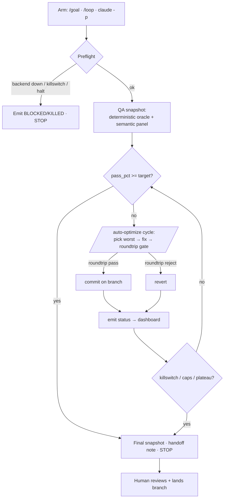

# Runbook — GA Chatbot AFK Harness

**What it is:** a runnable, instrumented system that lets the GA chatbot
*improve itself* unattended — it QAs the chatbot, fixes the worst-scoring
prompt, re-QAs to prove it didn't regress, commits on a branch, and repeats —
while a live dashboard shows a human exactly what's happening. "AFK" = away
from keyboard: you arm it, watch the dashboard, and review the branch it
produces. It **never merges or deploys on its own.**

This runbook is the human's map. The machine-followed logic lives in the skill
`.claude/skills/ga-chatbot-afk-harness/SKILL.md`.

---

## 1. The loop at a glance



Every box that changes state calls `Scripts/afk-harness-status.ps1`, which
writes `state/quality/chatbot-qa/afk-runs/latest-status.json` + a per-run
`.jsonl` event log. **Code owns the status**, so even a crashed or killed loop
leaves an honest last-known state on the dashboard.

## 2. What's reused vs. new

This harness is an **orchestrator**, not a new loop. It deliberately reuses the
Level-3 machinery ga already had:

| Reused (do not duplicate) | New in this harness |
|---|---|
| `/auto-optimize` — the dev loop (Iron Laws, caps, lock, rollback) | `.claude/skills/ga-chatbot-afk-harness/` — orchestrator |
| `/chatbot-qa-roundtrip-validate` — per-commit gate | `Scripts/afk-harness-status.ps1` — instrumentation |
| `Scripts/run-prompt-corpus.ps1` — deterministic oracle | `Tools/afk-dashboard/index.html` — human UI |
| `state/quality/chatbot-qa/baseline.json` — metric + caps | `/ga-chatbot-qa-panel` — semantic QA signal |

The semantic panel matters because the deterministic oracle only checks
substrings/routing; the panel (3 independent lenses + hexavalent T/P/U/D/F/C
consensus) catches *wrong-but-well-formatted* answers the oracle passes.

## 3. Arming it (3 modes)

> Preconditions: GaChatbot.Api up on `:5252` (`docs/runbooks/chatbot-deploy.md`),
> no `state/.loop-halted`, no `state/quality/chatbot-qa/.STOP`, no live
> `~/.demerzel/HALT-ALL`.

```bash
# A. Bounded, in-session (recommended first run)
/goal deterministic pass_pct >= 0.97 for chatbot corpus
/ga-chatbot-afk-harness target_metric=0.97 max_iterations=10

# B. Interval (only if repo preflight says LOOP_READY=true)
/loop /ga-chatbot-afk-harness

# C. Headless / true AFK
claude -p "/ga-chatbot-afk-harness target_metric=0.97 max_iterations=20"
```

## 4. Watching it — the dashboard

```bash
python -m http.server 8099      # from the ga repo root
# open http://localhost:8099/Tools/afk-dashboard/
```

The dashboard (zero dependencies, auto-refresh 5s) shows:

- **State pill** — `preflight · running · blocked · degraded · killed · done`
- **QA metrics** — deterministic pass %, semantic-panel pass %, target
- **Run card** — run id, branch, iteration / max, commits, elapsed
- **Blockers** — e.g. "backend_unavailable: GaChatbot.Api :5252" (shown only when blocked)
- **Metric trend** — deterministic + semantic over the run's cycles
- **Event timeline** — every phase, target-selected, commit, revert, with Δpp

Before the first arming it reads "No harness run on disk yet" — expected.
Serving from a different root? append `?root=/your/path/afk-runs`.

## 5. Safety model (read before arming headless)

The harness can edit GA source autonomously, so the rails are explicit:

1. **Branch-only.** All commits land on `afk/chatbot-qa-<date>`. The harness
   **never** pushes, opens/merges a PR, deploys, or applies a review-bypass
   label. A human reviews and lands.
2. **Rollback-gated.** No commit happens unless `/chatbot-qa-roundtrip-validate`
   confirms the metric didn't regress (`regression_threshold` 0.02), the
   canonical-trace gate holds, and no protected path changed.
3. **Caps.** `max_commits_per_session=50`, `max_wall_clock_minutes=480`,
   plateau exit after 5 sub-threshold cycles (from `baseline.json`).
4. **Killswitches (checked every iteration).**
   - `state/quality/chatbot-qa/.STOP` — stop this domain.
   - `state/.loop-halted` — stop all loops in the repo.
   - `~/.demerzel/HALT-ALL` — ecosystem-wide overseer halt.
5. **Honest degrade.** Backend down ⇒ `blocked` status + stop. Never a
   fabricated pass rate. (See the `feedback_green_but_dead` discipline.)
6. **Protected paths** (oracle, baselines, gates, signature fixtures) require an
   operator-only `[allow-protected: <path>]` commit marker — the loop cannot
   edit the contract it is measured against.

## 6. Landing the work (human-gated)

When a run finishes it drops `state/handoffs/<ts>-claude-code.md` with the
branch, commits, and final metrics. To land:

```bash
git log --oneline main..afk/chatbot-qa-<date>     # review every commit
gh pr create --base main --head afk/chatbot-qa-<date>
# Before merge: scan Codex bot comments; resolve P0/P1 (see CLAUDE.md).
```

## 7. File map

| Path | Purpose |
|---|---|
| `.claude/skills/ga-chatbot-afk-harness/SKILL.md` | orchestrator logic |
| `Scripts/afk-harness-status.ps1` | status/event writer |
| `Tools/afk-dashboard/index.html` | dashboard UI |
| `state/quality/chatbot-qa/afk-runs/latest-status.json` | current status (UI source) |
| `state/quality/chatbot-qa/afk-runs/<run_id>.jsonl` | per-run event log |
| `state/quality/chatbot-qa/baseline.json` | metric, caps, scope_boundary, protected paths |
| `state/quality/chatbot-qa-semantic/<date>.json` | semantic-panel snapshots |

## 8. Troubleshooting

| Symptom | Likely cause | Action |
|---|---|---|
| Dashboard "No harness run" | not armed yet, or served from wrong root | arm it, or pass `?root=` |
| State stuck `blocked` | GaChatbot.Api down on :5252 | start backend, re-arm |
| Loop exits immediately `killed` | a `.STOP` / `.loop-halted` / HALT-ALL marker present | remove the marker if intended |
| No commits despite low pass | every fix was roundtrip-rejected, or plateau | inspect timeline reverts; the corpus shape may be exhausted |
| Metric trend empty | only phase events so far (no cycle completed) | wait for the first cycle |
